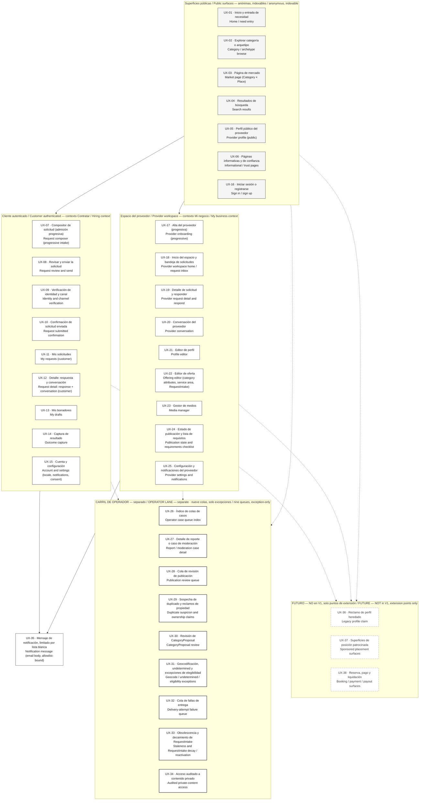

# Diagrama A — Superola en una página / Diagram A — Superola in One Page

> **Estado / Status:** `PROPUESTA — VALIDACIÓN DEL OWNER REQUERIDA` / `PROPOSED — OWNER VALIDATION REQUIRED`. Procedencia / Provenance: `TECHNICAL_DISCOVERY`. Es una propuesta de arquitectura UX de P04, no un diseño aprobado ni una especificación visual. / This is a P04 UX architecture proposal, not an approved design and not a visual specification.
>
> **Supuestos de trabajo / Working assumptions:** `WA-01`–`WA-05` (ver / see `docs/04-ux/README.md`). `G-06` está SIN SATISFACER / is UNSATISFIED. `DAVID WORKING ASSUMPTION — OWNER VALIDATION PENDING`.
>
> **Audiencia / Audience:** Owner-facing. Bilingüe español + inglés según / bilingual Spanish + English per `AGENTS.md` and `diagrams/README.md`.

Este documento es una **fuente de diagrama**. Es el mapa completo de superficies de Superola V1 en una sola página. No define el contenido de ninguna superficie: eso vive en `docs/04-ux/surface-inventory.md`, que es la fuente canónica. No es diseño visual de producto: **no decide color, tipografía, marca ni disposición de pantalla de ninguna superficie de Superola**. La sección 4 sí lleva una especificación de reproducción monocromática para volver a dibujar **este diagrama**, y sus valores son marcadores neutros de dibujo, no decisiones de producto. / This document is a **diagram source**. It is the complete map of Superola V1 surfaces on one page. It defines no surface's content: that lives in `docs/04-ux/surface-inventory.md`, which is canonical. It is not product visual design: **it decides no color, typography, branding, or screen layout for any Superola surface**. Section 4 does carry a monochrome reproduction specification for redrawing **this diagram**, and its values are neutral drawing placeholders, not product decisions.

---

## 1. Una superficie no es un servicio ni una unidad de despliegue / A surface is not a service or a deployment unit

**Esto es lo primero que hay que decir sobre este diagrama, y hay que decirlo antes de mostrarlo.** / **This is the first thing to say about this diagram, and it must be said before showing it.**

| Español | English |
|---|---|
| Cada caja de este dibujo es una **superficie**: un lugar donde una persona hace algo. No es un servicio, no es un microservicio, no es una base de datos, no es una unidad de despliegue y no es un módulo. | Every box in this drawing is a **surface**: a place where a person does something. It is not a service, not a microservice, not a database, not a deployment unit, and not a module. |
| Treinta y tantas cajas **no** significan treinta y tantas cosas que operar. `ADR-013` fija la plataforma como **un solo desplegable**. Contar cajas de este diagrama para estimar costo de infraestructura da un número equivocado. | Thirty-odd boxes do **not** mean thirty-odd things to operate. `ADR-013` fixes the platform as **one deployable**. Counting boxes on this diagram to estimate infrastructure cost produces a wrong number. |
| Una capacidad no se convierte automáticamente en un servicio ni en una unidad de despliegue. Es una regla explícita del repositorio (`AGENTS.md`), no una opinión de este documento. | A capability does not automatically become a service or a deployment unit. That is an explicit repository rule (`AGENTS.md`), not this document's opinion. |
| Lo que sí mide este diagrama es **alcance de diseño y de operación**: cuántas pantallas hay que diseñar, y cuántas colas hay que atender. Nueve colas de operador ya es una afirmación de carga de trabajo. | What this diagram does measure is **design and operating scope**: how many screens must be designed, and how many queues must be worked. Nine operator queues is already a workload claim. |

---

## 2. Documentos fuente y estado de evidencia / Source documents and evidence status

| Documento fuente / Source document | Qué aporta / What it supplies | Evidencia / Evidence | Procedencia / Provenance |
|---|---|---|---|
| `docs/04-ux/surface-inventory.md` | Los IDs y nombres canónicos `UX-01`–`UX-38`, usuario, autenticación, clasificación de renderizado / The canonical IDs and names `UX-01`–`UX-38`, user, auth, rendering classification | `PROPOSED` | `TECHNICAL_DISCOVERY` |
| `docs/04-ux/information-architecture.md` | Agrupación de superficies y navegación de doble rol / Surface grouping and dual-role navigation | `PROPOSED` | `TECHNICAL_DISCOVERY` |
| `docs/04-ux/customer-journey.md`, `provider-onboarding.md`, `provider-workspace.md`, `operator-surfaces.md` | Qué superficies participan en cada recorrido / Which surfaces participate in each journey | `PROPOSED` | `TECHNICAL_DISCOVERY` |
| `docs/02-architecture/adr/ADR-013-application-platform-and-module-boundary-enforcement.md` | Un solo desplegable; la plataforma está fija / One deployable; the platform is fixed | `PROPOSED` | `TECHNICAL_DISCOVERY` |
| `docs/02-architecture/adr/ADR-020-web-rendering-strategy-provisional-until-p04.md` | Vocabulario `DOC` / `LOCAL` / `RICH` y las islas `I-1`–`I-3` / `DOC` / `LOCAL` / `RICH` vocabulary and islands `I-1`–`I-3` | `PROPOSED` | `TECHNICAL_DISCOVERY` |
| `docs/02-architecture/adr/ADR-004-account-not-typed-by-marketplace-role.md` | Una `Account` puede ser cliente y proveedor a la vez / One `Account` may be both customer and provider | `CONFIRMED` | `DAVID_DIRECTIVE` |
| `presentation/outline.md` §"owner-facing diagram sources" | El requisito del Diagrama A / The Diagram A requirement | `PROPOSED` | `DAVID_DIRECTIVE` |

**Estado de las decisiones citadas, en prosa / Status of the cited decisions, in prose.** La columna *Evidencia* usa exclusivamente las seis etiquetas de evidencia de `AGENTS.md`; el estado de un ADR es una cosa distinta y se dice acá, no en esa columna. `ADR-004` está **ACCEPTED** y fue ratificado por David en el arranque de P03 (`SRC-014`), por eso su evidencia es `CONFIRMED` con procedencia `DAVID_DIRECTIVE`. `ADR-013` y `ADR-020` están **PROPOSED**. El renglón de `presentation/outline.md` registra un requisito de entrega de P03.1, no una medición: su evidencia es `PROPOSED`. / The *Evidence* column uses only `AGENTS.md`'s six evidence labels; an ADR's status is a different thing and is stated here, not in that column. `ADR-004` is **ACCEPTED** and was ratified by David at P03 start (`SRC-014`), which is why its evidence is `CONFIRMED` with `DAVID_DIRECTIVE` provenance. `ADR-013` and `ADR-020` are **PROPOSED**. The `presentation/outline.md` row records a P03.1 deliverable requirement, not a measurement: its evidence is `PROPOSED`.

**Nada en este diagrama es medición.** No hay evidencia de tráfico ni de usabilidad — `SRC-006` NOT RECEIVED. / **Nothing in this diagram is measurement.** There is no traffic or usability evidence — `SRC-006` NOT RECEIVED.

### 2.1 Convención de etiqueta bilingüe / Bilingual label convention

En prosa y en títulos de carril se usa la barra: `Búsqueda / Search`. En las cajas de superficie **no** se usa la barra como separador de idioma, porque varios nombres canónicos ya contienen una barra (`Home / need entry`, `Sign in / sign up`). En una caja de superficie el español va en la primera línea y el **nombre canónico en inglés, exacto y sin modificar**, va en la segunda. / In prose and lane titles the slash convention is used: `Búsqueda / Search`. Inside surface boxes the slash is **not** used as a language separator, because several canonical names already contain one (`Home / need entry`, `Sign in / sign up`). Inside a surface box, Spanish is on the first line and the **exact, unmodified English canonical name** is on the second.

---

## 3. Mermaid — el mapa completo de superficies / Mermaid — the full surface map

### 3.1 Cómo leer el diagrama / How to read the diagram

| Español | English |
|---|---|
| **Cuatro carriles y un grupo futuro.** Público, cliente autenticado, espacio del proveedor y — visualmente separado — el carril de operador. El grupo `FUTURO` está punteado y en gris porque **no está construido y no está incluido**. | **Four lanes and a future group.** Public, customer authenticated, provider workspace, and — visually separated — the operator lane. The `FUTURE` group is dashed and gray because it is **not built and not included**. |
| **El carril de operador se separa a propósito.** Es interno, solo por excepción, y ninguna de sus colas está en el camino del cliente ni del proveedor. Aparece en el mismo dibujo porque es **trabajo real de personas**, no porque sea parte del recorrido. | **The operator lane is separated deliberately.** It is internal, exception-only, and none of its queues sits on the customer or provider path. It appears on the same drawing because it is **real human work**, not because it is part of the journey. |
| **Una sola cuenta cruza dos carriles.** `ADR-004`: una `Account` puede ser cliente y proveedor al mismo tiempo. Los carriles son **contextos** — *Contratar* y *Mi negocio* — no tipos de cuenta. No hay cuenta de cliente ni cuenta de proveedor. | **One account spans two lanes.** `ADR-004`: one `Account` may be both customer and provider. The lanes are **contexts** — *Hiring* and *My business* — not account types. There is no customer account and no provider account. |
| **`UX-35` no está en ningún carril, y eso es correcto.** No es una pantalla: es un cuerpo de correo limitado por lista blanca. Nunca lleva datos de contacto, texto libre de la solicitud, dirección o fecha del evento, cantidad de invitados, presupuesto, montos de oferta ni contenido de conversación. | **`UX-35` is in no lane, and that is correct.** It is not a screen: it is an allowlist-bound email body. It never carries contact data, request free text, event address or date, guest count, budget, offer amounts, or conversation content. |
| **Las superficies públicas cargan la hipótesis de adquisición.** Por eso son anónimas e indexables, y por eso no hay muro de inicio de sesión delante del descubrimiento (`WA-05`). | **Public surfaces carry the acquisition hypothesis.** That is why they are anonymous and indexable, and why there is no login wall in front of discovery (`WA-05`). |

---

## 4. Excalidraw build specification

> **Scope of this section — read this before using any value in it.** This is a **monochrome reproduction specification for redrawing this one diagram**. Every measurement, hex value, font family, and font size below is a **neutral placeholder chosen so the diagram stays legible in grayscale**, on a projector, and in a printed handout. It is **not a product design token set**, not a brand palette, and not a type scale. **No product surface may take a color, a font, or a measurement from it.** Superola's visual design is not decided in P04 and is not decided here.

> **English only, deliberately.** Pixel offsets, stroke widths, hex values, and draw order are internal presentation-production support, which `AGENTS.md` classifies as English only; the owner will never read an offset table, so a parallel Spanish version would be a translated duplicate with no owner-presentation need. The diagram's content — box labels, lane titles, connector labels, the source table, the reading guide, and the never-show list — stays bilingual, and the literal strings that get **drawn on the canvas** remain bilingual inside the tables below because they are diagram content, not build metadata.

This repository has **no Excalidraw tooling**. This section is the normative source for rebuilding the diagram without re-deriving the inventory.

### 4.1 Canvas and styling convention

| Property | Value |
|---|---|
| Canvas | 1680 × 1480, origin top-left `(0,0)` |
| Grid | 20 px step; 220 px horizontal pitch |
| Public box | `rectangle` 200 × 80, `strokeColor` `#1e1e1e`, `backgroundColor` `#f5f5f5`, `fillStyle` `solid`, `strokeWidth` 1, `roughness` 1, `roundness` type 3 |
| Authenticated box | `rectangle` 200 × 80, `strokeColor` `#1e1e1e`, `backgroundColor` `transparent`, `strokeWidth` 1 |
| Operator box | `rectangle` 200 × 80, `strokeColor` `#3d3d3d`, `backgroundColor` `transparent`, `strokeWidth` 2 |
| Channel box | `rectangle` 200 × 80, `strokeColor` `#3d3d3d`, `backgroundColor` `transparent`, `strokeStyle` `dotted` |
| Future box | `rectangle` 200 × 80, `strokeColor` `#8a8a8a`, `backgroundColor` `transparent`, `strokeStyle` `dashed`, `opacity` 60 |
| Lane frame | `rectangle`, no fill, `strokeColor` `#8a8a8a`, `strokeStyle` `dashed`, drawn **behind** the boxes |
| Separator rule | full-width `line`, `strokeColor` `#1e1e1e`, `strokeWidth` 2 |
| Box text | `fontFamily` 2 (sans), `fontSize` 13, `textAlign` `center`, `verticalAlign` `middle`, `lineHeight` 1.25 |
| Lane title | `fontFamily` 2, `fontSize` 18, `textAlign` `left`, `strokeColor` `#1e1e1e` |

**Stated grayscale convention.** Three strokes: `#1e1e1e` primary, `#3d3d3d` operator and channel, `#8a8a8a` future and frames. Two fills: `#f5f5f5` for public surfaces, `transparent` for everything else. **No color.** The operator lane is distinguished by **stroke width 2 plus a separator rule**, not by color; the future group is distinguished by **dashed stroke plus opacity 60**, and additionally says `NOT in V1` in the lane title. No status is communicated by style alone. These three grays exist so nothing in the drawing depends on color reproduction — they are a legibility floor, not a palette.

### 4.2 Lanes: bands and frames

| Lane | Frame `x`,`y`,`w`,`h` | Title at | Box style |
|---|---|---|---|
| `L1` Public surfaces | 40, 100, 1600, 180 | 60, 118 | public |
| `L2` Customer authenticated | 40, 300, 1600, 260 | 60, 318 | authenticated |
| `L3` Provider workspace | 40, 580, 1600, 260 | 60, 598 | authenticated |
| `L4` Channel (`UX-35`) | 40, 860, 1600, 140 | 60, 878 | channel |
| — Separator rule | line from `40,1030` to `1640,1030` | label at 60, 1040 | — |
| `L5` Operator lane | 40, 1080, 1600, 260 | 60, 1098 | operator |
| `L6` FUTURE | 40, 1360, 1600, 120 | 60, 1378 | future |

Separator rule label, drawn bilingually on the canvas: `Todo lo de abajo es interno y solo por excepción / Everything below is internal and exception-only`.

### 4.3 Ordered element list

Draw order: the six lane frames first, then the separator rule, then the titles, then the boxes in this table's order. The two label columns are **drawn content** and stay bilingual.

| # | ID | Lane | Drawn label line 1 (ES) | Drawn label line 2 — exact canonical name | x | y | w | h | Group |
|---|---|---|---|---|---|---|---|---|---|
| 01 | `UX-01` | `L1` | Inicio y entrada de necesidad | `Home / need entry` | 60 | 160 | 200 | 80 | `g-public` |
| 02 | `UX-02` | `L1` | Explorar categoría o arquetipo | `Category / archetype browse` | 280 | 160 | 200 | 80 | `g-public` |
| 03 | `UX-03` | `L1` | Página de mercado | `Market page (Category × Place)` | 500 | 160 | 200 | 80 | `g-public` |
| 04 | `UX-04` | `L1` | Resultados de búsqueda | `Search results` | 720 | 160 | 200 | 80 | `g-public` |
| 05 | `UX-05` | `L1` | Perfil público del proveedor | `Provider profile (public)` | 940 | 160 | 200 | 80 | `g-public` |
| 06 | `UX-06` | `L1` | Páginas informativas y de confianza | `Informational / trust pages` | 1160 | 160 | 200 | 80 | `g-public` |
| 07 | `UX-16` | `L1` | Iniciar sesión o registrarse | `Sign in / sign up` | 1380 | 160 | 200 | 80 | `g-public` |
| 08 | `UX-07` | `L2` | Compositor de solicitud (admisión progresiva) | `Request composer (progressive intake)` | 60 | 360 | 200 | 80 | `g-customer` |
| 09 | `UX-08` | `L2` | Revisar y enviar la solicitud | `Request review and send` | 280 | 360 | 200 | 80 | `g-customer` |
| 10 | `UX-09` | `L2` | Verificación de identidad y canal | `Identity and channel verification` | 500 | 360 | 200 | 80 | `g-customer` |
| 11 | `UX-10` | `L2` | Confirmación de solicitud enviada | `Request submitted confirmation` | 720 | 360 | 200 | 80 | `g-customer` |
| 12 | `UX-11` | `L2` | Mis solicitudes | `My requests (customer)` | 940 | 360 | 200 | 80 | `g-customer` |
| 13 | `UX-12` | `L2` | Detalle: respuesta y conversación | `Request detail: response + conversation (customer)` | 1160 | 360 | 200 | 80 | `g-customer` |
| 14 | `UX-13` | `L2` | Mis borradores | `My drafts` | 1380 | 360 | 200 | 80 | `g-customer` |
| 15 | `UX-14` | `L2` | Captura de resultado | `Outcome capture` | 60 | 460 | 200 | 80 | `g-customer` |
| 16 | `UX-15` | `L2` | Cuenta y configuración | `Account and settings (locale, notifications, consent)` | 280 | 460 | 200 | 80 | `g-customer` |
| 17 | `UX-17` | `L3` | Alta del proveedor (progresiva) | `Provider onboarding (progressive)` | 60 | 640 | 200 | 80 | `g-provider` |
| 18 | `UX-18` | `L3` | Inicio del espacio y bandeja de solicitudes | `Provider workspace home / request inbox` | 280 | 640 | 200 | 80 | `g-provider` |
| 19 | `UX-19` | `L3` | Detalle de solicitud y responder | `Provider request detail and respond` | 500 | 640 | 200 | 80 | `g-provider` |
| 20 | `UX-20` | `L3` | Conversación del proveedor | `Provider conversation` | 720 | 640 | 200 | 80 | `g-provider` |
| 21 | `UX-21` | `L3` | Editor de perfil | `Profile editor` | 940 | 640 | 200 | 80 | `g-provider` |
| 22 | `UX-22` | `L3` | Editor de oferta | `Offering editor (category attributes, service area, RequestIntake)` | 1160 | 640 | 200 | 80 | `g-provider` |
| 23 | `UX-23` | `L3` | Gestor de medios | `Media manager` | 1380 | 640 | 200 | 80 | `g-provider` |
| 24 | `UX-24` | `L3` | Estado de publicación y lista de requisitos | `Publication state and requirements checklist` | 60 | 740 | 200 | 80 | `g-provider` |
| 25 | `UX-25` | `L3` | Configuración y notificaciones del proveedor | `Provider settings and notifications` | 280 | 740 | 200 | 80 | `g-provider` |
| 26 | `UX-35` | `L4` | Mensaje de notificación, limitado por lista blanca | `Notification message (email body, allowlist-bound)` | 60 | 900 | 200 | 80 | `g-channel` |
| 27 | `UX-26` | `L5` | Índice de colas de casos | `Operator case queue index` | 60 | 1140 | 200 | 80 | `g-operator` |
| 28 | `UX-27` | `L5` | Detalle de reporte o caso de moderación | `Report / moderation case detail` | 280 | 1140 | 200 | 80 | `g-operator` |
| 29 | `UX-28` | `L5` | Cola de revisión de publicación | `Publication review queue` | 500 | 1140 | 200 | 80 | `g-operator` |
| 30 | `UX-29` | `L5` | Sospecha de duplicado y reclamos de propiedad | `Duplicate suspicion and ownership claims` | 720 | 1140 | 200 | 80 | `g-operator` |
| 31 | `UX-30` | `L5` | Revisión de propuesta de categoría | `CategoryProposal review` | 940 | 1140 | 200 | 80 | `g-operator` |
| 32 | `UX-31` | `L5` | Geocodificación y excepciones de elegibilidad | `Geocode / undetermined / eligibility exceptions` | 1160 | 1140 | 200 | 80 | `g-operator` |
| 33 | `UX-32` | `L5` | Cola de fallas de entrega | `Delivery-attempt failure queue` | 1380 | 1140 | 200 | 80 | `g-operator` |
| 34 | `UX-33` | `L5` | Obsolescencia y decaimiento de admisión | `Staleness and RequestIntake decay / reactivation` | 60 | 1240 | 200 | 80 | `g-operator` |
| 35 | `UX-34` | `L5` | Acceso auditado a contenido privado | `Audited private-content access` | 280 | 1240 | 200 | 80 | `g-operator` |
| 36 | `UX-36` | `L6` | Reclamo de perfil heredado | `Legacy profile claim` | 60 | 1400 | 200 | 60 | `g-future` |
| 37 | `UX-37` | `L6` | Superficies de posición patrocinada | `Sponsored placement surfaces` | 280 | 1400 | 200 | 60 | `g-future` |
| 38 | `UX-38` | `L6` | Reserva, pago y liquidación | `Booking / payment / payout surfaces` | 500 | 1400 | 200 | 60 | `g-future` |

Every box carries its ID on a third 11 px line left-aligned inside the box, or as free text at the box's top-left corner at `(x + 8, y + 6)`. The ID is **never** omitted: it is the only way to reconcile the drawing with `docs/04-ux/surface-inventory.md`.

### 4.4 Grouping

| Group | Members | Why |
|---|---|---|
| `g-public` | `UX-01`–`UX-06`, `UX-16` + frame `L1` | Anonymous and indexable; they carry the acquisition hypothesis. |
| `g-customer` | `UX-07`–`UX-15` + frame `L2` | *Hiring* context, not an account type. |
| `g-provider` | `UX-17`–`UX-25` + frame `L3` | *My business* context, present only when a `BusinessMembership` exists. |
| `g-channel` | `UX-35` + frame `L4` | Not a screen. Grouped alone so nobody counts it as a product surface. |
| `g-operator` | `UX-26`–`UX-34` + frame `L5` + separator rule | Nine internal, exception-only queues, below the rule. |
| `g-future` | `UX-36`, `UX-37`, `UX-38` + frame `L6` | Not built, not included, dashed, opacity 60. |

### 4.5 Cross-lane connectors

Only five connectors. This diagram is a surface map, not a flow diagram: every extra arrow invites reading it as a journey, and Diagram B and the provider journey exist for that. The label column is **drawn content** and stays bilingual.

| # | ID | From | To | Style | Drawn label |
|---|---|---|---|---|---|
| 01 | `C01` | frame `L1` bottom edge, x 400 | frame `L2` top edge, x 400 | primary | `El cliente entra por lo público / The customer enters through public` |
| 02 | `C02` | frame `L1` bottom edge, x 1200 | frame `L3` top edge, x 1200 | primary | `El proveedor entra por lo público / The provider enters through public` |
| 03 | `C03` | frame `L2` bottom edge, x 400 | frame `L4` top edge, x 400 | primary | `Notificación de evento / Event notification` |
| 04 | `C04` | frame `L3` bottom edge, x 1200 | frame `L4` top edge, x 1200 | primary | `Notificación de evento / Event notification` |
| 05 | `C05` | separator rule, x 840 | frame `L5` top edge, x 840 | gray dashed | `Solo por excepción / Exception-only` |

The `FUTURE` group **receives no arrow.** It is drawn at the bottom, dashed, at opacity 60, with no connector. Drawing an arrow into it would make it look like an available path.

---

## 5. Lo que este diagrama nunca debe mostrar / What this diagram must never show

| No dibujar / Never draw | Por qué / Why |
|---|---|
| **Ninguna caja de servicio, microservicio, contenedor, base de datos, cola de mensajes, región ni unidad de despliegue.** Este es un mapa de superficies. | `ADR-013` fija **un solo desplegable**. Dibujar una segunda región o un servicio por capacidad compra infraestructura con un dibujo. Una capacidad no es automáticamente un servicio (`AGENTS.md`). / `ADR-013` fixes **one deployable**. Drawing a second region or a service per capability purchases infrastructure with a drawing. A capability is not automatically a service (`AGENTS.md`). |
| **Ningún tipo de cuenta.** Sin "cuenta de cliente" ni "cuenta de proveedor", sin bandera de tipo, sin interruptor de modo que cambie estado global. | `ADR-004` (`ACCEPTED`): una `Account` puede ser ambas cosas. Los carriles son contextos, no tipos. / One `Account` may be both. The lanes are contexts, not types. |
| **Ninguna superficie de reserva, pago o liquidación dentro de V1.** `UX-38` vive **solo** en el grupo `FUTURO`, punteado, sin flecha entrante. | `WA-03`, `DB-02`. Y ningún lenguaje con forma de dinero puede aparecer en las superficies públicas ni en `UX-35`. / And no money-shaped language may appear on public surfaces or in `UX-35`. |
| **Ninguna superficie de patrocinio dentro de V1.** `UX-37` vive solo en `FUTURO`. En V1 todo resultado lleva `placementBasis` con el único valor `organic`. | `ADR-008`. El patrocinio, cuando llegue, es una sección **asignada y etiquetada aparte**, nunca mezclada con los resultados orgánicos. / Sponsorship, when it ships, is a separately allocated and separately labelled section, never mixed into organic results. |
| **Ningún mapa, ningún calendario, ninguna difusión.** Sin superficie de mapa, sin superficie de disponibilidad o calendario, sin superficie de "pedir a varios proveedores". | `ADR-019` nivel 3, `ADR-005`, `DB-01`. Ninguna de las tres existe en el inventario, y dibujarlas las inventaría. / None of the three exists in the inventory, and drawing them would invent them. |
| **Ningún dato privado en `UX-35`.** Sin datos de contacto, texto libre, dirección o fecha del evento, cantidad de invitados, presupuesto, montos de oferta ni contenido de conversación. | `ADR-010`. La lista blanca permite: que ocurrió un evento y de qué tipo, el nombre público de quien actuó, un enlace no adivinable y un momento aproximado. Nada más. / The allowlist permits: that an event occurred and its type, the acting party's public display name, a non-guessable link, and coarse timing. Nothing else. |
| **Ningún panel de administración genérico**, ningún motor de derechos, ningún sistema de campañas patrocinadas, ninguna cola inventada. | Canon `§5.17`. Nueve colas es el conjunto completo, y ya es una afirmación de carga de trabajo no medida. / Nine queues is the complete set, and it is already an unmeasured workload claim. |

---

Las horas de operador que este carril implica **no están medidas**. Las cifras modeladas — 8.35 / 55.42 / 340.58 horas por mes en los tres escenarios — son el marco de referencia, no un pronóstico ni un costo comprometido, y sus supuestos de tarifa y carga deben verse junto a la cifra (`AGENTS.md`, *Cost framing*). Antes de aprobar cualquier diseño visual de este carril hay que resolver quién trabaja esas colas. / The operator hours this lane implies are **unmeasured**. The modelled figures — 8.35 / 55.42 / 340.58 hours per month at the three scenarios — are the frame, not a forecast and not a committed operating cost, and their rate and workload assumptions must be visible next to the figure (`AGENTS.md`, *Cost framing*). Before any visual design of this lane is approved, who works those queues must be resolved.
