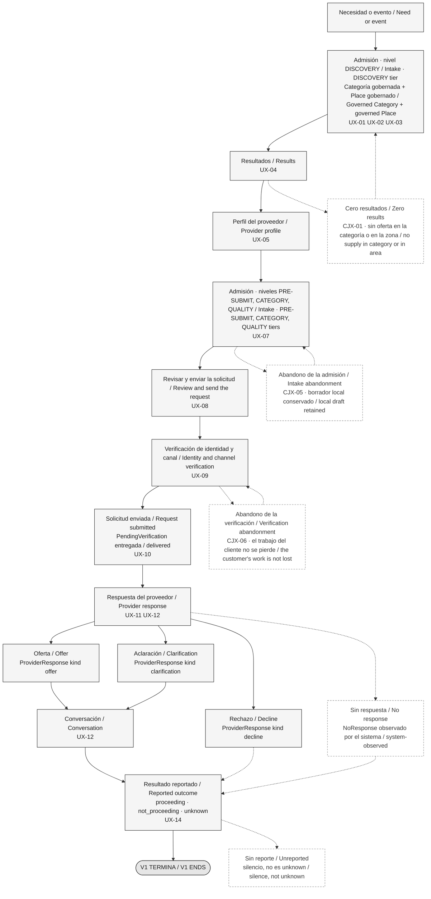

# Diagrama B — Recorrido del cliente / Diagram B — Customer Journey

> **Estado / Status:** `PROPUESTA — VALIDACIÓN DEL OWNER REQUERIDA` / `PROPOSED — OWNER VALIDATION REQUIRED`. Procedencia / Provenance: `TECHNICAL_DISCOVERY`. Es una propuesta de arquitectura UX de P04, no un diseño aprobado ni una especificación visual. / This is a P04 UX architecture proposal, not an approved design and not a visual specification.
>
> **Supuestos de trabajo / Working assumptions:** `WA-01`–`WA-05` (ver / see `docs/04-ux/README.md`). `G-06` está SIN SATISFACER / is UNSATISFIED. `DAVID WORKING ASSUMPTION — OWNER VALIDATION PENDING`.
>
> **Audiencia / Audience:** Owner-facing. Bilingüe español + inglés según / bilingual Spanish + English per `AGENTS.md` and `diagrams/README.md`.

Este documento es una **fuente de diagrama**, no un documento de recorrido. No define estados, no define reglas y no reemplaza a `docs/04-ux/customer-journey.md`, que es la fuente canónica. No es diseño visual de producto: **no decide color, tipografía ni marca de ninguna superficie de Superola**. La sección 3 sí lleva una especificación de reproducción monocromática para volver a dibujar **este diagrama**, y sus valores son marcadores neutros de dibujo, no decisiones de producto. / This document is a **diagram source**, not a journey document. It defines no states, defines no rules, and does not replace `docs/04-ux/customer-journey.md`, which is canonical. It is not product visual design: **it decides no color, typography, or branding for any Superola surface**. Section 3 does carry a monochrome reproduction specification for redrawing **this diagram**, and its values are neutral drawing placeholders, not product decisions.

---

## 1. Documentos fuente y estado de evidencia / Source documents and evidence status

| Documento fuente / Source document | Qué aporta / What it supplies | Evidencia / Evidence | Procedencia / Provenance |
|---|---|---|---|
| `docs/04-ux/customer-journey.md` | Cadena de superficies, cadena de ciclo de vida, recorridos de excepción `CJX-01`–`CJX-12` / Surface chain, lifecycle chain, exception journeys `CJX-01`–`CJX-12` | `PROPOSED` | `TECHNICAL_DISCOVERY` |
| `docs/04-ux/request-intake.md` | Modelo de admisión progresiva, niveles `DISCOVERY` / `PRE-SUBMIT` / `CATEGORY` / `QUALITY`, `RequestDraft` / Progressive intake model, `DISCOVERY` / `PRE-SUBMIT` / `CATEGORY` / `QUALITY` tiers, `RequestDraft` | `PROPOSED` | `TECHNICAL_DISCOVERY` |
| `docs/01-product/user-journeys.md` | Estados de producto P01 y el marcador terminal `V1 ENDS` / P01 product states and the `V1 ENDS` terminal marker | `PROPOSED` | `TECHNICAL_DISCOVERY` |
| `docs/02-architecture/adr/ADR-005-no-availability-model-in-v1.md` | `V1 has no availability model`; `RequestIntake` no es disponibilidad / is not availability | `PROPOSED` | `TECHNICAL_DISCOVERY` |
| `docs/02-architecture/adr/ADR-010-contact-disclosure-decision-seam.md` | Los datos de contacto no son atributo de la solicitud / Contact data is not an attribute of the request | `PROPOSED` | `TECHNICAL_DISCOVERY` |
| `docs/02-architecture/decision-branches.md` `DB-01`, `DB-02`, `DB-10` | Un solo destinatario; sin transacción; qué promete "disponible" / One recipient; no transaction; what "available" promises | `PROPOSED` | `TECHNICAL_DISCOVERY` |
| `presentation/outline.md` §"owner-facing diagram sources" | El requisito de producir este diagrama / The requirement to produce this diagram | `PROPOSED` | `DAVID_DIRECTIVE` |

**Estado de las decisiones citadas, en prosa / Status of the cited decisions, in prose.** La columna *Evidencia* usa exclusivamente las seis etiquetas de evidencia de `AGENTS.md`; el estado de un ADR es una cosa distinta y se dice acá, no en esa columna. `ADR-005` y `ADR-010` están **PROPOSED** como registros de decisión. El renglón de `presentation/outline.md` registra un requisito de entrega de P03.1, no una medición: su evidencia es `PROPOSED`. / The *Evidence* column uses only `AGENTS.md`'s six evidence labels; an ADR's status is a different thing and is stated here, not in that column. `ADR-005` and `ADR-010` are **PROPOSED** as decision records. The `presentation/outline.md` row records a P03.1 deliverable requirement, not a measurement: its evidence is `PROPOSED`.

**Nada en este diagrama es medición.** No hay evidencia de tráfico ni de usabilidad — `SRC-006` NOT RECEIVED. / **Nothing in this diagram is measurement.** There is no traffic or usability evidence — `SRC-006` NOT RECEIVED.

---

## 2. Mermaid — el recorrido primario y sus excepciones / Mermaid — the primary journey and its exceptions

### 2.1 Cómo leer el diagrama / How to read the diagram

| Español | English |
|---|---|
| **La admisión está partida a propósito.** Solo las respuestas del nivel `DISCOVERY` se piden antes de ver resultados. Lo demás se pide después de que el cliente eligió a un proveedor, porque hasta ese momento la plataforma no sabe qué preguntas aplican. | **Intake is split deliberately.** Only `DISCOVERY`-tier answers are asked before results appear. The rest is asked after the customer has chosen a provider, because until then the platform does not know which questions apply. |
| **Las cuatro salidas de la respuesta no son iguales.** Oferta, aclaración y rechazo son acciones del proveedor. *Sin respuesta* **no** es una acción: es un estado observado por el sistema (`NoResponse`), por eso va en línea punteada y nunca se presenta como un juicio. | **The four response outcomes are not equivalent.** Offer, clarification, and decline are provider actions. *No response* is **not** an action: it is a system-observed state (`NoResponse`), which is why it is dashed and is never presented as a judgement. |
| **Las líneas punteadas son caminos secundarios**, no fallas. Cero resultados, abandono y silencio son comportamientos normales de un marketplace y se miden. | **Dashed lines are secondary paths**, not failures. Zero results, abandonment, and silence are normal marketplace behaviours and are measured. |
| **`unknown` y *sin reporte* son cosas distintas.** `unknown` es una respuesta explícita del cliente. *Sin reporte* es silencio. Nunca se juntan. | **`unknown` and *unreported* are different.** `unknown` is an explicit customer answer. *Unreported* is silence. They are never collapsed. |
| **El recorrido termina en el resultado reportado.** No sigue. Lo que viene después es una extensión futura y aprobada aparte. | **The journey ends at the reported outcome.** It does not continue. What follows is a future extension, separately approved. |

---

## 3. Excalidraw build specification

> **Scope of this section — read this before using any value in it.** This is a **monochrome reproduction specification for redrawing this one diagram**. Every measurement, hex value, font family, and font size below is a **neutral placeholder chosen so the diagram stays legible in grayscale**, on a projector, and in a printed handout. It is **not a product design token set**, not a brand palette, and not a type scale. **No product surface may take a color, a font, or a measurement from it.** Superola's visual design is not decided in P04 and is not decided here.

> **English only, deliberately.** Pixel offsets, stroke widths, hex values, and draw order are internal presentation-production support, which `AGENTS.md` classifies as English only; the owner will never read an offset table, so a parallel Spanish version would be a translated duplicate with no owner-presentation need. The diagram's content — box labels, the reading guide, the source table, and the never-show list — stays bilingual, and the literal strings that get **drawn on the canvas** remain bilingual inside the tables below because they are diagram content, not build metadata.

This repository has **no Excalidraw tooling** — no generated `.excalidraw` sources beyond the hand-authored starting file below, no scripts, no `package.json`. This section is therefore the normative source: it is precise enough to rebuild the diagram without re-deriving the journey.

A hand-authored starting file accompanies this specification: `diagrams/journeys/customer-journey.excalidraw`. It contains the 14 primary boxes `B01`–`B15` **except `B08`**, and does **not** contain the exception band `X01`–`X04` or the `B16` terminal. Those elements are added by following the tables below.

### 3.1 Canvas and styling convention

| Property | Value |
|---|---|
| Canvas | 1600 × 1240, origin top-left `(0,0)` |
| Grid | 20 px step; every coordinate is a multiple of 20 |
| Primary box | `rectangle` 220 × 90, `strokeColor` `#1e1e1e`, `backgroundColor` `#f5f5f5`, `fillStyle` `solid`, `strokeWidth` 1, `strokeStyle` `solid`, `roughness` 1, `roundness` type 3 |
| Exception box | `rectangle` 220 × 90, `strokeColor` `#8a8a8a`, `backgroundColor` `transparent`, `strokeStyle` `dashed`, `roughness` 1 |
| Terminal | `ellipse` 220 × 70, `strokeColor` `#1e1e1e`, `backgroundColor` `#e6e6e6`, `fillStyle` `solid` |
| Primary arrow | `arrow`, `strokeColor` `#1e1e1e`, `strokeStyle` `solid`, `strokeWidth` 1, `endArrowhead` `arrow`, `startArrowhead` `null` |
| Secondary arrow | `arrow`, `strokeColor` `#8a8a8a`, `strokeStyle` `dashed`, `endArrowhead` `arrow` |
| Text | `fontFamily` 2 (sans), `fontSize` 16, `textAlign` `center`, `verticalAlign` `middle`, `lineHeight` 1.25, `strokeColor` `#1e1e1e` |
| Title text | `fontSize` 20, `textAlign` `left`, at `(40, 40)` |

**Stated grayscale convention.** Only three stroke values: `#1e1e1e` primary, `#8a8a8a` secondary, `#3d3d3d` exception text. Only three fills: `#f5f5f5` primary, `transparent` exception, `#e6e6e6` terminal. **No color is used on any element.** Status is never communicated by style alone: every secondary box also says in words that it is secondary. This is canon `§5.11`'s accessibility requirement applied to a diagram — a legibility floor for this drawing, not a palette for the product.

### 3.2 Ordered element list

Draw order = table order. `x`/`y` is the top-left corner. The label column is **drawn content** and stays bilingual.

| # | ID | Type | Drawn bilingual label | x | y | w | h | Group |
|---|---|---|---|---|---|---|---|---|
| 01 | `T-TITLE` | `text` | `Recorrido del cliente / Customer journey — Superola V1 (PROPUESTA / PROPOSED)` | 40 | 40 | 900 | 25 | — |
| 02 | `B01` | `rectangle` + bound text | `Necesidad o evento / Need or event` | 40 | 100 | 220 | 90 | `g-spine` |
| 03 | `B02` | `rectangle` + bound text | `Búsqueda / Search  ·  UX-01 UX-02 UX-03` | 300 | 100 | 220 | 90 | `g-spine` |
| 04 | `B03` | `rectangle` + bound text | `Resultados / Results  ·  UX-04` | 560 | 100 | 220 | 90 | `g-spine` |
| 05 | `B04` | `rectangle` + bound text | `Perfil del proveedor / Provider profile  ·  UX-05` | 820 | 100 | 220 | 90 | `g-spine` |
| 06 | `B05` | `rectangle` + bound text | `Solicitud: contexto / Request: context  ·  UX-07` | 1080 | 100 | 220 | 90 | `g-spine` |
| 07 | `B06` | `rectangle` + bound text | `Revisar y enviar / Review and send  ·  UX-08` | 1340 | 100 | 220 | 90 | `g-spine` |
| 08 | `B07` | `rectangle` + bound text | `Verificación / Verification  ·  UX-09` | 1340 | 300 | 220 | 90 | `g-spine` |
| 09 | `B08` | `rectangle` + bound text | `Solicitud enviada / Request submitted  ·  UX-10` | 1080 | 220 | 220 | 60 | `g-spine` |
| 10 | `B09` | `rectangle` + bound text | `Respuesta del proveedor / Provider response  ·  UX-11 UX-12` | 1040 | 300 | 220 | 90 | `g-spine` |
| 11 | `B10` | `rectangle` + bound text | `Oferta / Offer` | 1340 | 500 | 220 | 90 | `g-response` |
| 12 | `B11` | `rectangle` + bound text | `Aclaración / Clarification` | 1080 | 500 | 220 | 90 | `g-response` |
| 13 | `B12` | `rectangle` + bound text | `Rechazo / Decline` | 820 | 500 | 220 | 90 | `g-response` |
| 14 | `B13` | `rectangle` (dashed) + bound text | `Sin respuesta / No response` | 560 | 500 | 220 | 90 | `g-response` |
| 15 | `B14` | `rectangle` + bound text | `Conversación / Conversation  ·  UX-12` | 1080 | 680 | 220 | 90 | `g-close` |
| 16 | `B15` | `rectangle` + bound text | `Resultado reportado / Reported outcome  ·  UX-14` | 1080 | 860 | 220 | 90 | `g-close` |
| 17 | `B16` | `ellipse` + bound text | `V1 TERMINA / V1 ENDS` | 1080 | 1020 | 220 | 70 | `g-close` |
| 18 | `X01` | `rectangle` (dashed) + bound text | `Cero resultados / Zero results  ·  CJX-01` | 40 | 300 | 220 | 90 | `g-exception` |
| 19 | `X02` | `rectangle` (dashed) + bound text | `Abandono de admisión / Intake abandonment  ·  CJX-05` | 40 | 500 | 220 | 90 | `g-exception` |
| 20 | `X03` | `rectangle` (dashed) + bound text | `Abandono de verificación / Verification abandonment  ·  CJX-06` | 40 | 680 | 220 | 90 | `g-exception` |
| 21 | `X04` | `rectangle` (dashed) + bound text | `Sin reporte / Unreported — silencio / silence` | 40 | 860 | 220 | 90 | `g-exception` |
| 22 | `T-LANE1` | `text` | `Camino primario / Primary path` | 40 | 1140 | 400 | 20 | — |
| 23 | `T-LANE2` | `text` | `Caminos secundarios: punteado y gris / Secondary paths: dashed and gray` | 40 | 1180 | 700 | 20 | — |

`B08` is a 60 px-tall box placed **between** `B05` and `B07` on the vertical axis to signal that it is a durable, provider-invisible state, not a surface the customer works in.

### 3.3 Grouping

| Group | Members | Why |
|---|---|---|
| `g-spine` | `B01`–`B09` | The spine moves as one unit. |
| `g-response` | `B10`–`B13` | The four response outcomes are one set and must stay aligned. |
| `g-close` | `B14`, `B15`, `B16` | The journey close. |
| `g-exception` | `X01`–`X04` | The exception band is left-aligned and visually subordinate. |

### 3.4 Arrows: source and target

Source and target points in absolute coordinates; `points` is relative to the start.

| # | ID | Source | Target | From `(x,y)` | To `(x,y)` | Style |
|---|---|---|---|---|---|---|
| 01 | `A01` | `B01` | `B02` | 260, 145 | 300, 145 | primary |
| 02 | `A02` | `B02` | `B03` | 520, 145 | 560, 145 | primary |
| 03 | `A03` | `B03` | `B04` | 780, 145 | 820, 145 | primary |
| 04 | `A04` | `B04` | `B05` | 1040, 145 | 1080, 145 | primary |
| 05 | `A05` | `B05` | `B06` | 1300, 145 | 1340, 145 | primary |
| 06 | `A06` | `B06` | `B07` | 1450, 190 | 1450, 300 | primary |
| 07 | `A07` | `B07` | `B08` | 1340, 340 | 1300, 260 | primary |
| 08 | `A08` | `B08` | `B09` | 1190, 280 | 1160, 300 | primary |
| 09 | `A09` | `B09` | `B10` | 1150, 390 | 1450, 500 | primary |
| 10 | `A10` | `B09` | `B11` | 1150, 390 | 1190, 500 | primary |
| 11 | `A11` | `B09` | `B12` | 1150, 390 | 930, 500 | primary |
| 12 | `A12` | `B09` | `B13` | 1150, 390 | 670, 500 | secondary |
| 13 | `A13` | `B10` | `B14` | 1450, 590 | 1250, 680 | primary |
| 14 | `A14` | `B11` | `B14` | 1190, 590 | 1190, 680 | primary |
| 15 | `A15` | `B14` | `B15` | 1190, 770 | 1190, 860 | primary |
| 16 | `A16` | `B12` | `B15` | 930, 590 | 1120, 860 | secondary |
| 17 | `A17` | `B13` | `B15` | 670, 590 | 1100, 860 | secondary |
| 18 | `A18` | `B15` | `B16` | 1190, 950 | 1190, 1020 | primary |
| 19 | `A19` | `B03` | `X01` | 560, 190 | 260, 320 | secondary |
| 20 | `A20` | `X01` | `B02` | 260, 320 | 400, 190 | secondary |
| 21 | `A21` | `B05` | `X02` | 1080, 190 | 260, 520 | secondary |
| 22 | `A22` | `B07` | `X03` | 1340, 390 | 260, 700 | secondary |
| 23 | `A23` | `B15` | `X04` | 1080, 905 | 260, 905 | secondary |

`A20` is the only return arrow and exists because zero results returns the customer to correct or relax the search with the relaxed constraint named. **It never converts the query into a broadcast.**

---

## 4. Lo que este diagrama nunca debe mostrar / What this diagram must never show

| No dibujar / Never draw | Por qué / Why |
|---|---|
| **Ningún paso de reserva o pago** — sin checkout, sin depósito, sin botón de aceptar que cree una obligación, sin devolución, sin disputa, sin reseña derivada de transacción. Ningún lenguaje con forma de dinero. | `WA-03`, `DB-02`, `ADR-003`. Una cotización no es una reserva. `ReportedOutcome: proceeding` no es ni reserva ni pago. Es la extensión `UX-38`, `FUTURE` y aprobada aparte. / A quote is not a booking. `ReportedOutcome: proceeding` is neither a booking nor a payment. |
| **Ninguna difusión ni fan-out** — sin "pedí cotización a cinco proveedores", sin conjunto de destinatarios, sin ventana de respuesta compartida, sin cierre automático de solicitudes hermanas, sin reencaminamiento. | `WA-02`, `DB-01`. El destinatario es **una referencia única**, deliberadamente no una colección de tamaño uno. Cero resultados **nunca** se convierte en difusión. / The recipient is a **single reference**, deliberately not a collection of size one. |
| **Ningún calendario ni disponibilidad** — sin selector de fecha como filtro, sin bloques libres/ocupados, sin sincronización de calendario, sin badge de "disponible", sin booleano de disponibilidad. | `ADR-005`, `WA-01`, `DB-10`. `V1 has no availability model.` La fecha deseada es contexto de la solicitud, **nunca un filtro**. "No acepta solicitudes" **no** es indisponibilidad de fecha. / Desired date is request context, **never a filter**. "Not accepting requests" is **not** date unavailability. |
| **Ningún mapa** — sin mapa renderizado, sin pines, sin radios dibujados, sin capas de teselas. | `ADR-019` nivel 3 / Level 3. Ningún recorrido V1 necesita un mapa renderizado, y un pin dibujado desde un centroide de `Place` afirma una precisión que el dato no respalda. / No V1 journey needs a rendered map, and a pin drawn from a `Place` centroid claims precision the data does not support. |

Cuatro prohibiciones adicionales que se heredan y que también aplican a este dibujo / Four inherited prohibitions that also apply to this drawing: ningún dato de contacto, ningún texto libre de la solicitud, ninguna dirección ni fecha del evento, ningún monto de oferta puede aparecer en una caja de notificación (`ADR-010`); y `Suspended` nunca es distinguible de `Deactivated` para el cliente. / no contact data, no request free text, no event address or date, and no offer amount may appear in a notification box (`ADR-010`); and `Suspended` is never distinguishable from `Deactivated` for the customer.

---

`G-06` sigue SIN SATISFACER. Este diagrama no lo satisface y no debe presentarse como si lo hiciera: dibuja lo que V1 **construye** bajo `WA-01`, no lo que "disponible" **promete** a un cliente. Esa respuesta sigue siendo del owner (`Q-007`, `DB-10`). / `G-06` remains UNSATISFIED. This diagram does not satisfy it and must not be presented as if it does: it draws what V1 **builds** under `WA-01`, not what "available" **promises** a customer. That answer remains the owner's (`Q-007`, `DB-10`).
