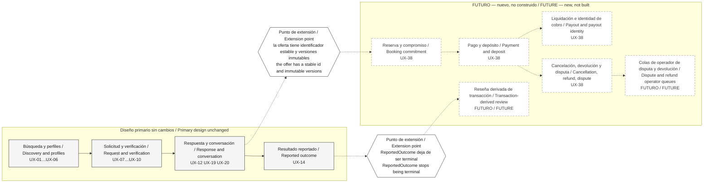
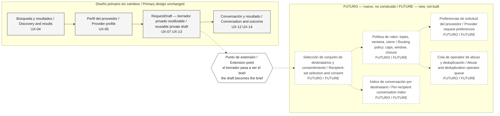
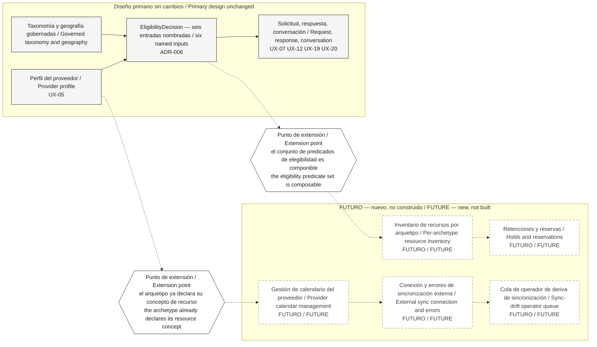
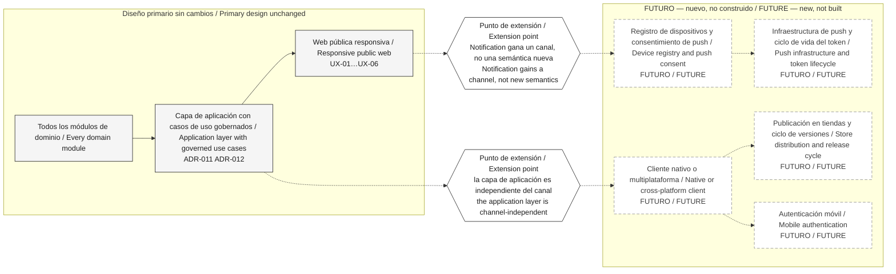
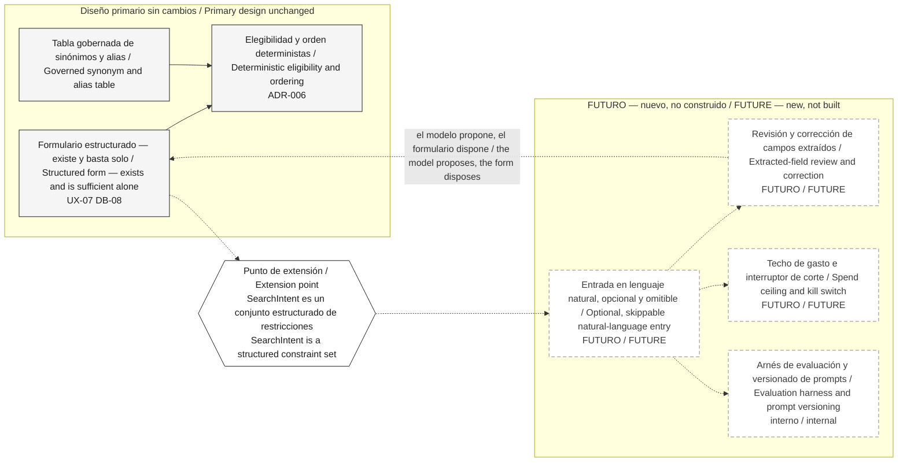

# Diagrama C — Qué cambia si… / Diagram C — What Changes If…

> **Estado / Status:** `PROPUESTA — VALIDACIÓN DEL OWNER REQUERIDA` / `PROPOSED — OWNER VALIDATION REQUIRED`. Procedencia / Provenance: `TECHNICAL_DISCOVERY`. Es una propuesta de arquitectura UX de P04, no un diseño aprobado ni una especificación visual. / This is a P04 UX architecture proposal, not an approved design and not a visual specification.
>
> **Supuestos de trabajo / Working assumptions:** `WA-01`–`WA-05` (ver / see `docs/04-ux/README.md`). `G-06` está SIN SATISFACER / is UNSATISFIED. `DAVID WORKING ASSUMPTION — OWNER VALIDATION PENDING`.
>
> **Audiencia / Audience:** Owner-facing. Bilingüe español + inglés según / bilingual Spanish + English per `AGENTS.md` and `diagrams/README.md`.

Este documento es una **fuente de diagrama**. No es diseño visual de producto: **no decide color, tipografía, marca ni disposición de pantalla de ninguna superficie de Superola**. La sección 8 sí lleva una especificación de reproducción monocromática para volver a dibujar **esta capa**, y sus valores son marcadores neutros de dibujo, no decisiones de producto. / This document is a **diagram source**. It is not product visual design: **it decides no color, typography, branding, or screen layout for any Superola surface**. Section 8 does carry a monochrome reproduction specification for redrawing **this overlay**, and its values are neutral drawing placeholders, not product decisions.

---

## 1. Esto es una capa, no una arquitectura alternativa / This is an overlay, not an architecture variant

**Léase esto antes de mirar cualquier diagrama de abajo.** / **Read this before looking at any diagram below.**

| Español | English |
|---|---|
| Cada una de las cinco secciones es una **capa que se dibuja encima del diseño primario**, no un diseño distinto. El Diagrama A y el Diagrama B **no cambian** cuando se enciende una capa: se les marca dónde se engancha algo nuevo. | Each of the five sections is an **overlay drawn on top of the primary design**, not a different design. Diagram A and Diagram B do **not change** when an overlay is switched on: they get marked where something new attaches. |
| Este documento **no dibuja arquitecturas alternativas**. No hay un "Superola con pagos" ni un "Superola con calendario" como sistemas paralelos. Hay un solo diseño con puntos de extensión nombrados. | This document **does not draw alternative architectures**. There is no "Superola with payments" or "Superola with a calendar" as a parallel system. There is one design with named extension points. |
| La columna que importa es **lo que NO cambia**. Es la columna que dice cuánto del trabajo ya hecho sobrevive a la decisión, y es la razón por la que se puede avanzar hoy sin las respuestas del owner. | The column that matters is **what does NOT change**. It is the column that says how much of the work already done survives the decision, and it is the reason work can proceed today without the owner's answers. |
| Ninguna de las cinco está aprobada. Ninguna está construida. Ninguna está incluida en V1. | None of the five is approved. None is built. None is included in V1. |

Este documento sigue el precedente de `presentation/architecture-preview-v0.1.md` §4: **primero se dice lo que no cambia.** Ese orden no es cortesía — es la información que el owner necesita para decidir sin miedo. / This document follows the precedent of `presentation/architecture-preview-v0.1.md` §4: **what does not change is stated first.** That order is not politeness — it is the information the owner needs in order to decide without fear.

### 1.1 Las cinco ramas y sus identificadores / The five branches and their identifiers

| # | Rama / Branch | Rompe el supuesto / Breaks the assumption | Rama de decisión / Decision branch | Nivel de reversión / Reversal tier |
|---|---|---|---|---|
| `C-1` | Los pagos entran en V1 / Payments enter V1 | `WA-03` | `DB-02` | Nivel 1 — reescribe agregados e invariantes / Tier 1 |
| `C-2` | La difusión a varios proveedores entra en V1 / Fan-out enters V1 | `WA-02` | `DB-01` | Nivel 1 / Tier 1 |
| `C-3` | La disponibilidad garantizada de calendario entra en V1 / Guaranteed calendar availability enters V1 | `WA-01` | `DB-10` (y `G-06` / and `G-06`) | Nivel 2 — cambia un área acotada / Tier 2 |
| `C-4` | El móvil nativo entra en V1 / Native mobile enters V1 | `WA-04` | `DB-06` | Nivel 3 — alcance de lanzamiento y entrega / Tier 3 |
| `C-5` | La admisión asistida por IA se lanza / AI-assisted intake ships | — (canon `§5.7`) | `DB-08` | Nivel 2 / Tier 2 |

**Nota sobre el alcance / Scope note.** `presentation/outline.md` nombra *migración heredada* como una de las cinco ramas del Diagrama C. La directiva de P04 la reemplaza por **disponibilidad garantizada de calendario**, porque `G-06` — qué promete "disponible" a un cliente — es la puerta que formalmente bloquea P04 y sigue sin resolverse. La migración heredada (`DB-03`, `UX-36`) no desaparece: se decide en P05 y ya está cubierta en `presentation/architecture-preview-v0.1.md` §3 y §4. / `presentation/outline.md` names *legacy migration* as one of Diagram C's five branches. The P04 directive replaces it with **guaranteed calendar availability**, because `G-06` — what "available" promises a customer — is the gate that formally blocks P04 and remains unresolved. Legacy migration (`DB-03`, `UX-36`) does not disappear: it is decided in P05 and is already covered in `presentation/architecture-preview-v0.1.md` §3 and §4.

---

## 2. Documentos fuente y estado de evidencia / Source documents and evidence status

| Documento fuente / Source document | Qué aporta / What it supplies | Evidencia / Evidence | Procedencia / Provenance |
|---|---|---|---|
| `docs/02-architecture/decision-branches.md` `DB-01`, `DB-02`, `DB-06`, `DB-08`, `DB-10` | Las cinco ramas, su impacto y sus disparadores de reconsideración / The five branches, their impact, and their reconsideration triggers | `PROPOSED` | `TECHNICAL_DISCOVERY` |
| `docs/04-ux/README.md` `WA-01`–`WA-05` | Los cinco supuestos de trabajo de P04 y qué rama preserva cada uno / P04's five working assumptions and the branch each preserves | `ASSUMPTION` | `DAVID_DIRECTIVE` |
| `docs/04-ux/surface-inventory.md` | Los IDs de superficie que ganan un punto de extensión / The surface IDs that gain an extension point | `PROPOSED` | `TECHNICAL_DISCOVERY` |
| `presentation/architecture-preview-v0.1.md` §4 | El precedente de "primero lo que no cambia" / The "what does not change first" precedent | `PROPOSED` | `TECHNICAL_DISCOVERY` |
| `docs/03-technology/ai-evaluation.md` §8.1 | Las cuatro condiciones previas del experimento de admisión asistida / The assisted-intake experiment's four preconditions | `PROPOSED` | `TECHNICAL_DISCOVERY` |
| `docs/02-architecture/system-architecture.md` §3 | Sin transporte en tiempo real, sin envío iniciado por el servidor / No realtime transport, no server-initiated push | `PROPOSED` | `TECHNICAL_DISCOVERY` |
| `presentation/outline.md` §"owner-facing diagram sources" | El requisito del Diagrama C / The Diagram C requirement | `PROPOSED` | `DAVID_DIRECTIVE` |

**Estado de las decisiones citadas, en prosa / Status of the cited decisions, in prose.** La columna *Evidencia* usa exclusivamente las seis etiquetas de evidencia de `AGENTS.md`; el estado de un ADR o de una entrega es una cosa distinta y se dice acá, no en esa columna. El renglón de `presentation/outline.md` registra un requisito de entrega de P03.1, no una medición: su evidencia es `PROPOSED`. / The *Evidence* column uses only `AGENTS.md`'s six evidence labels; the status of an ADR or of a deliverable is a different thing and is stated here, not in that column. The `presentation/outline.md` row records a P03.1 deliverable requirement, not a measurement: its evidence is `PROPOSED`.

**Nada en este documento es medición.** Ningún costo, ninguna fecha, ninguna estimación de esfuerzo. `SRC-006` NOT RECEIVED. / **Nothing in this document is measurement.** No cost, no date, no effort estimate. `SRC-006` NOT RECEIVED.

### 2.1 Convención de dibujo de la capa / Overlay drawing convention

| Elemento / Element | Cómo se dibuja / How it is drawn |
|---|---|
| Superficie primaria sin cambios / Unchanged primary surface | Línea sólida `#1e1e1e`, relleno `#f5f5f5`. **Idéntica al Diagrama A/B.** / Solid `#1e1e1e`, fill `#f5f5f5`. **Identical to Diagram A/B.** |
| Punto de extensión / Extension point | Rombo pequeño `#1e1e1e` de 40 × 40, sin relleno, pegado al borde de la superficie existente. La superficie **no se redibuja**. / Small 40 × 40 `#1e1e1e` diamond, no fill, attached to the existing surface's edge. The surface is **not redrawn**. |
| Superficie nueva / New surface | Punteada `#8a8a8a`, sin relleno, opacidad 60, con la palabra `FUTURO / FUTURE` en la etiqueta. / Dashed `#8a8a8a`, no fill, opacity 60, with the word `FUTURE` in the label. |
| Lo que hay que volver a decidir / What must be re-decided | Nota de texto en `#3d3d3d` con guion de llamada al rombo, nunca una caja. / Text note in `#3d3d3d` with a leader line to the diamond, never a box. |

Los valores de esta tabla y los de la sección 8 son **marcadores neutros de reproducción monocromática**, elegidos para que el dibujo se lea en escala de grises. No son un sistema de diseño de producto y ninguna superficie de Superola puede tomar de ahí un color, una tipografía ni una medida. / The values in this table and in section 8 are **neutral monochrome reproduction placeholders**, chosen so the drawing reads in grayscale. They are not a product design system, and no Superola surface may take a color, a font, or a measurement from them.

---

## 3. `C-1` — Si los pagos entran en V1 / If payments enter V1

`WA-03` se rompe. `DB-02` es **la pregunta abierta de mayor apalancamiento del programa**, y David no puede decidirla. / `WA-03` breaks. `DB-02` is **the single highest-leverage question outstanding**, and David cannot decide it.

| | Contenido / Content |
|---|---|
| **Lo que NO cambia / What does NOT change** | Búsqueda, páginas de mercado, perfiles públicos, páginas de confianza (`UX-01`–`UX-06`). Toda la admisión progresiva y sus cuatro clases de campo `DISCOVERY` / `PRE-SUBMIT` / `CATEGORY` / `QUALITY` (`UX-07`, `UX-08`). Verificación de identidad y canal (`UX-09`). La bandeja del proveedor y el formulario de respuesta (`UX-18`, `UX-19`). La conversación (`UX-12`, `UX-20`). Toda el alta del proveedor y las puertas de publicación (`UX-17`, `UX-21`–`UX-24`). El taxonomía gobernada, la geografía y la decisión de elegibilidad. La lista blanca de notificación. / Discovery, market pages, public profiles, trust pages (`UX-01`–`UX-06`). All progressive intake and its four field classes (`UX-07`, `UX-08`). Identity and channel verification (`UX-09`). The provider inbox and response form (`UX-18`, `UX-19`). Conversation (`UX-12`, `UX-20`). All provider onboarding and publication gates (`UX-17`, `UX-21`–`UX-24`). Governed taxonomy, geography, and the eligibility decision. The notification allowlist. |
| **Superficies existentes que ganan un punto de extensión / Existing surfaces that gain an extension point** | `UX-12` y `UX-19` — la oferta ya tiene identificador estable y versiones inmutables, así que un compromiso futuro puede referenciar una versión concreta; ese seam ya existe y no cuesta nada hoy. `UX-14` — la captura de resultado deja de ser terminal y pasa a ser intermedia. `UX-15` — la identidad de cobro es un **sujeto de verificación separado** de la identidad de marketplace, y eso vive en la cuenta. `UX-06` — las páginas de confianza tienen que decir qué protege y qué no protege la plataforma. / `UX-12` and `UX-19` — the offer already has a stable identifier and immutable versions, so a future commitment can reference a specific version; that seam already exists and costs nothing today. `UX-14` — outcome capture stops being terminal and becomes intermediate. `UX-15` — payout identity is a **separate verification subject** from marketplace identity, and that lives in the account. `UX-06` — trust pages must state what the platform protects and what it does not. |
| **Superficies nuevas / New surfaces** | `UX-38` se abre en un conjunto: reserva y compromiso, pago y depósito, alta de identidad de cobro, liquidación, cancelación, devolución, disputa, y confirmación de servicio prestado. Reseña derivada de transacción. Facturación e impuestos por mercado. Al menos dos colas de operador nuevas — disputa y devolución. / `UX-38` opens into a set: booking commitment, payment and deposit, payout identity onboarding, payout, cancellation, refund, dispute, and service completion. Transaction-derived review. Invoicing and tax per market. At least two new operator queues — dispute and refund. |
| **Lo que hay que volver a decidir / What must be re-decided** | Qué significan "reseña" y "verificado" — hoy V1 **no tiene** `verified booking`. Si `Event` pasa a ser un agregado necesario. Si la monetización se mueve de suscripción a comisión por transacción (`DB-07`). Si "disponible" tiene que volverse reservable, lo que acopla con `DB-10` / `C-3`. La regla de "ningún lenguaje con forma de dinero en páginas públicas ni en notificaciones" (`DB-02`) tiene que reescribirse, no borrarse. El régimen de consistencia y auditoría alrededor del dinero. / What "review" and "verified" mean — V1 today has **no** `verified booking`. Whether `Event` becomes a necessary aggregate. Whether monetization moves from subscription to transaction fee (`DB-07`). Whether "available" must become reservable, coupling to `DB-10` / `C-3`. The "no money-shaped language on public pages or in notifications" rule (`DB-02`) must be rewritten, not deleted. The consistency and audit regime around money. |

**Advertencia honesta / Honest warning.** Si el owner exige la transacción en el primer lanzamiento, el conjunto de límites de P02 queda **equivocado, no meramente incompleto**. Esta rama es la única de las cinco de la que eso se puede decir. / If the owner requires the transaction in the first release, P02's boundary set is **wrong, not merely incomplete**. This branch is the only one of the five of which that can be said.

---

## 4. `C-2` — Si la difusión a varios proveedores entra en V1 / If fan-out enters V1

`WA-02` se rompe. `DB-01`. El seam que abarata esta rama es `RequestDraft`, y ya existe. / `WA-02` breaks. `DB-01`. The seam that makes this branch cheap is `RequestDraft`, and it already exists.

| | Contenido / Content |
|---|---|
| **Lo que NO cambia / What does NOT change** | Todo el descubrimiento: inicio, exploración, páginas de mercado, resultados y perfiles (`UX-01`–`UX-06`). El perfil público y su proyección. La semántica del contenido de la oferta. El modelo de contenido de la conversación (`UX-12`, `UX-20`). El modelo de entrega de notificaciones y su lista blanca (`UX-35`). Todo el alta del proveedor y las puertas de publicación (`UX-17`, `UX-21`–`UX-24`). Taxonomía, geografía, elegibilidad. La admisión progresiva y sus clases de campo. Las colas de operador existentes. / All of discovery: home, browse, market pages, results, and profiles (`UX-01`–`UX-06`). The public profile and its projection. Offer content semantics. The conversation content model (`UX-12`, `UX-20`). The notification delivery model and its allowlist (`UX-35`). All provider onboarding and publication gates (`UX-17`, `UX-21`–`UX-24`). Taxonomy, geography, eligibility. Progressive intake and its field classes. The existing operator queues. |
| **Superficies existentes que ganan un punto de extensión / Existing surfaces that gain an extension point** | `UX-07` y `UX-13` — el `RequestDraft` pasa de borrador privado a *brief*; **el agregado ya existe y era necesario de todos modos**, por eso esta rama es una política nueva sobre un agregado existente y no un rediseño estructural. `UX-04` — los resultados ganarían una selección múltiple deliberada con consentimiento explícito. `UX-08` — la revisión previa al envío tendría que mostrar a quiénes va y pedir confirmación por destinatario. `UX-11` — *Mis solicitudes* se reagrupa por brief además de por solicitud. `UX-25` — el proveedor gana preferencias de recepción. / `UX-07` and `UX-13` — `RequestDraft` moves from private draft to *brief*; **the aggregate already exists and was required anyway**, which is why this branch is a new policy over an existing aggregate rather than a structural redesign. `UX-04` — results would gain a deliberate multi-select with explicit consent. `UX-08` — pre-send review must show who receives it and require per-recipient confirmation. `UX-11` — *My requests* regroups by brief as well as by request. `UX-25` — the provider gains reception preferences. |
| **Superficies nuevas / New surfaces** | Selección del conjunto de destinatarios con su modelo de consentimiento. Superficie de política de ruteo: topes de reparto, ventana de respuesta compartida, cierre y reencaminamiento. Preferencias y límites de solicitud del proveedor. Índice de conversación por destinatario. Una cola de operador para abuso, deduplicación y control de ráfaga de notificaciones. / Recipient-set selection with its consent model. A routing-policy surface: fan-out caps, shared response window, closure, and reroute. Provider request preferences and limits. A per-recipient conversation index. An operator queue for abuse, deduplication, and notification burst control. |
| **Lo que hay que volver a decidir / What must be re-decided** | La atribución de la tasa de respuesta: hoy es atribuible al proveedor; con ruteo se confunde con la calidad del ruteo. La medición de `NoResponse` se re-indexa de por-solicitud a por-brief. El resultado reportado abarca varios destinatarios. Los límites de abuso y la presión de notificaciones. Y una regla **no** se vuelve a decidir: cero resultados sigue sin poder convertirse en una difusión, con o sin fan-out. / Response-rate attribution: today it is attributable to the provider; with routing it is confounded with routing quality. The `NoResponse` measurement re-keys from per-request to per-brief. Reported outcome spans recipients. Abuse limits and notification pressure. And one rule is **not** re-decided: zero results still may not become a broadcast, with or without fan-out. |

---

## 5. `C-3` — Si la disponibilidad garantizada de calendario entra en V1 / If guaranteed calendar availability enters V1

`WA-01` se rompe. `DB-10`, y es la rama que responde `G-06`. **Es la única de las cinco que el owner ya tiene formalmente pendiente sobre la mesa.** / `WA-01` breaks. `DB-10`, and it is the branch that answers `G-06`. **It is the only one of the five formally pending with the owner today.**

| | Contenido / Content |
|---|---|
| **Lo que NO cambia / What does NOT change** | La taxonomía gobernada y los cinco `CategoryArchetype`. La geografía, el `Place` gobernado y la resolución sin llamadas a proveedores externos. Todo el modelo de identidad del proveedor, el negocio, el perfil y las puertas de publicación (`UX-17`, `UX-21`–`UX-24`). El ciclo de vida completo de solicitud y respuesta: `clarification`, `decline`, `offer`, `NoResponse` (`UX-12`, `UX-19`). La conversación (`UX-20`). La notificación y su lista blanca (`UX-35`). La admisión de operador. **El conjunto de predicados de elegibilidad componible es el seam, y su costo de acarreo hoy es casi cero.** / The governed taxonomy and the five `CategoryArchetype`s. Geography, the governed `Place`, and zero-vendor-call resolution. The entire provider identity, business, profile, and publication-gate model (`UX-17`, `UX-21`–`UX-24`). The full request and response lifecycle: `clarification`, `decline`, `offer`, `NoResponse` (`UX-12`, `UX-19`). Conversation (`UX-20`). Notification and its allowlist (`UX-35`). Operator intake. **The composable eligibility predicate set is the seam, and its carry cost today is near zero.** |
| **Superficies existentes que ganan un punto de extensión / Existing surfaces that gain an extension point** | `UX-05` — el perfil hoy lleva **verbatim en sustancia** la no-afirmación de `ADR-005`; con esta rama esa frase se reemplaza, no se borra. `UX-22` — el editor de oferta ya declara el concepto de recurso del arquetipo como metadato descriptivo; pasaría a declararlo como inventario real. `UX-04` — la fecha podría volverse un filtro, cosa que hoy **nunca** es. `UX-07` — la fecha del evento cambia de clase, de `PRE-SUBMIT` a `DISCOVERY`, y eso reordena el compositor entero. `UX-33` — la cola de decaimiento de `RequestIntake` cambia de significado. / `UX-05` — the profile today carries `ADR-005`'s non-claim **verbatim in substance**; under this branch that sentence is replaced, not deleted. `UX-22` — the offering editor already declares the archetype's resource concept as descriptive metadata; it would declare it as real inventory. `UX-04` — date could become a filter, which today it **never** is. `UX-07` — event date changes class, from `PRE-SUBMIT` to `DISCOVERY`, and that reorders the entire composer. `UX-33` — the `RequestIntake` decay queue changes meaning. |
| **Superficies nuevas / New surfaces** | Gestión de calendario del proveedor. Inventario de recursos por arquetipo — salones para un salón, grupos para un mariachi, vehículos para un transporte. Retenciones y reservas con control de contención y expiración. Conexión de sincronización externa con su superficie de errores. Una cola de operador para deriva de sincronización. / Provider calendar management. Per-archetype resource inventory — rooms for a venue, groups for a mariachi, vehicles for a transport company. Holds and reservations with contention control and expiry. External calendar-sync connection with its error surface. An operator queue for sync drift. |
| **Lo que hay que volver a decidir / What must be re-decided** | `G-06` mismo: qué le promete "disponible" a un cliente. La tabla de clasificación de campos del canon `§5.3`, entera. Si la fecha deseada pasa de contexto a filtro. Qué pasa con `RequestIntake`: hoy es admisión, no disponibilidad, y las dos cosas no pueden coexistir sin confundir al cliente. Si la disponibilidad se vuelve **reservable**, aparece contención y el mapa de consistencia cambia materialmente, acoplando con `DB-02` / `C-1`. Y el riesgo operativo que ya está registrado: **la disponibilidad obsoleta suprime demanda de forma invisible, el proveedor se queja de no tener solicitudes, y la causa no se puede diagnosticar desde los datos.** / `G-06` itself: what "available" promises a customer. Canon `§5.3`'s field-classification table, entirely. Whether desired date moves from context to filter. What happens to `RequestIntake`: today it is intake, not availability, and the two cannot coexist without confusing the customer. If availability becomes **reservable**, contention appears and the consistency map changes materially, coupling to `DB-02` / `C-1`. And the operational risk already on record: **stale availability suppresses demand invisibly, the provider then complains about having no leads, and the cause is undiagnosable from data.** |

**El instrumento más barato del producto ya está puesto / The cheapest instrument in the product is already in place.** El motivo de rechazo, opcional y escrito por el proveedor, convierte esta pregunta en una **medición** en vez de un debate: la proporción de rechazos atribuidos a indisponibilidad de fecha o recurso, dentro de la cohorte de lanzamiento. No cuesta nada hoy y responde la rama mañana. / The optional, provider-authored decline reason turns this question into a **measurement** rather than a debate: the share of declines attributed to date or resource unavailability, within the launch cohort. It costs nothing today and answers the branch tomorrow.

---

## 6. `C-4` — Si el móvil nativo entra en V1 / If native mobile enters V1

`WA-04` se rompe. `DB-06`. Es de nivel 3 — alcance de lanzamiento y entrega, radio de dominio casi nulo. / `WA-04` breaks. `DB-06`. Tier 3 — launch scope and delivery, near-zero domain radius.

| | Contenido / Content |
|---|---|
| **Lo que NO cambia / What does NOT change** | **Todos los módulos de dominio, sin excepción.** Y la capa de aplicación, **si de verdad fue independiente del canal** — eso es exactamente la prueba de si el principio se respetó. El inventario de superficies y el propósito de cada una. La elegibilidad, el ranking y `placementBasis`. La taxonomía y la geografía. La lista blanca de notificación (`ADR-010`) sigue vigente palabra por palabra: un push es un canal nuevo, no un permiso nuevo. La web pública tiene que seguir existiendo y siendo indexable, porque es la hipótesis de adquisición. / **Every domain module, without exception.** And the application layer, **if it was genuinely channel-independent** — that is exactly the test of whether the principle was honoured. The surface inventory and each surface's purpose. Eligibility, ranking, and `placementBasis`. Taxonomy and geography. The notification allowlist (`ADR-010`) holds word for word: a push is a new channel, not a new permission. Public web must continue to exist and be indexable, because it is the acquisition hypothesis. |
| **Superficies existentes que ganan un punto de extensión / Existing surfaces that gain an extension point** | `UX-15` y `UX-25` — consentimiento de push por dispositivo, y estado de entrega por dispositivo. `UX-19` — es **la superficie de mayor riesgo móvil del producto** hoy y seguiría siéndolo: los proveedores trabajan desde el teléfono en la práctica. `UX-16` — flujos de autenticación móvil. `UX-32` — la cola de fallas de entrega gana una clase de falla por dispositivo. / `UX-15` and `UX-25` — per-device push consent and per-device delivery state. `UX-19` — it is **the product's highest-risk mobile surface** today and would remain so: providers work from phones in practice. `UX-16` — mobile authentication flows. `UX-32` — the delivery-attempt failure queue gains a per-device failure class. |
| **Superficies nuevas / New surfaces** | Un cliente nativo o multiplataforma completo, que es un cliente paralelo, no una superficie. Registro de dispositivos y consentimiento de push. Ciclo de vida del token. Presencia en tiendas y su proceso de versiones. Autenticación móvil. / A full native or cross-platform client, which is a parallel client rather than a surface. Device registry and push consent. Token lifecycle. Store presence and its release process. Mobile authentication. |
| **Lo que hay que volver a decidir / What must be re-decided** | **Una restricción de arquitectura entra en conflicto directo: `system-architecture.md` §3 dice sin transporte en tiempo real y sin envío iniciado por el servidor.** Un push *es* envío iniciado por el servidor. Esa restricción se reescribe con su alcance exacto — push como notificación, no como transporte de estado — o el móvil nativo entra sin push, que es la mitad de su valor. La recomendación de renderizado `ADR-020` opción A queda intacta para la web pública (la regla 4 de SEO sigue vigente) y deja de aplicar dentro de la app. El contrato externo pasa a ser versionado. Y aparece un compromiso offline que hoy no existe. / **One architecture constraint conflicts head-on: `system-architecture.md` §3 states no realtime transport and no server-initiated push.** A push *is* server-initiated. That constraint is rewritten with its exact scope — push as notification, not as state transport — or native mobile ships without push, which is half its value. The `ADR-020` Option A rendering recommendation stands intact for public web (SEO rule 4 still binds) and stops applying inside the app. The external contract becomes versioned. And an offline expectation appears that does not exist today. |

---

## 7. `C-5` — Si la admisión asistida por IA se lanza / If AI-assisted intake ships

No rompe ningún `WA`. Rompe la disposición de producto del canon `§5.7`: **`FUTURE`, no V1.** `DB-08`. / Breaks no `WA`. It breaks canon `§5.7`'s product disposition: **`FUTURE`, not V1.** `DB-08`.

| | Contenido / Content |
|---|---|
| **Lo que NO cambia / What does NOT change** | **El formulario estructurado tiene que existir y bastar por sí solo** — `DB-08` lo dice literalmente, y eso significa que se construye igual. La elegibilidad y el orden siguen siendo deterministas, auditables y explicables. La tabla gobernada de sinónimos y alias sigue siendo un prerrequisito, no un sustituto. Los perfiles, la conversación, la respuesta del proveedor, el alta, las puertas de publicación y las colas de operador quedan idénticos. Y una regla no se toca: **la UX nunca puede insinuar que la IA es la fuente de verdad del marketplace.** / **The structured form must exist and be sufficient alone** — `DB-08` says it literally, which means it gets built either way. Eligibility and ordering stay deterministic, auditable, and explainable. The governed synonym and alias table remains a prerequisite, not a substitute. Profiles, conversation, provider response, onboarding, publication gates, and operator queues are identical. And one rule is untouched: **the UX may never imply AI is the marketplace source of truth.** |
| **Superficies existentes que ganan un punto de extensión / Existing surfaces that gain an extension point** | `UX-01` y `UX-04` — una entrada de texto libre opcional delante del formulario. `UX-07` — una etapa de revisión de campos extraídos dentro del compositor; **no es una superficie nueva, es una etapa más del compositor progresivo que ya existe**. `UX-15` — consentimiento explícito si el texto libre se procesa fuera de la plataforma. `UX-06` — las páginas de confianza tienen que decir qué hace y qué no hace la asistencia. / `UX-01` and `UX-04` — an optional free-text entry in front of the form. `UX-07` — an extracted-field review stage inside the composer; **not a new surface, one more stage of the progressive composer that already exists**. `UX-15` — explicit consent if free text is processed off-platform. `UX-06` — trust pages must state what the assistance does and does not do. |
| **Superficies nuevas / New surfaces** | Una superficie de operador para el techo de gasto y el interruptor de corte hacia el formulario estructurado. Un arnés de evaluación con versionado de prompts, que es interno y no es una superficie de producto. Nada más: la extracción vive **dentro** de `UX-07`. / An operator surface for the spend ceiling and the kill switch back to the structured form. An evaluation harness with prompt versioning, which is internal and not a product surface. Nothing else: extraction lives **inside** `UX-07`. |
| **Lo que hay que volver a decidir / What must be re-decided** | Las cuatro condiciones previas, **todas requeridas**: (1) que el compositor guiado ya esté lanzado y el abandono de composición esté medido por paso (`R-022`); (2) que el abandono se concentre en la etapa de texto libre y contexto, no en la verificación; (3) que la puerta de privacidad `Q-033` se resuelva con base legal y un término de retención cero verificado; (4) un techo de gasto duro impuesto por la aplicación con interruptor de corte. Ancla de costo, solo paramétrica: USD $0.01 por solicitud ≈ USD $3 / $30 / $200 por mes en los tres escenarios modelados. / The four preconditions, **all required**: (1) the guided composer has shipped and composition abandonment is measured per step (`R-022`); (2) abandonment concentrates in the free-text and context stage rather than in verification; (3) `Q-033`'s privacy gate is resolved with a lawful basis and a verified zero-retention term; (4) an application-enforced hard spend ceiling with a kill switch. Cost anchor, parametric only: USD $0.01 per request ≈ USD $3 / $30 / $200 per month at the three modelled scenarios. |

**Regla permanente si alguna vez se lanza / Permanent rule if it ever ships.** El modelo propone; el formulario dispone. Cada campo extraído se muestra, cada uno es corregible, **nada depende de la salida del modelo**, y una caída del modelo degrada a escribir a mano, no a fallar. Nunca ordena, nunca decide elegibilidad, nunca infiere en silencio un hecho crítico, y siempre se puede omitir. / The model proposes; the form disposes. Every extracted field is shown, every one is correctable, **nothing depends on model output**, and a model outage degrades to typing rather than to failure. It never ranks, never decides eligibility, never silently infers a critical fact, and is always skippable.

---

## 8. Excalidraw build specification

> **Scope of this section — read this before using any value in it.** This is a **monochrome reproduction specification for redrawing this overlay**. Every measurement, hex value, font family, and font size below is a **neutral placeholder chosen so the drawing stays legible in grayscale**, on a projector, and in a printed handout. It is **not a product design token set**, not a brand palette, and not a type scale. **No product surface may take a color, a font, or a measurement from it.** Superola's visual design is not decided in P04 and is not decided here.

> **English only, deliberately.** Pixel offsets, stroke widths, hex values, and draw order are internal presentation-production support, which `AGENTS.md` classifies as English only; the owner will never read an offset table, so a parallel Spanish version would be a translated duplicate with no owner-presentation need. The overlay's content — the branch tables, the reading guide, and the never-show list — stays bilingual, and the literal strings that get **drawn on the canvas** remain bilingual below because they are diagram content, not build metadata.

This repository has **no Excalidraw tooling**. This overlay is built **on top of** the Diagram A and Diagram B scenes, not as a standalone file.

### 8.1 Overlay mechanics

| Step | Action |
|---|---|
| 1 | Duplicate the base scene (`customer-journey.excalidraw` for journey overlays; the Diagram A scene for surface overlays). **Do not edit the base scene.** |
| 2 | Lock every base element: `locked: true`. The overlay may never move a primary box. |
| 3 | Add extension-point diamonds at each affected surface's right edge, at `(box.x + box.w - 20, box.y - 20)`. |
| 4 | Add the `FUTURE` band below the base content, at `y = base canvas height + 80`, with new surfaces dashed and at opacity 60. The band's drawn title is bilingual: `FUTURO / FUTURE`. |
| 5 | Connect each diamond to its new surface with a dashed `#8a8a8a` arrow. **No solid arrow ever enters the `FUTURE` band.** |
| 6 | Add the "what must be re-decided" note as free `#3d3d3d` text with a leader line to the diamond. Never in a box: a box looks like a surface. |
| 7 | Put the overlay title at top-left, drawn bilingually: `C-n · <rama> · CAPA, NO VARIANTE / OVERLAY, NOT A VARIANT`. |

### 8.2 Overlay elements, per branch

All diamonds are `diamond` 40 × 40, `strokeColor` `#1e1e1e`, `backgroundColor` `transparent`, `strokeWidth` 1, `roughness` 1. All `FUTURE` boxes are `rectangle` 200 × 80, `strokeColor` `#8a8a8a`, `strokeStyle` `dashed`, `backgroundColor` `transparent`, `opacity` 60.

| Branch | Base scene | Diamonds anchored to | `FUTURE` boxes |
|---|---|---|---|
| `C-1` | Diagram A + Diagram B | `UX-12`, `UX-14`, `UX-15`, `UX-19`, `UX-06` | 6 — booking, payment, payout, refund and dispute, review, operator queues |
| `C-2` | Diagram B | `UX-04`, `UX-07`, `UX-08`, `UX-11`, `UX-13`, `UX-25` | 5 — recipient set, routing policy, provider preferences, per-recipient index, abuse queue |
| `C-3` | Diagram A + Diagram B | `UX-04`, `UX-05`, `UX-07`, `UX-22`, `UX-33` | 5 — calendar, resource inventory, holds, sync, drift queue |
| `C-4` | Diagram A | `UX-15`, `UX-16`, `UX-19`, `UX-25`, `UX-32` | 5 — native client, device registry, push, stores, mobile auth |
| `C-5` | Diagram B | `UX-01`, `UX-04`, `UX-06`, `UX-07`, `UX-15` | 2 — spend ceiling and kill switch, evaluation harness |

Every `FUTURE` box's drawn label stays bilingual on the canvas, matching the section 3–7 diagrams above.

**Stated grayscale convention.** Identical to Diagrams A and B: three strokes (`#1e1e1e`, `#3d3d3d`, `#8a8a8a`), fills `#f5f5f5` and `transparent`, **no color**. `FUTURE` is distinguished by dashed stroke plus opacity 60 **and** by the word `FUTURE` written in the label. Never by style alone. These grays are a legibility floor for this drawing, not a palette for the product.

---

## 9. Lo que este diagrama nunca debe mostrar / What this diagram must never show

| No dibujar / Never draw | Por qué / Why |
|---|---|
| **Ninguna arquitectura alternativa.** Sin un segundo Diagrama A "con pagos", sin un sistema paralelo, sin dos columnas de opciones enfrentadas. | Esto es una capa. Dibujar dos arquitecturas invita a elegir entre ellas, y no hay dos: hay una con puntos de extensión nombrados. / This is an overlay. Drawing two architectures invites choosing between them, and there are not two: there is one with named extension points. |
| **Ninguna flecha sólida hacia la banda `FUTURO`.** Ningún camino que se lea como disponible. | Nada de esto está aprobado, construido ni incluido. Una flecha sólida es una promesa. / None of this is approved, built, or included. A solid arrow is a promise. |
| **Ningún costo, ninguna fecha, ningún esfuerzo.** Sin "3 meses", sin "2 sprints", sin cifra de inversión junto a una rama. | No hay medición. La única cifra permitida en este documento es el ancla paramétrica de `C-5`, y va etiquetada como paramétrica y en USD explícito. / There is no measurement. The only figure permitted in this document is `C-5`'s parametric anchor, labelled parametric and in explicit USD. |
| **Ninguna recomendación de rama.** Este documento no dice cuál elegir. | `C-1` y `C-3` son decisiones del owner; `G-02` y `G-06` siguen SIN SATISFACER. P04 muestra consecuencias, no vota. / `C-1` and `C-3` are owner decisions; `G-02` and `G-06` remain UNSATISFIED. P04 shows consequences, it does not vote. |
| **Ningún mapa, ningún calendario y ninguna difusión dentro del diseño primario.** Solo pueden aparecer dentro de una banda `FUTURO` y etiquetados como tales. | Dibujarlos en el carril primario los convertiría en V1 por accidente. / Drawing them in the primary lane would make them V1 by accident. |

---

`G-02` y `G-06` siguen SIN SATISFACER, y son exactamente las dos puertas que gobiernan `C-1` y `C-3`. Este documento no las satisface y no debe presentarse como si lo hiciera. Lo que sí hace es acotar el precio de cada respuesta antes de pedirla — y esa es toda su función. / `G-02` and `G-06` remain UNSATISFIED, and they are exactly the two gates governing `C-1` and `C-3`. This document does not satisfy them and must not be presented as if it does. What it does is bound the price of each answer before asking for it — and that is its entire function.
