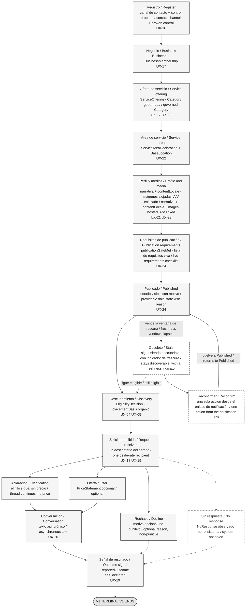

# Recorrido del proveedor / Provider Journey — Diagram Source

> **Estado / Status:** `PROPUESTA — VALIDACIÓN DEL OWNER REQUERIDA` / `PROPOSED — OWNER VALIDATION REQUIRED`. Procedencia / Provenance: `TECHNICAL_DISCOVERY`. Es una propuesta de arquitectura UX de P04, no un diseño aprobado ni una especificación visual. / This is a P04 UX architecture proposal, not an approved design and not a visual specification.
>
> **Supuestos de trabajo / Working assumptions:** `WA-01`–`WA-05` (ver / see `docs/04-ux/README.md`). `G-06` está SIN SATISFACER / is UNSATISFIED. `DAVID WORKING ASSUMPTION — OWNER VALIDATION PENDING`.
>
> **Audiencia / Audience:** Owner-facing. Bilingüe español + inglés según / bilingual Spanish + English per `AGENTS.md` and `diagrams/README.md`.

Este documento es una **fuente de diagrama**, no un documento de recorrido. No define estados de publicación, no define requisitos y no reemplaza a `docs/04-ux/provider-onboarding.md` ni a `docs/04-ux/provider-workspace.md`, que son las fuentes canónicas. No es diseño visual de producto: **no decide color, tipografía ni marca de ninguna superficie de Superola**. La sección 3 sí lleva una especificación de reproducción monocromática para volver a dibujar **este diagrama**, y sus valores son marcadores neutros de dibujo, no decisiones de producto. / This document is a **diagram source**, not a journey document. It defines no publication states, defines no requirements, and does not replace `docs/04-ux/provider-onboarding.md` or `docs/04-ux/provider-workspace.md`, which are canonical. It is not product visual design: **it decides no color, typography, or branding for any Superola surface**. Section 3 does carry a monochrome reproduction specification for redrawing **this diagram**, and its values are neutral drawing placeholders, not product decisions.

---

## 1. Documentos fuente y estado de evidencia / Source documents and evidence status

| Documento fuente / Source document | Qué aporta / What it supplies | Evidencia / Evidence | Procedencia / Provenance |
|---|---|---|---|
| `docs/04-ux/provider-onboarding.md` | Orden de incorporación, `publicationGateMet`, estados de publicación / Onboarding order, `publicationGateMet`, publication states | `PROPOSED` | `TECHNICAL_DISCOVERY` |
| `docs/04-ux/provider-workspace.md` | Bandeja de solicitudes, tipos de `ProviderResponse`, control de `RequestIntake` / Request inbox, `ProviderResponse` kinds, `RequestIntake` control | `PROPOSED` | `TECHNICAL_DISCOVERY` |
| `docs/01-product/user-journeys.md` §"Provider journey" | Bucle de valor mínimo coherente y salvaguardas de ciclo de vida / Smallest coherent value loop and lifecycle safeguards | `PROPOSED` | `TECHNICAL_DISCOVERY` |
| `docs/02-architecture/adr/ADR-005-no-availability-model-in-v1.md` | `RequestIntake` es estado de admisión, no disponibilidad; motivo de rechazo capturado / `RequestIntake` is an intake state, not availability; decline reason captured | `PROPOSED` | `TECHNICAL_DISCOVERY` |
| `docs/02-architecture/adr/ADR-006-discovery-owns-eligibility-ordering-and-placement.md` | Seis entradas nombradas; estado de publicación `Published`/`Stale` únicamente / Six named inputs; publication state `Published`/`Stale` only | `PROPOSED` | `TECHNICAL_DISCOVERY` |
| `docs/02-architecture/adr/ADR-018-media-zero-egress-storage-fixed-derivatives-and-link-out-for-audio-and-video.md` | Imágenes alojadas; audio y video enlazados, nunca subidos / Images hosted; audio and video linked, never uploaded | `PROPOSED` | `TECHNICAL_DISCOVERY` |
| `docs/02-architecture/decision-branches.md` `DB-01`, `DB-06`, `DB-10` | Un solo destinatario; web primero; qué promete "disponible" / One recipient; web first; what "available" promises | `PROPOSED` | `TECHNICAL_DISCOVERY` |
| `presentation/outline.md` §"owner-facing diagram sources" | El requisito de producir fuentes de diagrama bajo `diagrams/` / The requirement to produce diagram sources under `diagrams/` | `PROPOSED` | `DAVID_DIRECTIVE` |

**Estado de las decisiones citadas, en prosa / Status of the cited decisions, in prose.** La columna *Evidencia* usa exclusivamente las seis etiquetas de evidencia de `AGENTS.md`; el estado de un ADR es una cosa distinta y se dice acá, no en esa columna. `ADR-005`, `ADR-006` y `ADR-018` están **PROPOSED** como registros de decisión. El renglón de `presentation/outline.md` registra un requisito de entrega de P03.1, no una medición: su evidencia es `PROPOSED`. / The *Evidence* column uses only `AGENTS.md`'s six evidence labels; an ADR's status is a different thing and is stated here, not in that column. `ADR-005`, `ADR-006`, and `ADR-018` are **PROPOSED** as decision records. The `presentation/outline.md` row records a P03.1 deliverable requirement, not a measurement: its evidence is `PROPOSED`.

**Nada en este diagrama es medición.** No hay evidencia de tráfico ni de usabilidad — `SRC-006` NOT RECEIVED. / **Nothing in this diagram is measurement.** There is no traffic or usability evidence — `SRC-006` NOT RECEIVED.

---

## 2. Mermaid — la cadena del proveedor y el bucle de mantenimiento / Mermaid — the provider chain and the maintenance loop

### 2.1 Cómo leer el diagrama / How to read the diagram

| Español | English |
|---|---|
| **Crear una cuenta y aparecer en búsquedas son dos cosas distintas.** Para la cuenta hace falta un canal de contacto y probar que es suyo. Nada más. Para aparecer hace falta cumplir `publicationGateMet`, y el proveedor ve la lista de requisitos desde la primera pantalla. | **Creating an account and appearing in discovery are two different things.** The account needs a contact channel and proven control of it. Nothing else. Appearing needs `publicationGateMet`, and the provider sees the requirements checklist from the first screen. |
| **El bucle de mantenimiento es visible a propósito.** `Obsoleto` no esconde al proveedor: sigue siendo descubrible con un indicador de frescura. Reconfirmar es **una sola acción** desde el enlace de la notificación, y es la acción de mantenimiento más frecuente del producto. | **The maintenance loop is visible deliberately.** `Stale` does not hide the provider: they stay discoverable with a freshness indicator. Reconfirming is **one action** from the notification link, and it is the highest-frequency maintenance action in the product. |
| **Las cuatro salidas de una solicitud no son iguales.** Aclaración, oferta y rechazo son acciones del proveedor. *Sin respuesta* es un estado observado por el sistema, no una acción, y nunca se presenta como un juicio. | **The four request outcomes are not equivalent.** Clarification, offer, and decline are provider actions. *No response* is a system-observed state, not an action, and is never presented as a judgement. |
| **El rechazo no castiga.** El motivo es opcional, lo escribe el proveedor, nunca lo deriva un operador, y es el instrumento más barato del producto: convierte la pregunta de disponibilidad en una medición. | **Declining is not punished.** The reason is optional, provider-authored, never operator-derived, and it is the cheapest instrument in the product: it turns the availability question into a measurement. |
| **`RequestIntake` no es disponibilidad.** El proveedor controla `accepting` / `paused` / `unconfirmed`. Eso dice si quiere recibir solicitudes, no si una fecha está libre. | **`RequestIntake` is not availability.** The provider controls `accepting` / `paused` / `unconfirmed`. That states whether they want to receive requests, not whether a date is free. |

---

## 3. Excalidraw build specification

> **Scope of this section — read this before using any value in it.** This is a **monochrome reproduction specification for redrawing this one diagram**. Every measurement, hex value, font family, and font size below is a **neutral placeholder chosen so the diagram stays legible in grayscale**, on a projector, and in a printed handout. It is **not a product design token set**, not a brand palette, and not a type scale. **No product surface may take a color, a font, or a measurement from it.** Superola's visual design is not decided in P04 and is not decided here.

> **English only, deliberately.** Pixel offsets, stroke widths, hex values, and draw order are internal presentation-production support, which `AGENTS.md` classifies as English only; the owner will never read an offset table, so a parallel Spanish version would be a translated duplicate with no owner-presentation need. The diagram's content — box labels, arrow labels, the reading guide, the source table, and the never-show list — stays bilingual, and the literal strings that get **drawn on the canvas** remain bilingual inside the tables below because they are diagram content, not build metadata.

This repository has **no Excalidraw tooling**. This section is the normative source for rebuilding the diagram without re-deriving the journey.

### 3.1 Canvas and styling convention

| Property | Value |
|---|---|
| Canvas | 1620 × 1320, origin top-left `(0,0)` |
| Grid | 20 px step |
| Primary box | `rectangle` 220 × 90, `strokeColor` `#1e1e1e`, `backgroundColor` `#f5f5f5`, `fillStyle` `solid`, `strokeWidth` 1, `strokeStyle` `solid`, `roughness` 1, `roundness` type 3 |
| Exception box | `rectangle` 220 × 90, `strokeColor` `#8a8a8a`, `backgroundColor` `transparent`, `strokeStyle` `dashed` |
| Maintenance box | `rectangle` 220 × 90, `strokeColor` `#1e1e1e`, `backgroundColor` `transparent`, `strokeStyle` `dashed` |
| Terminal | `ellipse` 220 × 70, `backgroundColor` `#e6e6e6`, `fillStyle` `solid` |
| Primary arrow | `arrow`, `strokeColor` `#1e1e1e`, `strokeStyle` `solid`, `endArrowhead` `arrow`, `startArrowhead` `null` |
| Secondary arrow | `arrow`, `strokeColor` `#8a8a8a`, `strokeStyle` `dashed`, `endArrowhead` `arrow` |
| Maintenance arrow | `arrow`, `strokeColor` `#1e1e1e`, `strokeStyle` `dashed`, `endArrowhead` `arrow` |
| Text | `fontFamily` 2 (sans), `fontSize` 16, `textAlign` `center`, `verticalAlign` `middle`, `lineHeight` 1.25 |

**Stated grayscale convention.** Identical to Diagram B: three strokes (`#1e1e1e`, `#8a8a8a`, `#3d3d3d`), three fills (`#f5f5f5`, `transparent`, `#e6e6e6`), **no color**. Maintenance and exception are distinguished by **stroke color**, not fill, and both carry the distinction in words inside the box. These grays are a legibility floor for this drawing, not a palette for the product.

### 3.2 Ordered element list

The label column is **drawn content** and stays bilingual.

| # | ID | Type | Drawn bilingual label | x | y | w | h | Group |
|---|---|---|---|---|---|---|---|---|
| 01 | `T-TITLE` | `text` | `Recorrido del proveedor / Provider journey — Superola V1 (PROPUESTA / PROPOSED)` | 40 | 40 | 940 | 25 | — |
| 02 | `P01` | `rectangle` + bound text | `Registro / Register  ·  UX-16` | 40 | 100 | 220 | 90 | `g-onboard` |
| 03 | `P02` | `rectangle` + bound text | `Negocio / Business  ·  UX-17` | 300 | 100 | 220 | 90 | `g-onboard` |
| 04 | `P03` | `rectangle` + bound text | `Oferta de servicio / Service offering  ·  UX-22` | 560 | 100 | 220 | 90 | `g-onboard` |
| 05 | `P04` | `rectangle` + bound text | `Área de servicio / Service area  ·  UX-22` | 820 | 100 | 220 | 90 | `g-onboard` |
| 06 | `P05` | `rectangle` + bound text | `Perfil y medios / Profile and media  ·  UX-21 UX-23` | 1080 | 100 | 220 | 90 | `g-onboard` |
| 07 | `P06` | `rectangle` + bound text | `Requisitos de publicación / Publication requirements  ·  UX-24` | 1340 | 100 | 220 | 90 | `g-onboard` |
| 08 | `P07` | `rectangle` + bound text | `Publicado / Published  ·  UX-24` | 1340 | 300 | 220 | 90 | `g-live` |
| 09 | `P08` | `rectangle` + bound text | `Descubrimiento / Discovery  ·  UX-04 UX-05` | 1080 | 300 | 220 | 90 | `g-live` |
| 10 | `P09` | `rectangle` + bound text | `Solicitud recibida / Request received  ·  UX-18 UX-19` | 820 | 300 | 220 | 90 | `g-live` |
| 11 | `P10` | `rectangle` + bound text | `Aclaración / Clarification` | 1080 | 500 | 220 | 90 | `g-response` |
| 12 | `P12` | `rectangle` + bound text | `Oferta / Offer` | 820 | 500 | 220 | 90 | `g-response` |
| 13 | `P11` | `rectangle` + bound text | `Rechazo / Decline` | 560 | 500 | 220 | 90 | `g-response` |
| 14 | `P13` | `rectangle` (dashed, gray) + bound text | `Sin respuesta / No response` | 300 | 500 | 220 | 90 | `g-response` |
| 15 | `P14` | `rectangle` + bound text | `Conversación / Conversation  ·  UX-20` | 820 | 680 | 220 | 90 | `g-close` |
| 16 | `P15` | `rectangle` + bound text | `Señal de resultado / Outcome signal  ·  UX-19` | 820 | 860 | 220 | 90 | `g-close` |
| 17 | `P16` | `ellipse` + bound text | `V1 TERMINA / V1 ENDS` | 820 | 1040 | 220 | 70 | `g-close` |
| 18 | `S01` | `rectangle` (dashed, black) + bound text | `Obsoleto / Stale — sigue descubrible / stays discoverable` | 1340 | 500 | 220 | 90 | `g-maint` |
| 19 | `S02` | `rectangle` (dashed, black) + bound text | `Reconfirmar / Reconfirm — una acción / one action` | 1340 | 680 | 220 | 90 | `g-maint` |
| 20 | `T-MAINT` | `text` | `Bucle de mantenimiento / Maintenance loop` | 1340 | 460 | 260 | 20 | `g-maint` |
| 21 | `T-LANE1` | `text` | `Camino primario / Primary path` | 40 | 1220 | 400 | 20 | — |
| 22 | `T-LANE2` | `text` | `Caminos secundarios: punteado gris / Secondary paths: gray dashed` | 40 | 1260 | 700 | 20 | — |
| 23 | `T-LANE3` | `text` | `Mantenimiento: punteado negro / Maintenance: black dashed` | 40 | 1300 | 700 | 20 | — |

### 3.3 Grouping

| Group | Members | Why |
|---|---|---|
| `g-onboard` | `P01`–`P06` | The onboarding chain is one unit and ends at a threshold, not at a publication. |
| `g-live` | `P07`, `P08`, `P09` | The provider's live state. |
| `g-response` | `P10`–`P13` | The four request outcomes are one aligned set. |
| `g-close` | `P14`, `P15`, `P16` | The journey close. |
| `g-maint` | `S01`, `S02`, `T-MAINT` | The maintenance loop moves together and stays visually separated on the right. |

### 3.4 Arrows: source and target

| # | ID | Source | Target | From `(x,y)` | To `(x,y)` | Style |
|---|---|---|---|---|---|---|
| 01 | `A01` | `P01` | `P02` | 260, 145 | 300, 145 | primary |
| 02 | `A02` | `P02` | `P03` | 520, 145 | 560, 145 | primary |
| 03 | `A03` | `P03` | `P04` | 780, 145 | 820, 145 | primary |
| 04 | `A04` | `P04` | `P05` | 1040, 145 | 1080, 145 | primary |
| 05 | `A05` | `P05` | `P06` | 1300, 145 | 1340, 145 | primary |
| 06 | `A06` | `P06` | `P07` | 1450, 190 | 1450, 300 | primary |
| 07 | `A07` | `P07` | `P08` | 1340, 345 | 1300, 345 | primary |
| 08 | `A08` | `P08` | `P09` | 1080, 345 | 1040, 345 | primary |
| 09 | `A09` | `P09` | `P10` | 930, 390 | 1190, 500 | primary |
| 10 | `A10` | `P09` | `P12` | 930, 390 | 930, 500 | primary |
| 11 | `A11` | `P09` | `P11` | 930, 390 | 670, 500 | primary |
| 12 | `A12` | `P09` | `P13` | 930, 390 | 410, 500 | secondary |
| 13 | `A13` | `P10` | `P14` | 1190, 590 | 1000, 680 | primary |
| 14 | `A14` | `P12` | `P14` | 930, 590 | 930, 680 | primary |
| 15 | `A15` | `P14` | `P15` | 930, 770 | 930, 860 | primary |
| 16 | `A16` | `P11` | `P15` | 670, 590 | 860, 860 | secondary |
| 17 | `A17` | `P13` | `P15` | 410, 590 | 840, 860 | secondary |
| 18 | `A18` | `P15` | `P16` | 930, 950 | 930, 1040 | primary |
| 19 | `A19` | `P07` | `S01` | 1450, 390 | 1450, 500 | maintenance |
| 20 | `A20` | `S01` | `P08` | 1340, 520 | 1300, 370 | maintenance |
| 21 | `A21` | `S01` | `S02` | 1450, 590 | 1450, 680 | maintenance |
| 22 | `A22` | `S02` | `P07` | 1560, 725 | 1560, 345 | maintenance |

`A22` is the loop's return arrow and is drawn as a four-point polyline outside the right edge: `points` `[[0,0],[40,0],[40,-380],[0,-380]]`. It is the only arrow that leaves the column width, and that is deliberate: it makes the loop legible at a glance.

Arrow labels are drawn content and stay bilingual on the canvas: `A19` carries `vence la ventana de frescura / freshness window elapses`, `A20` carries `sigue elegible / still eligible`, and `A22` carries `vuelve a Published / returns to Published`. The freshness window length is **`POLICY PENDING`** and no number is written on the drawing.

---

## 4. Lo que este diagrama nunca debe mostrar / What this diagram must never show

| No dibujar / Never draw | Por qué / Why |
|---|---|
| **Ningún paso de reserva o pago** — sin cobro, sin depósito, sin pago al proveedor, sin devolución, sin disputa, sin reseña derivada de transacción, sin lenguaje con forma de dinero. | `WA-03`, `DB-02`. La oferta es terminal en V1. **V1 no tiene transición de aceptar que cree una obligación.** / The offer is terminal in V1. **V1 has no accept transition that creates an obligation.** |
| **Ninguna difusión ni fan-out** — sin cola de solicitudes distribuidas, sin ventana de respuesta compartida, sin límites de reparto, sin reencaminamiento. | `WA-02`, `DB-01`. El proveedor recibe solicitudes **menos numerosas y auto-seleccionadas**; la tasa de respuesta es atribuible al proveedor, no a la calidad del ruteo. / The provider receives **fewer, self-selected** requests; response rate is attributable to the provider, not to routing quality. |
| **Ningún calendario ni disponibilidad** — sin calendario del proveedor, sin sincronización externa, sin bloqueos de fecha, sin inventario de recursos, sin booleano de disponibilidad. | `ADR-005`, `WA-01`, `DB-10`. `V1 has no availability model.` `RequestIntake` es admisión, no disponibilidad, y "no acepta solicitudes" **nunca** se redacta como indisponibilidad de fecha. / `RequestIntake` is intake, not availability, and "not accepting requests" is **never** worded as date unavailability. |
| **Ningún mapa** — sin mapa del área de servicio, sin radio dibujado, sin pin de la ubicación base. | `ADR-019` nivel 3 / Level 3, y la invariante de privacidad: **la ubicación base precisa del proveedor nunca se expone públicamente.** El área declarada se muestra en palabras. / and the privacy invariant: **precise provider base location is never publicly exposed.** Declared coverage is stated in words. |
| **Ningún panel de CRM** — sin etapas de embudo, sin campos personalizados, sin etiquetas, sin acciones masivas, sin constructor de reportes, sin badges de tasa o tiempo de respuesta. | Canon `§5.14`: **no es un CRM.** Y las tasas y tiempos de respuesta nunca se exponen públicamente. Si una superficie no puede nombrar la decisión de marketplace que sustenta, no se lanza. / Canon `§5.14`: **not a CRM.** And response-rate and response-time badges are never publicly exposed. If a surface cannot name the marketplace decision it supports, it does not ship. |
| **Ningún estado `Suspended` visible al cliente** — el cliente ve `Published` y `Stale`, nada más. | `Suspended` no debe ser distinguible de `Deactivated` para un cliente. El proveedor sí ve su propio estado con motivo. / `Suspended` must not be distinguishable from `Deactivated` for a customer. The provider does see their own state with a reason. |

---

Este diagrama asume `WA-04` — web primero, responsivo obligatorio. La superficie de mayor riesgo móvil del producto es `UX-19`, responder a una solicitud, porque los proveedores trabajan desde el teléfono en la práctica (`DB-06`). Ese riesgo no se resuelve dibujándolo: se resuelve evaluando `UX-19` a ancho de teléfono antes de aprobar cualquier diseño visual. / This diagram assumes `WA-04` — web-first, responsive required. The product's highest-risk mobile surface is `UX-19`, responding to a request, because providers work from phones in practice (`DB-06`). That risk is not resolved by drawing it: it is resolved by evaluating `UX-19` at phone width before any visual design is approved.
