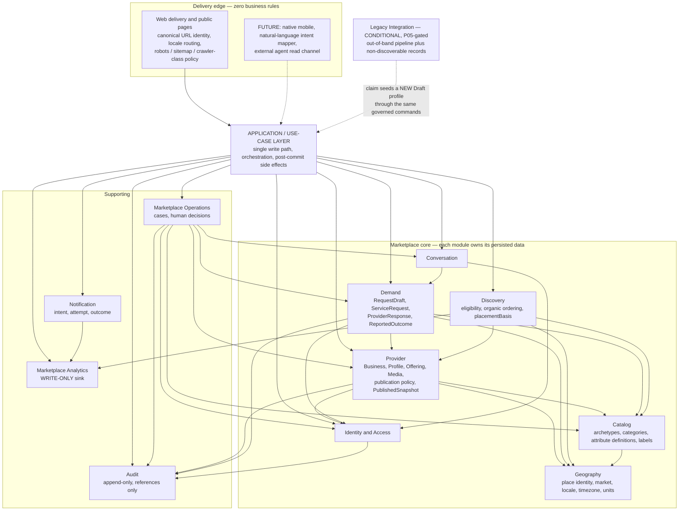

# Domain & Module Map — P02

> **Status:** `PROPOSED`. Provenance: `TECHNICAL_DISCOVERY`.
>
> **Standing qualifier:** `DAVID WORKING ASSUMPTION — OWNER VALIDATION PENDING`. The boundaries here are designed against a David-accepted design envelope (`SRC-013`), not against owner validation. The P01.1 release gate in `docs/01-product/owner-reconciliation-matrix.md` was **not** satisfied at P02 start: `G-06` and `G-10` unsatisfied; `G-01`, `G-04`, `G-05`, `G-07`, `G-09` partial. P02 proceeds under that document's own statement that the gate "is a readiness test, not an authorization." **Nothing here authorizes P04.**
>
> **Scenario stamp:** all operational, capacity, and cost statements in this document assume **S-1** (one launch geography, one production locale) per `docs/05-roadmap/mvp-scope.md` and `OR-003`/`OR-004`. Multi-country and multi-locale capability is an *architecture* requirement derived from `docs/00-context/product-context.md` and `AGENTS.md`, independent of any launch-market claim.

## Reading rules

These rules govern how this map may be used. They exist because the legacy platform's confirmed failures were governance failures, and because a diagram is the cheapest way to commit money without a decision.

1. **A module is not a deployment unit, service, process, database, team, or repository.** It is a conceptual ownership boundary. See `system-architecture.md` for the recommended deployment shape and `ADR-001`.
2. **A deferred capability may appear as a named future concern with no entity, no field, no relationship, and no box in an entity or domain-context diagram.** A clearly labelled out-of-scope box in a *layer*, *external-boundary*, or *owner-facing* diagram is permitted and commits nothing — the box states where something would attach, not that it exists. Booking, payment, payout, refund, dispute, review, calendar, availability, subscription, and sponsored campaign are named in this repository and **modelled nowhere**: the entity relationship overview in `domain-model.md` §1.13 contains none of them.
3. **Nothing becomes public or privileged as a side effect.** Publication, discoverability, and any future entitlement or placement are explicit governed transitions with an audit record.
4. **Never name a fact the platform cannot prove.** This constrains `verified`, `available`, `booking`, `conversion`, and `completed`. Naming is an architectural constraint here, not copywriting.
5. **Every accepted boundary carries three cost fields** — cost direction, dominant driver, and a measured reconsideration trigger — so `AGENTS.md`'s reconsideration-trigger obligation binds at design time rather than at the approval gate.
6. The reported ~43,000 legacy registrations are owner-reported and unaudited (`A-001`, `R-001`) and **may not size storage, indexes, compute, or operator capacity**.

## Recommended modules

Ten marketplace modules, one structural application layer, one cross-cutting audit facility, and one conditional legacy boundary.

| # | Module | Responsibility | Owns (authoritative) | Does NOT own |
|---|---|---|---|---|
| 1 | **Identity & Access** | Establish who an actor is and which contact channels they demonstrably control. | `Account`, `ContactChannel`, `VerificationFact`, `ConsentRecord`, party-to-party `Block`, coarse platform role, operator-imposed actor restriction state. | Business ownership or business-scoped permissions; marketplace roles; notification preferences; whether a message may be posted about a given request. |
| 2 | **Provider** | Own the provider side: the business, its publishable profiles and offerings, and the publication decision. | `Business`, `BusinessMembership`, `ProviderProfile`, `ServiceOffering`, `OfferingAttributeValue`, `ServiceAreaDeclaration`, `RequestIntake`, `MediaAsset`, `MediaRightsDeclaration`, `MediaReference`, `PublishedSnapshot`, per-field publication policy and its version, import provenance. | Taxonomy definitions; place identity; whether it appears in results; requests; entitlements. |
| 3 | **Catalog** | Govern what services exist and what each category structurally requires. | `Category`, `CategoryArchetype`, `CategoryAttributeDefinition`, `PublicationRequirement`, `CategoryProposal` queue, localized labels over stable identifiers. | Which provider offers what; relevance; place data; who approves a change (that is an Operations case). |
| 4 | **Geography** | Own canonical place identity and the locale, timezone, currency, and unit policy that depends on it. | `Place`, `PostalAddress` shapes, `GeoPoint`, `BaseLocation` role, `Market`, locale/currency/unit vocabularies, service-area representations and geo-match predicates. | Which provider serves where (that is Provider data expressed in this vocabulary); event location choice; relevance. |
| 5 | **Demand** | Run the customer-to-provider exchange lifecycle from private draft to reported outcome. | `RequestDraft`, `ServiceRequest`, `EventContext`, `RequestAmendment`, `ProviderResponse`, `PriceStatement`, `ReportedOutcome`. | Conversation content; provider profile truth; notification delivery; anything financial. |
| 6 | **Conversation** | Hold the asynchronous in-platform text attached to a request, under content governance. | `Conversation`, `Message`, `ThreadEvent`, retention/deletion/export scope, legal hold. | Request state; the offer (a business record in Demand); notification delivery; moderation decisions. |
| 7 | **Discovery** | Decide who is eligible to appear, in what order, and with what placement provenance. | `SearchIntent`, `ResultSet`, `PlacementSlot`, `EligibilityDecision`, `LocationEligibility`, organic ordering policy, zero-result and unmet-demand capture. | Taxonomy, profile facts, geometry, publication state, **and profile freshness state, which it reads from Provider rather than owning** — all derived, never authoritative. |
| 8 | **Notification** | Deliver a minimal alert about a marketplace action and make failure visible. | `NotificationIntent`, `DeliveryAttempt`, channel adapter boundary, suppression derived from hard delivery failure. | Message bodies; contact-channel verification or consent; whether the recipient responded. |
| 9 | **Marketplace Operations** | Run exception-only human cases and record who decided what, why, and when. | `Report`, `ModerationCase`, `ModerationDecision`, `OwnershipClaim`, `OwnershipEvidence`, `DuplicateSuspicion`, `ResponsivenessObservation`, `FreshnessObservation`, case queue age and ownership. | Provider, Demand, Conversation, Catalog, or Identity state — it issues **governed commands** to the owning module. |
| 10 | **Marketplace Analytics** | Record marketplace-meaningful facts that no aggregate owns, segmented so aggregates cannot hide a dead local market. | `MarketplaceEvent` vocabulary, append-only observation sink, segmentation dimensions. | Any business state. Any decision. |
| — | **Application / use-case layer** *(structural, not a domain context)* | The single write path for every present and future channel. | Orchestration, post-commit side effects, view composition across modules. | Any domain rule or invariant. |
| — | **Audit** *(cross-cutting facility)* | Answer "who did what, when, on whose authority" to a human, later. | Append-only `AuditRecord` holding actor, action, subject **reference**, outcome, basis, time, channel. | Domain state. Payload copies. Measurement. |
| — | **Legacy Integration** *(conditional; P05-gated)* | Hold imported records that are structurally incapable of entering the marketplace, plus the out-of-band pipeline. | `LegacyProviderRecord`, `ImportBatch`, `ClaimInvitation`, suppression list, lawful-basis and cohort markers. | Any live marketplace state. It never writes a `ProviderProfile` directly. |

### Cost annotation per module

Direction and dominant driver only. No figures — `docs/05-roadmap/mvp-scope.md` forbids fabricated ranges and `docs/03-technology/cost-model.md` is `INPUTS NOT VALIDATED`.

| Module | Cost direction | Dominant cost driver | Measured reconsideration trigger |
|---|---|---|---|
| Identity & Access | LOW | Contact-channel verification flows and their abandonment support | Measured verification abandonment rate exceeding the approved bound (`A-014`) |
| Provider | MEDIUM | Governed category attributes; media egress per anonymous public view | Egress per profile view or per active provider exceeding the approved unit ceiling |
| Catalog | LOW build / **MEDIUM-HIGH operator** | Taxonomy exception queue volume — the highest-ranked operator cost in the product | `CategoryProposal` volume and resolution time exceeding manual capacity |
| Geography | LOW | Place-data resolution coverage per country | Share of `undetermined` location-eligibility outcomes exceeding the approved bound |
| Demand | LOW-MEDIUM | Category-gated response machinery where archetypes require it | Share of declines attributed to date or resource unavailability (from the recorded decline reason) |
| Conversation | LOW | Retention, deletion, and abuse-evidence handling | Report volume per request exceeding operator capacity |
| Discovery | LOW in V1 | Query cost over source truth | p95 eligibility-and-rank latency exceeding the approved budget **after** tuning, with candidate-set size and query mix recorded |
| Notification | LOW-MEDIUM | Deliverability apparatus: domain authentication, bounce and complaint handling, suppression, sender reputation | Non-response share where delivery was **confirmed** |
| Marketplace Operations | **HIGH recurring** | Human case volume across taxonomy, duplicates, reports, stale supply, claim disputes | Case volume, backlog age, and resolution time per class exceeding manual capacity |
| Marketplace Analytics | LOW | Event volume | Measurement queries measurably degrading production latency |
| Audit | LOW | Retention period and restricted-read discipline | A compliance obligation the current model cannot produce |
| Legacy Integration | **Zero if no cohort is approved** | Manual review time ÷ unknown yield rate | Measured cost per publishable, reachable, request-eligible imported provider below measured cost per freshly acquired provider |

## Candidates challenged and rejected

The candidate list P02 was given is not a target. Every rejection below has a reason and a promotion trigger.

| Candidate | Disposition | Reason | Promotion trigger |
|---|---|---|---|
| **Provider Profile** as its own module | **MERGED into Provider** as a distinct aggregate | Publication requires Business standing **and** profile completeness **and** Catalog's publication requirements **and** media readiness, evaluated together and rejectably. Split across modules, that becomes a distributed invariant with no compensating benefit, and Business deactivation to profile un-publication becomes eventually consistent — a safety regression. `Business != ProviderProfile` is a *modelling* requirement, satisfied by distinct aggregates and distinct identifiers. | A launch or expansion category requires multiple independently published profiles per business with distinct staff permissions or independent moderation handling. |
| **Quote** | **REJECTED as a module and as an aggregate.** It is `ProviderResponse`, an entity inside the `ServiceRequest` aggregate | The request state transition to responded and the response's creation **must be atomic**, or a request reads "no response" alongside an orphan offer — which corrupts the `R-016` no-response measurement the entire loop depends on. Every stated response rule in `docs/01-product/user-journeys.md` is expressed in terms of request state. One customer, one provider, bounded response count: no contention justifies a separate root. | An offer must be referenced by a commitment that outlives request closure (`DB-02`), or category-structured offers acquire independent revision and approval workflows. |
| **Availability** | **REJECTED for V1.** `V1 has no availability model.` | `A-006` is `SUPERSEDED` and the universal model is `REJECTED`; `docs/05-roadmap/mvp-scope.md` defers date/resource availability, holds, realtime, and calendar sync; `OR-010`/`G-06` is an unresolved **owner** gate that the working envelope does not address. A rejection without a stated positive replacement is an invitation to design one, so the replacement is stated: `RequestIntake` is an **intake state**, not an availability claim, and date feasibility is resolved by the provider's response. | The owner's answer to `G-06`/`OR-010` makes "available" a reservable commitment; **or** the recorded decline reason shows date/resource unavailability above the approved share. |
| **Monetization** | **REJECTED as a module. Reserved seam.** | The seam is exactly three structural facts, all of which are required anyway: one named `EligibilityDecision` point that Provider and Discovery consult; `placementBasis` carried end to end; and per-provider value events. No plan, price, tier, trial clock, proration, or entitlement data exists. | Owner approves a subscription package (`OR-012`/`G-08`), or the first paid capability is scheduled. |
| **Marketplace Administration** as its own module | **MERGED into Marketplace Operations** | In V1 both produce the identical artifact: a case with intake, state, human decision, actor, and audit record. The distinction people want — automated enforcement versus human tooling — **does not exist in V1**, because there is no automated enforcement. Two modules would duplicate case, queue, and audit machinery for one small team. | Rule-based or classifier-based enforcement acts **without** a human case. |
| **Trust & Safety** as its own module | **MERGED into Marketplace Operations** | Same argument. The entity distinctions survive the merge: `Report` (a submission) is not `ModerationCase` (an operator work item) is not `ModerationDecision` (an auditable finding). | Same as above. |
| **Media** | **NOT A MODULE.** A capability inside Provider | The conversation baseline excludes attachments (`mvp-scope.md`), so media has exactly one consumer in V1. A module would serve one caller. The `MediaAsset` / `MediaReference` distinction is preserved as entities. | Conversation attachments ship, or a second consumer appears. |
| **Legacy Integration / Migration** | **NOT a runtime module.** An out-of-band pipeline plus one gated record boundary | Extraction, profiling, taxonomy mapping, duplicate scoring, cohort selection, rehearsal, reconciliation, and rollback live outside the application boundary and are disposable — P05 owns them. What persists is `LegacyProviderRecord` and `ImportBatch`, in a boundary whose records are structurally not `ProviderProfile`s. **Forbidden: any runtime read-through, proxy, or dual-write to the legacy platform**, which would make confirmed-broken legacy data a permanent liability of the new system. | A decision to keep legacy authoritative for some entity beyond cutover, or an approved cohort requiring continuous synchronisation. |
| **Public distribution** as its own module | **NOT A MODULE.** A delivery-edge concern over Provider's publication policy | Publication authority must sit with the owner of the data being published, or "what is public" has two sources of truth. Canonical URL identity, locale routing, robots, sitemap, and per-crawler-class policy are edge concerns whose **policy is governed data with a named owner and a single enforcement point**. | — |
| **Bookings, Payments, Subscriptions/Billing, Reviews** (present in the pre-P02 map) | **REMOVED as capabilities.** Named future concerns only | Reading rule 2. These four are exactly the rows an author converts to entities "for completeness," and doing so would design the Phase-1 domain around unvalidated Phase-2 concepts. | Transaction Extension approval (`G-02`/`A-004`). |
| **AI / Matching** (present in the pre-P02 map) | **REMOVED as a capability** | The optional intent experiment sits **outside** the domain and in front of it. Promoting it to a module creates an AI dependency inside the marketplace core, which contradicts `docs/07-research/ai-discoverability.md` and the working envelope's own constraint that the model is never the source of truth for eligibility or ranking. | An approved, budgeted, stoppable experiment demonstrates measured incremental value. |
| **Favorites** (present in the pre-P02 map) | **REMOVED.** Not in the V1 hypothesis | No actor outcome in `docs/01-product/actors.md` requires it. | Evidence of a customer outcome it serves. |
| **Events** as an aggregate | **REJECTED.** `EventContext` is a value object owned by the request | An `Event` aggregate imports an unsolvable identity problem — *are these two requests the same wedding?* — with no V1 payoff, because V1 has no booking or review that must attach to one real-world occasion. An optional customer-declared `eventGroupingHint` is carried so a future `Event` can be reconstructed without re-collecting data. | Transaction Extension approval, at which point bookings and reviews must attach to one occasion. |
| **Application / use-case layer** | **ADDED** (structural) | The single write path is what makes the future mobile, natural-language, and external-agent seams cheap, and what keeps business rules out of delivery adapters. The legacy platform's effective architecture was per-channel controllers with embedded rules. | — |
| **Audit** | **ADDED** (cross-cutting facility) | The pre-P02 trust minimum in `docs/01-product/feature-inventory.md` contains **no audit concept at all**, which makes claim, moderation, and deletion decisions indefensible later. Audit is written by the domain at decision points — not by the delivery channel, which does not know the basis, and not by storage triggers, which cannot name authority or intent. | — |

## Adjudicated boundary disputes

The specialists disagreed. These are the primary agent's resolutions, recorded so a reviewer can reopen them.

| Dispute | Resolution | Dissent preserved |
|---|---|---|
| Is there a separate **Public Projection & Distribution** boundary? | **No module.** Provider owns the per-field publication policy **and its version**; `PublishedSnapshot` is the versioned, allowlist-derived, rebuildable public projection; the edge owns URL identity, locale routing, and crawler policy as governed data with one enforcement point. | The security review argued for a boundary. Its substantive requirements are preserved as invariants: allowlist-derived (unknown fields **absent**, not passed through), versioned field set, rebuildable, and the search read path fed **only** through the publication policy — never from source tables. |
| Is there a separate **Legacy Import & Provenance** boundary? | **Yes — and this reverses an earlier primary-agent position.** `LegacyProviderRecord` is a distinct entity in a distinct boundary and is structurally **not** a `ProviderProfile`, so it cannot appear in discovery or receive a request. Claim **binds ownership; it does not publish** — it seeds a *new* `ProviderProfile` in `Draft` that must pass the same publication gate a fresh provider passes. The legacy record is retained, linked, and separable with `ImportBatch` provenance intact. | The solution architect argued for one store with import writing through governed provider commands. That argument is honoured where it matters: profile creation on claim goes through the same governed commands. Import itself writes only legacy records. |
| Where does **BusinessMembership** live? | **Provider.** A business-scoped relationship belongs with `Business`; placing it in Identity drags marketplace concepts into the access module. | The security review placed it with parties. Its substantive requirements hold either way: ownership is a **revocable relation, never a column**, and every action records the acting `Account` plus the `Business` acted for. |
| Where does **Block** live? | **Identity & Access**, as a party-pair relationship, because it must survive request closure, apply to future requests, and be read on the hot path by both Demand and Conversation. Operator-imposed **actor restriction** is a separate state, also on the party, applied only by governed command from Operations. | The solution architect self-flagged this as the least principled placement in the design. A user-initiated block is a party relationship; a moderation-imposed restriction is a decision outcome. The split is what keeps both honest. |
| Does **Audit** live in Analytics? | **No.** Analytics is write-only, lossy-tolerant, and never a source of truth. Audit must be complete, never sampled, and **must not be deletable by the same path that deletes domain data** — or a deletion request erases the evidence that it was requested. | — |

## Dependency direction

Two rules stated once: **any module may write to Analytics; no module may ever read from it.** **Audit is written by the domain at decision points and read only by an operator role, and that read is itself audited, with a recorded operational purpose (`DAVID_DIRECTIVE`, 2026-08-11, `SRC-014`).**

> **P03 note, recorded rather than applied.** P03 initially softened the Analytics rule to *"as an input to a decision"*, on the theory that the absolute phrasing forbade viewing the funnel. **That edit was withdrawn on adversarial review, because the premise was wrong:** `docs/03-technology/technology-evaluation.md` §4.11 answers the funnel with **SQL against the transactional store**, not with Analytics reads, so the conflict never arises on the recommended design. The absolute rule stands, the forbidden-dependency row below stands, and the build-failing architecture rule *"no module reads Analytics"* enforces the strong form. **No technology constraint justified weakening it.**

### Forbidden dependencies

| Forbidden | Why | Instead |
|---|---|---|
| `Provider → Demand` | Publication and profile truth must not depend on request volume. It is also the back door through which demand signals leak into ranking. | `RequestIntake` is **provider-declared**, never demand-derived. |
| `Discovery → Demand` | The same failure in direct form: response rate or lead volume becoming a relevance term with no governance (`R-004`). | If responsiveness ever becomes a ranking input, a governed process computes it and **publishes it as a provider quality attribute on Provider**, which Discovery reads. Inverted dependency, explicit governance. |
| `Catalog / Geography / Provider → Discovery` | Governed data must not know about relevance. Also a cycle. | Discovery pulls. Source modules never learn it exists. |
| `Demand → Conversation` | Would couple request lifecycle to chat, cycle with `Conversation → Demand`, and fuse two different retention clocks. | The offer and the request detail are Demand records. Conversation opens lazily on first message. |
| `Notification → Conversation` | Enforces "minimal sensitive content" structurally rather than by reviewer vigilance. | The payload is a pointer; the recipient reads content in-platform. |
| Any domain module → `Notification` | Domain semantics must be independent of delivery channel. | The application layer commits the domain transaction **and the delivery intent together**, then dispatches out of band (**corrected by P03**, `R-044`). Delivery state is composed into views by the application layer, never read by Demand. |
| Any hot path → `Marketplace Operations` | Operational tooling must never sit on a public read path. | Moderation outcomes are applied as governed state transitions on the owning aggregate. |
| Any module → `Marketplace Analytics` (read) | Prevents an observation sink from becoming a source of truth. | Derive from domain state. |
| Anything → the legacy platform at runtime | Would make confirmed-broken legacy data a permanent liability. | Out-of-band pipeline; edge-level routing for coexistence. |
| `Identity & Access → Provider / Demand` | Keeps the access module generic; marketplace roles must not accumulate there. | Identity owns the subject and coarse role. Provider owns `BusinessMembership` and business-scoped permissions. Authorization is subject plus relationship plus the owning module's state-dependent policy. |
| Any module → the natural-language or AI experiment | The model must never be the source of truth for eligibility or ranking. | The experiment sits in front of the application layer and emits the same structured query object the deterministic form emits. The dependency arrow points one way and the product is fully functional with the experiment disabled. |
| Cross-module query joins or referential constraints | This is what makes later extraction expensive, and it is the real trap in a single deployable — not the shared process. | Modules own their data; cross-module references are by identifier only; composition happens in the application layer or in a read model owned by one module. |

### Where inversion or a read model is genuinely required

| Situation | Minimum sufficient answer |
|---|---|
| Notification triggered by a marketplace action | **Corrected by P03** (`system-architecture.md` §4, `R-044`): the durable delivery intent commits **with** the domain transaction; the external send happens afterwards, out of band, with retry and an idempotent effect. One producer, one consumer. Not a bus. |
| Analytics | One-way append. No consumer makes a decision. Not a bus. |
| Delivery state shown on a request | The application layer composes Demand plus Notification for the view. No domain dependency. |
| Responsiveness as a future relevance input | Inverted: a published provider quality attribute on Provider. |
| Category-specific request validation | `Demand → Catalog` calls a **validation contract**, never reads raw definition rows — otherwise Demand re-implements taxonomy rules. |
| Search result freshness | In V1, none. Discovery queries source truth directly, so freshness is read-your-writes and free. See `search-architecture-requirements.md`. |

**V1 requires no event bus.** Every deferred action in V1 has exactly one known consumer and one known effect. The requirement is durable deferred work; the mechanism is a P03 decision. See `system-architecture.md`.

## Sources

`AGENTS.md` · `docs/00-context/product-context.md` · `docs/00-context/assumptions.md` (`A-001`, `A-004`, `A-006` `SUPERSEDED`, `A-007`, `A-009`, `A-011`, `A-014`) · `docs/01-product/feature-inventory.md` · `docs/01-product/user-journeys.md` · `docs/01-product/actors.md` · `docs/01-product/product-vision.md` · `docs/01-product/monetization.md` · `docs/01-product/owner-reconciliation-matrix.md` · `docs/05-roadmap/mvp-scope.md` · `docs/05-roadmap/risks.md` (`R-004`, `R-010`, `R-013`, `R-015`, `R-016`, `R-018`, `R-019`) · `docs/06-migration/legacy-data-strategy.md` · `docs/07-research/ai-discoverability.md` · `SRC-013`.
