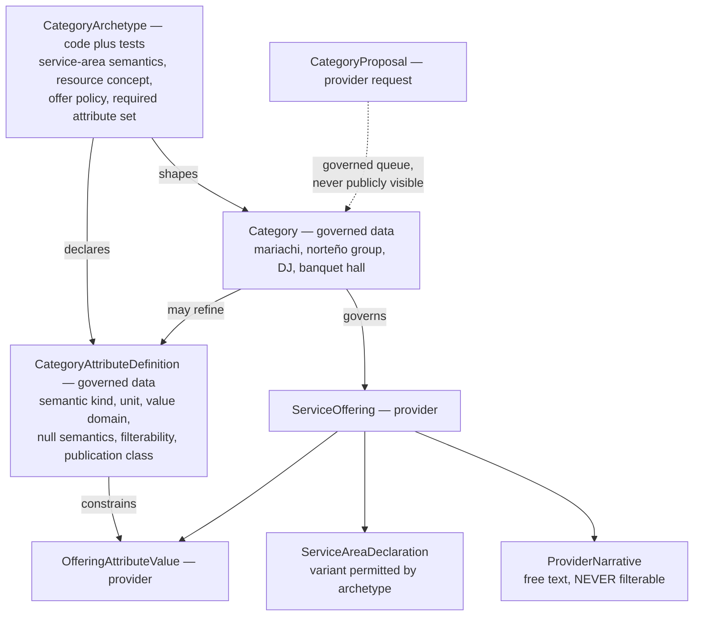
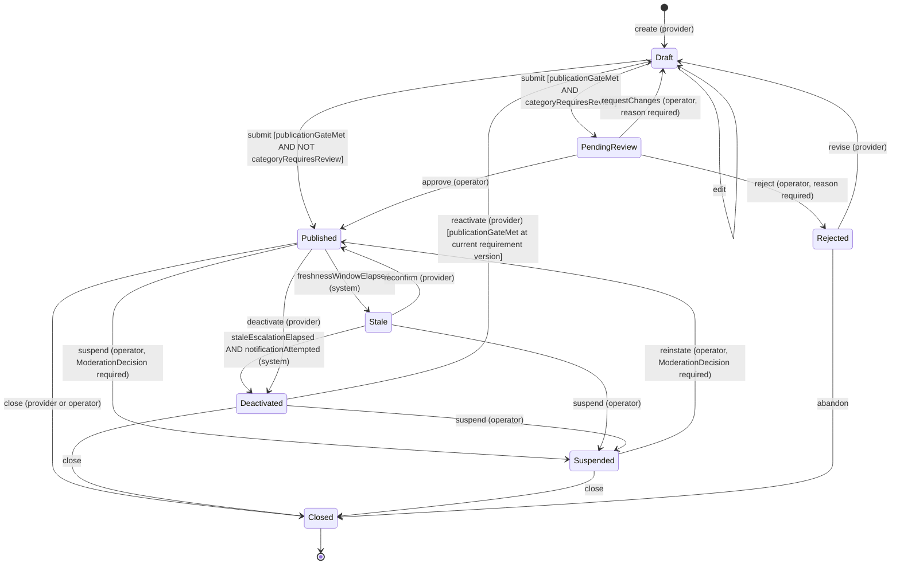
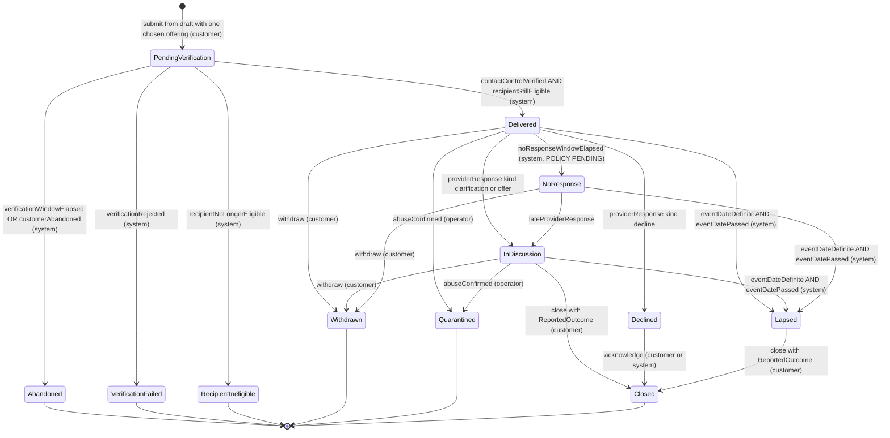
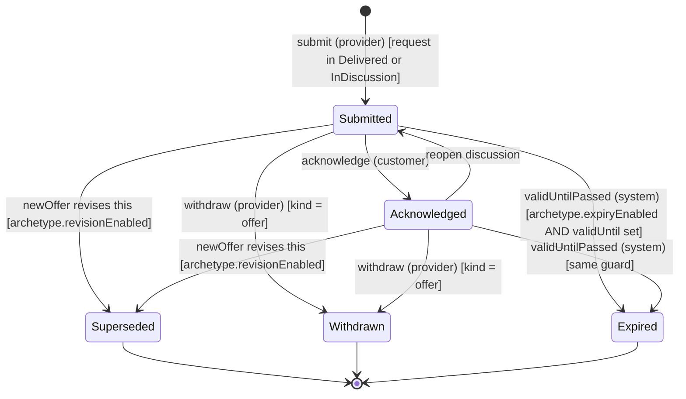
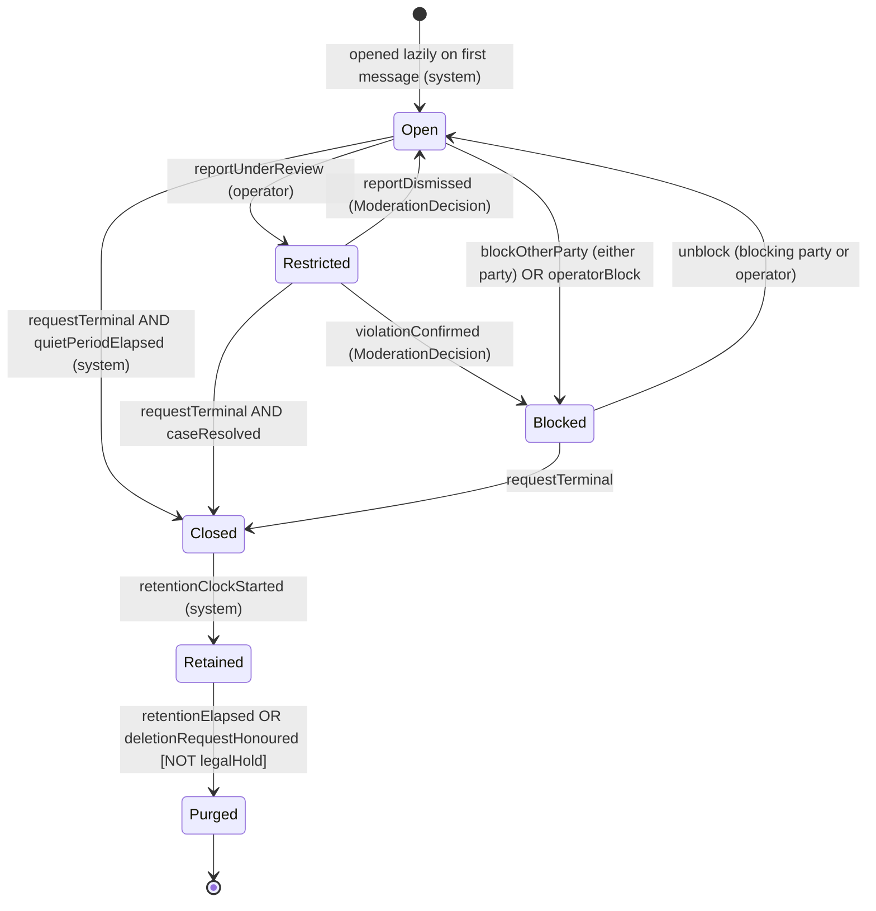
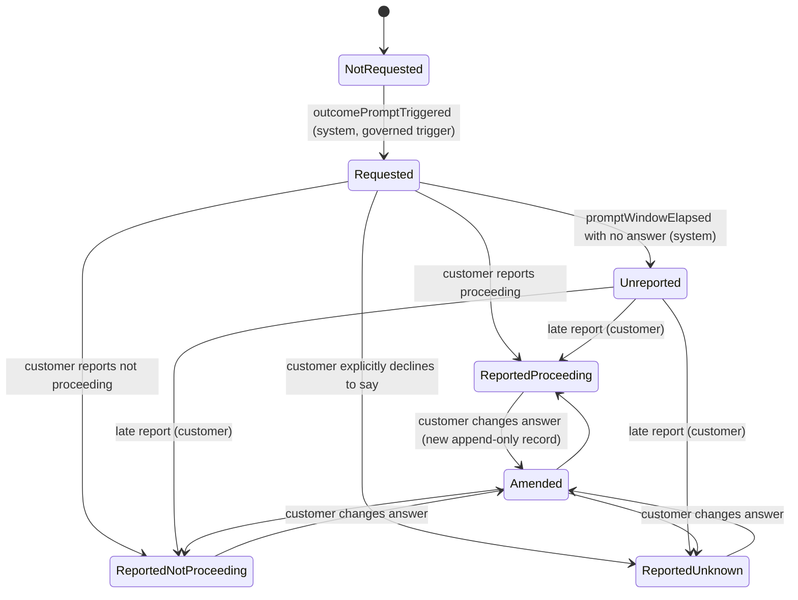
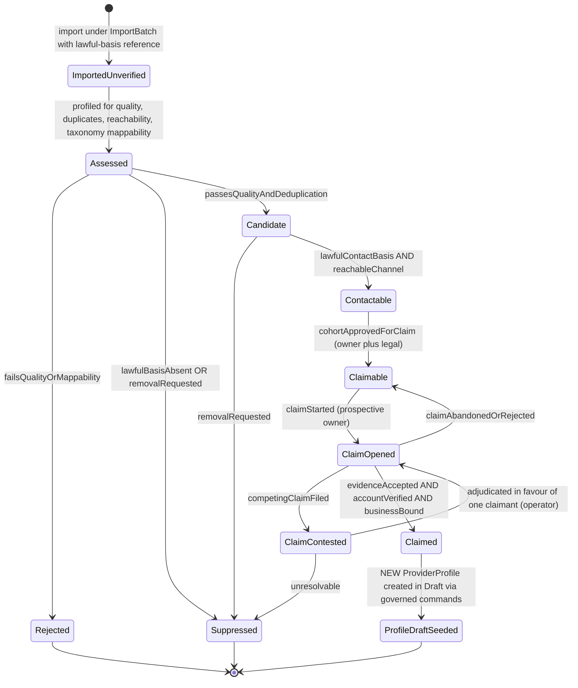
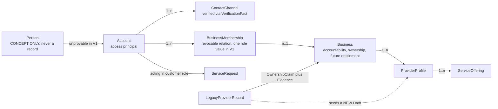

# Conceptual Domain Model — P02

> **Status:** `PROPOSED`. Provenance: `TECHNICAL_DISCOVERY`.
>
> **Standing qualifier:** `DAVID WORKING ASSUMPTION — OWNER VALIDATION PENDING` (`SRC-013`). The P01.1 release gate was not satisfied at P02 start; `G-06` and `G-10` are unsatisfied. **Nothing here authorizes P04.**
>
> **Scenario stamp:** operational statements assume **S-1** (one launch geography, one production locale). Multi-country and multi-locale capability is a structural requirement independent of launch scope.
>
> **Hard boundary:** this document contains **no physical database tables, SQL, DDL, column types, indexes, or persistence schema**, and selects no persistence technology. Attributes below are *concepts*. Module names come from `domain-map.md`.

## Modelling rules

1. A deferred capability appears as a named future concern with **no entity, no field, no relationship, and no box in an entity or domain-context diagram**. A labelled out-of-scope box in a layer or owner-facing diagram commits nothing; §1.13's entity relationship overview is the test, and it contains no deferred concept.
2. Never name a fact the platform cannot prove. `verified`, `available`, `booking`, `conversion`, and `completed` are all constrained by this.
3. Absence must be distinguishable from negation. `unknown` is never silently treated as matching or as not-matching.
4. Every quantity carries its unit; every monetary value carries its currency; every instant carries the zone it belongs to.
5. Every governed vocabulary uses a stable language-neutral identifier with separately localized labels. A label is never an identifier.
6. No entity contains a hard-coded country, locale, currency, or measurement system.

---

## 1. Entities

### 1.1 Identity & Access

| Entity | Purpose | Identity concept | Key attribute concepts | Key invariants | Status |
|---|---|---|---|---|---|
| **Account** | The authenticated principal that can act in the marketplace. | Opaque, permanent, internal. **Never an email or phone number.** | credential-control state, UI locale preference, lifecycle state | Exactly one Account per credential set. An Account is **not typed** customer or provider — role is derived from what it does (§2.10). Deleting credentials must not delete commercial records. | V1 |
| **Person** | The human behind an Account. | — | — | **REJECTED as a record. KEPT as naming discipline.** Superola cannot prove human identity in V1; creating a Person record invents an identity-resolution problem it cannot solve and invites a false "verified" claim (`Q-014`). | Concept only |
| **ContactChannel** | A reachable address whose control can be proven and whose disclosure is policy-governed. | (Account, channel kind, normalized value) | kind, normalized value, deliverability state, provenance | Verification is per-channel, not per-account. A channel that fails delivery is **degraded, not unverified** — delivery failure is never evidence about the party. | V1 |
| **VerificationFact** | A typed, expiring, revocable record that a specific claim about a subject was proven by a specific method at a specific time. | (subject, claim type, verified-at) | subject reference, claim type, method class, evidence **reference**, verified-at, verified-by, revoked-at | **Verification is never a boolean on a Business or an Account.** V1's only honest claim type is *control of this contact channel was proven at time T*. Two consumers, one mechanism: the Provider publication gate and the request delivery predicate. | V1 |
| **ConsentRecord** | An auditable record of consent given for a named purpose. | (Account, purpose class, policy version, granted-at) | purpose class, policy version, granted-at, withdrawn-at, source, evidence | Append-only; withdrawal never erases the prior grant, and **unsubscribe is not delete**. Minimum two separable purpose classes: **transactional/service** and **marketing/reactivation**. Conflating them makes legacy reactivation unusable and degrades transactional deliverability. | V1 |
| **Block** | A party-pair relationship preventing further interaction. | (blocking party, blocked party) | created-at, revoked-at | Survives closure of any request and applies to future ones. Read on the hot path by Demand and Conversation. **User-initiated only.** | V1 |
| **ActorRestriction** | Operator-imposed limitation on a party's participation. | (party, decision reference) | state (`unrestricted` / `restricted` / `suspended`), decision reference | Applied **only** by governed command from Marketplace Operations. A distinct lifecycle from content moderation state (§7.2). A restriction on an Account must not orphan a Business that has independent obligations. | V1 |

### 1.2 Catalog

| Entity | Purpose | Identity concept | Key attribute concepts | Key invariants | Status |
|---|---|---|---|---|---|
| **CategoryArchetype** | The *service-shape family* that determines which service-area semantics, resource concept, offer policy, and attribute set apply. | Stable identifier from a small closed set. | permitted service-area variants, resource concept (descriptive), offer policy flags, required attribute set | **Adding a Category is a governance act; adding an Archetype is an engineering act.** Every Category binds to exactly one Archetype. This is the keystone of §3. | V1 |
| **Category** | A governed taxonomy node customers search by and operators measure by. | Stable, language-neutral. Slug is a locale-bound alias with retained redirect history. | parent, localized labels and synonyms per locale, archetype binding, lifecycle state, publication requirements | **Only operators create Categories.** Provider input can only ever become a `CategoryProposal`. Deprecation must record `merged_into` so search, public URLs, measurement, and migration survive. | V1 |
| **CategoryAttributeDefinition** | The governed definition of one attribute a category's offerings may carry. | (Archetype or Category, attribute key) | semantic kind, unit, allowed value domain (language-neutral IDs plus localized labels), cardinality, **null semantics**, **filterability**, publication class, required-for-publication | Never provider-writable. **Null semantics is mandatory** — the legacy saturation failure came from treating missing as matching. Filterability is governed, per-`Market`, and **revocable** (§3.4). | V1 |
| **PublicationRequirement** | The governed minimum a profile and its offerings must satisfy per category to be published. | (Category, version) | required attributes, required media roles, required geographic resolution, prohibited-content policy version | Versioned. A profile records **which version it satisfied**, or raising the bar silently unpublishes existing supply. | V1 |
| **CategoryProposal** | A provider's request for a category that does not exist. | (Account, submitted-at) | requested label, free text, state | **Never publicly visible, never searchable, never a taxonomy node, never a public URL** until an operator creates a governed Category. This single rule — not the modelling choice — is what prevents the legacy taxonomy failure from recurring (`A-009`). | V1 |

### 1.3 Provider

| Entity | Purpose | Identity concept | Key attribute concepts | Key invariants | Status |
|---|---|---|---|---|---|
| **Business** | The commercial party that offers services and bears accountability, ownership, and future entitlement. | Opaque, permanent. | display name, self-asserted legal-name claim (unverified), country of operation, lifecycle state, provenance (`self_established` / `legacy_seeded`) | A sole practitioner **is** a Business — no Person/Business polymorphism. Suspension attaches here, not to the profile. Outlives the Account that created it. No business-registry verification in V1. | V1 |
| **BusinessMembership** | Binds an Account to a Business with a role. | (Account, Business) | role, granted-by, granted-at, revoked-at | **A revocable relation, never an owner reference on Business.** V1 ships the relation with exactly **one** role value. The relation is not deferrable even though roles are: a direct owner reference would require rewriting every authorization decision and migrating every business when staff arrive. | V1 (relation); roles later |
| **ProviderProfile** | The marketplace-facing presentation and credibility artifact for a Business. | Opaque, permanent. Public slug is a locale alias with retained redirect history. | narrative text plus content locale, media references, publication state, freshness state, satisfied requirement version, provenance | Belongs to exactly one Business; a Business may have more than one. Renaming or re-categorizing **never** changes the identifier. | V1 |
| **ServiceOffering** | One governed category of service this provider offers — **the unit of discovery eligibility**. | Opaque; (Profile, Category) is unique. | Category, `BaseLocation`, `ServiceAreaDeclaration`, attribute values, optional price indication, `RequestIntake` | **Discovery matches Offerings, not Profiles.** Service area attaches here, not to the Profile, because archetype semantics differ per offering. A mariachi that also DJs is one Business, one Profile, two Offerings. | V1 |
| **OfferingAttributeValue** | A provider-supplied value bound to a governed definition. | (Offering, attribute key) | values, unit as entered, canonical value, as-of | Must reference an existing `CategoryAttributeDefinition`. **No orphan or ad-hoc keys** — that is the legacy failure in miniature. | V1 |
| **ProviderNarrative** | Free-text provider description. | part of Profile or Offering | text, content locale, moderation state | **Never filterable, never taxonomy, never an attribute source.** Named explicitly so it is not quietly mined into facets. | V1 |
| **ServiceAreaDeclaration** | The provider's **claim** about where it will serve. | (Offering, version) | archetype-permitted variant, parameters, unit, conditions text, as-of | It is a claim, not a platform fact — hence the name. The variant must be permitted by the Offering's archetype. See §4.2. | V1 |
| **RequestIntake** | Whether this offering is currently willing to receive requests. | (Offering) | state (`accepting` / `paused` / `unconfirmed`), paused-until, last-confirmed-at, optional provider-authored reason | **Deliberately not named availability.** `A-006` is `SUPERSEDED`; the word on this concept *is* the failure mode. A stale `accepting` **decays to `unconfirmed`** after a governed freshness window — an unrefreshed positive signal is how a marketplace becomes a graveyard of stale contacts (`R-016`). See §7.1. | V1 |
| **MediaAsset** | The stored object plus technical metadata, rights declaration, and moderation state. | Opaque. | technical metadata, moderation state, processing state | Rights and moderation attach **once, to the asset**. Deleting a placement must not destroy moderation evidence. | V1 |
| **MediaRightsDeclaration** | The provider's acknowledgement of rights to use an asset. | (Asset, policy version) | policy version, acknowledged-at | Versioned, append-only. | V1 |
| **MediaReference** | An ordered, role-typed, captioned **placement** of an asset on a Profile or Offering. | (holder, asset, position) | role, position, caption, alternative text | Presentation, ordering, role, and alternative text attach here — accessibility is a property of the placement, not the asset. The same asset may be referenced by two offerings. | V1 |
| **PublishedSnapshot** | The versioned, allowlist-derived public projection of a profile. | (Profile, version) | published field set, publishable-field-set version, published-at, canonical resource identity, satisfied requirement version | **Allowlist-derived: a field is public because it is explicitly marked publishable; unknown fields are absent, not passed through.** Rebuildable from source at any time. The field-set version is recorded so *"was this field public on date D?"* is answerable, and so a moderation case can prove what was public when a report was filed. | V1 |
| **ImportProvenance** | Where a provider-side record came from, per record **and per field**. | attached to Business / Profile / Offering | source system, source record identifier, batch identity, extracted-at, transformation, lawful-basis reference | Field-level origin is required because a migration mixes imported values with provider-corrected values in one record; without it, *"is this data ours or theirs?"* is unanswerable — which is the difference between a deletion request you can honour and one you cannot. | V1 (only if a cohort is approved) |

### 1.4 Geography

| Entity | Purpose | Key attribute concepts | Key invariants | Status |
|---|---|---|---|---|
| **Place** | A governed geographic reference node. | stable language-neutral identifier, governed `placeKind`, parent chain, canonical name, localized names, synonyms, optional representative point and bounding box | **Variable-depth hierarchy with a governed place kind — not a fixed country / state / city triple**, which breaks the moment you leave the origin country. Depth is data, not structure. Provider-typed place text is a *resolution input*, never a Place. | V1 |
| **PostalAddress** | A locale-variant structured address supplied by a party. | country-shaped structured fields plus a free-form fallback line | Privacy-classified; never required to be fully public. Postal codes are a *zone vocabulary* for delivery archetypes, not a universal geography. | V1 |
| **GeoPoint** | Coordinates with quality metadata. | value, **precision**, **provenance**, as-of | **Precision and provenance are mandatory. A GeoPoint without sufficient precision may not drive distance eligibility.** This is the direct structural fix for the reported legacy defect that providers appear in incorrect locations. | V1 |
| **BaseLocation** | The operating origin of an Offering. | Place plus optional GeoPoint plus optional PostalAddress | Distinct from service area and from service location. Three different meanings, three different concepts. | V1 |
| **Market** | A governed (**Category** × Place-at-a-stated-granularity) pair. **Category, not archetype, and one stated granularity** — an archetype-keyed market strictly contains the category-keyed markets inside it, so mixing keys would double-count the per-market liquidity this unit exists to measure. An archetype-level rollup is a *derived aggregate over* markets, never a market. | category reference, place reference, stated granularity | **One concept serving three consumers**: the liquidity-segmentation unit required by `docs/01-product/product-vision.md`, the named-market service-area vocabulary, and the future sponsored-inventory unit. The owner's "Mariachi + Chicago" is a Market. Three separate definitions of this unit would make organic health and paid inventory unreconcilable (`Q-021`). | V1 |
| **Locale / Currency / UnitSystem** | Vocabularies, in explicit roles. | — | Locale appears in **three separate roles**: `contentLocale` (the language of one piece of authored content), `uiLocale` (an account preference), and `marketLocales` (what a Market supports). Currency is on **every** monetary value and is independent of country. Units are stored as entered **and** canonically. | V1 |

### 1.5 Discovery

| Entity | Purpose | Key invariants | Status |
|---|---|---|---|
| **SearchIntent** | A customer's expressed constraint set plus its result summary. | **Non-durable in V1: analytics only.** It creates no recipient, no consent, no reachable owner, and no obligation. It must never become a broadcast. Zero-result searches are a named demand signal. See §10 for the `DemandWatch` question this forecloses. | V1 (non-durable) |
| **ResultSet** / **PlacementSlot** | The ordered candidate list, where each slot carries its basis. | Every slot carries **`placementBasis`** (V1: always `organic`), a disclosure marker, and a ranking explanation. This is the sponsored seam. Organic ordering takes **organic inputs only**. The forbidden anti-pattern is a `featured` boolean on a profile (`R-004`). | V1 |
| **EligibilityDecision** | The single named concept answering *may this offering appear, or receive this request?* | Named inputs: publication state, category eligibility, `LocationEligibility`, `RequestIntake` state, trust state, and **entitlement (constant in V1)**. **One decision concept, not scattered conditionals** — this is the subscription seam. It must never gain a "paid" branch; paid placement is a separate pipeline. | V1 |
| **LocationEligibility** | Three-valued geographic eligibility: `eligible` / `ineligible` / `undetermined`. | **The three-valued result is load-bearing.** `undetermined` must be representable and surfaced — never silently coerced to `eligible` (legacy saturation) nor to `ineligible` (hides real supply, produces false empty results). | V1 |

### 1.6 Demand

| Entity | Purpose | Identity concept | Key attribute concepts | Key invariants | Status |
|---|---|---|---|---|---|
| **RequestDraft** | The customer's private, reusable, pre-delivery request content. | Account-scoped. | event context content, category, last-edited-at | **Has no recipient and is never visible to any provider.** Reuse requires deliberate selection and fresh confirmation per recipient. Required by the B0 envelope — and it is the `DB-01` seam (§9). | V1 |
| **ServiceRequest** | A durable, delivered demand artifact addressed to exactly one Offering. | Opaque, permanent. | requesting Account, recipient Offering, `EventContext`, category-scoped detail values, lifecycle state, consent reference, verified-contact snapshot | **Exactly one recipient Offering, immutable after delivery.** No recipient sets, no routing, no fan-out, no shared response window, no auto-closure of siblings, no reroute. **This invariant is not implemented as a collection of size one** — see §9. Material changes are `RequestAmendment` records, never in-place edits. | V1 |
| **EventContext** | The event facts a request carries. | value object owned by the request | occasion type, date or window or flexible, service-location constraint, guest-count indication, budget indication, **the service location's timezone** | A value object, **not an `Event` aggregate** — an aggregate would import an unsolvable *"are these two requests the same wedding?"* identity problem with no V1 payoff. Carries an optional customer-declared `eventGroupingHint` so a future `Event` can be reconstructed without re-collecting data. | V1 |
| **RequestAmendment** | An append-only record of a material change after delivery. | (Request, sequence) | changed facts, changed-at, acknowledgement state | Notifies; **does not automatically invalidate** an outstanding offer. Auto-invalidation is archetype-gated. | V1 |
| **ProviderResponse** | The provider's answer to a request. | (Request, sequence) | kind ∈ {`clarification`, `decline`, `offer`}, body text plus content locale, **optional decline reason**, optional `PriceStatement`, optional valid-until, optional revises-link, lifecycle state | The **universal** response is clarify / decline / minimum text offer. Structured fields, revision machinery, and expiry are **archetype-gated**. 0..n per request — which is what makes `NoResponse` observable. **The recorded decline reason is the free instrument that answers the availability question from Phase-1 data at no cost.** | V1 |
| **PriceStatement** | A monetary statement with the context that makes it honest. | value object | **currency (always explicit)**, basis, amount or range, inclusions, exclusions, conditions, as-of | Direct implementation of a P01 invariant: a price needs currency, basis, inclusions and exclusions, conditions, and freshness rather than a naked number. **No implicit currency, ever.** | V1 |
| **ReportedOutcome** | The customer's self-declared statement of what happened. | (Request, sequence) | value ∈ {`proceeding`, `not_proceeding`, `unknown`}, reported-by, reported-at, basis = `self_declared` | **Never derived from platform activity. Never labelled conversion, booking, payment, or completion.** Append-only. `unknown` (an explicit answer) is **not** `Unreported` (silence) — collapsing them corrupts every marketplace-health number. Customer-only in V1: a provider claim would create a conflicting assertion with no adjudication mechanism. | V1 |

### 1.7 Conversation

| Entity | Purpose | Key invariants | Status |
|---|---|---|---|
| **Conversation** | The durable in-platform thread attached to a request. | Participants are **fixed at creation**. Exactly one per request in V1, but a separate entity because its retention clock, privacy class, and moderation state diverge from the request's marketplace state. Opened lazily on first message. Closing a request never deletes conversation evidence. | V1 |
| **Message** | One user-authored entry. | Append-only. Author role, content locale, moderation state. **Content never leaves this boundary** into notification payloads, search read paths, analytics events, or public output. **Assume it contains contact data regardless of policy** (§7.4). No attachments, presence, typing, read receipts, or audio/video in the baseline. | V1 |
| **ThreadEvent** | A system-generated marker in the thread. | Distinct from `Message` so a system marker is never counted as a user message, moderated as user content, or attributed to a party. | V1 |
| **LegalHold** | A flag blocking purge regardless of retention or deletion request. | Must be explicit, auditable, and reason-bearing. | V1 |

### 1.8 Notification

| Entity | Purpose | Key invariants | Status |
|---|---|---|---|
| **NotificationIntent** | The decision that a party should be informed of a domain event, under a minimal-content policy. | Created **after** the domain transaction commits. Survives channel failure. Idempotent, so retries cannot duplicate a marketplace effect. Payload is a **reference**, resolved through a disclosure decision at render time. | V1 |
| **DeliveryAttempt** | One attempt on one channel with an outcome. | Failure is attributable to the attempt and is **never evidence of provider non-response**. Its retention class differs from message retention. A failed notification never rolls back the marketplace action. | V1 |

Three things routinely conflated and here kept distinct: **verified** (control proven), **consented** (permission given), **deliverable** (the channel currently works).

### 1.9 Marketplace Operations

| Entity | Purpose | Key invariants | Status |
|---|---|---|---|
| **Report** | A party's submission that something violates policy. | Available to an authenticated participant and **must not require the reported content to still be visible**. The reporter's free-text note is classified **sensitive** — reporters describe harassment in it. A report is not a finding. | V1 |
| **ModerationCase** | The operator work item aggregating reports or proactive detection about a subject. | Can open without a report. Outlives its reports. Carries queue age, owner, and escalation — the measured basis for deriving tooling later. | V1 |
| **ModerationDecision** | The auditable outcome, with reason, actor, authority, and policy version. | Append-only, never overwritten; reversal is a new decision. Evidence is retained even when content is hidden from the parties. | V1 |
| **EvidenceHold** | A snapshot of the specific content a report concerns. | **Narrow** (only reported items), **clocked**, **operator-only**, and **enumerable** — so a data-subject request gets a truthful answer rather than a false one. Retention basis and period is a legal question (`Q-024`). | V1 |
| **OwnershipClaim** / **OwnershipEvidence** | An assertion of control over a Business, Profile, or legacy record, plus supporting items. | Competing claims **never** auto-resolve first-come. While contested: not published, no request delivery, no partial access. Evidence is held **by reference**, not raw copy, where it is a third party's data. | Conditional |
| **DuplicateSuspicion** | A case kind for suspected duplicate supply. | Prevention at creation where cheap; detection afterwards is a permanent queue. | V1 |
| **ResponsivenessObservation** / **FreshnessObservation** | Computed internal signals about response behaviour and profile currency. | **Computed and retained; NOT published as a label in V1.** Publishing them before policy validation would be a punitive or misleading label. | V1, internal only |

### 1.10 Audit and Analytics

| Entity | Purpose | Key invariants | Status |
|---|---|---|---|
| **AuditRecord** | Answer *who did what, when, on whose authority*, to a human, later. | Actor (`Account` plus the `Business` acted for, or operator role), action, subject **reference**, outcome, basis reference, timestamp with zone, channel. **References, never payload copies** — an audit record that copies request text becomes a second store of customer-private data with a longer retention than the original. Append-only. **Must not be deletable by the same path that deletes domain data.** Needs a stated retention period; "forever" is unbounded liability that collides with deletion rights. Readable by an operator role only, and that read is itself audited. | V1 |
| **MarketplaceEvent** | Record marketplace-meaningful facts that no aggregate owns. | **Write-only: no module reads it, no decision depends on it, it is never a source of truth.** Pseudonymous. No free text. No contact data. Carries mandatory `market`, `locale`, `archetype`, and `placementBasis` dimensions. | V1 |

### 1.11 Reserved concepts — no V1 entity, no V1 field

| Concept | V1 treatment |
|---|---|
| **ProviderEntitlement** | A named, **constant-valued** input to `EligibilityDecision`. The V1 answer is always *free tier: eligible if publication and trust gates pass*. No plan, tier, or store. |
| **Subscription** | Concept only. Subject would be `Business`. No plans, prices, trials, proration, billing, tax, invoices, or dunning. |
| **SponsoredCampaign** | Concept only. No campaign, budget, impression accounting, rotation, allocation, or inventory. **And no `featured` boolean anywhere.** |
| **Booking**, **Payment**, **Payout**, **Refund**, **Dispute**, **ServiceCompletion**, **Review/Reputation** | Named future concerns of the **Transaction Extension**. No entity, no field, no relationship, no diagram box. See §7.3 for why a review cannot exist in Phase 1. |
| **Availability** (date or resource) | **REJECTED for V1** (`A-006` `SUPERSEDED`, `OR-010`). No date, calendar, hold, concurrency, or resource-availability field exists. |
| **DemandWatch** | Named future concern: *notify me when supply appears in my area*. Deliberately foreclosed by making `SearchIntent` non-durable; see §10 for the open question. |

### 1.12 Legacy Integration — conditional, P05 hypothesis

> `ASSUMPTION`. Depends on `A-001`, `A-007`, `A-009`, `OR-008`, `OR-009`, and legal review. `docs/06-migration/legacy-data-strategy.md` is NOT STARTED. This is a shape to critique, not a plan. **If no cohort is approved, this boundary is empty and the claim queue is zero.**

| Entity | Purpose | Key invariants |
|---|---|---|
| **LegacyProviderRecord** | An imported record that Superola asserts *may* describe a real business. | **Structurally not a `ProviderProfile`**, therefore incapable of appearing in discovery or receiving a request. Never publishes. Never mutated into a profile — it is retained, linked, and separable with batch provenance intact. |
| **ImportBatch** | The provenance envelope: source, extraction date, lawful-basis reference, authorization reference. | Batch identity plus the ability to **enumerate everything a batch created or modified**. "Unimport this batch" is not a backup restore — a restore also reverts legitimate post-import provider edits, which is a second incident. Resumable and idempotent per source record; it will run more than once. |
| **ClaimInvitation** | A lawful, consented invitation to claim a specific record. | Requires a lawful basis **and** a reachable channel before it exists. |
| **SuppressionRecord** | A durable *do not import, publish, or contact* marker. | **Checked before record creation.** Without it, the next import pass resurrects a deleted provider — the single most likely privacy incident in the plan, because staged repeated passes are anticipated. Keyed on something stable across exports. Note the self-referential problem: a suppression list is PII retained specifically to honour a deletion (`Q-024`). |

### 1.13 Relationship overview

```mermaid
erDiagram
    ACCOUNT ||--o{ CONTACT_CHANNEL : "proves control of"
    ACCOUNT ||--o{ VERIFICATION_FACT : "is subject of"
    ACCOUNT ||--o{ CONSENT_RECORD : "grants"
    ACCOUNT ||--o{ BLOCK : "initiates"
    ACCOUNT ||--o{ BUSINESS_MEMBERSHIP : "holds"
    BUSINESS ||--o{ BUSINESS_MEMBERSHIP : "is governed by"
    BUSINESS ||--o{ PROVIDER_PROFILE : "presents"
    PROVIDER_PROFILE ||--|{ SERVICE_OFFERING : "offers"
    PROVIDER_PROFILE ||--o{ PUBLISHED_SNAPSHOT : "projects publicly as"
    PROVIDER_PROFILE ||--o{ MEDIA_REFERENCE : "places"
    SERVICE_OFFERING ||--o{ MEDIA_REFERENCE : "places"
    MEDIA_ASSET ||--o{ MEDIA_REFERENCE : "is referenced by"
    MEDIA_ASSET ||--|| MEDIA_RIGHTS_DECLARATION : "is covered by"

    CATEGORY_ARCHETYPE ||--|{ CATEGORY : "shapes"
    CATEGORY_ARCHETYPE ||--o{ CATEGORY_ATTRIBUTE_DEFINITION : "declares"
    CATEGORY ||--o{ CATEGORY_ATTRIBUTE_DEFINITION : "may refine"
    CATEGORY ||--o{ SERVICE_OFFERING : "governs"
    CATEGORY ||--o{ PUBLICATION_REQUIREMENT : "requires"
    CATEGORY_ATTRIBUTE_DEFINITION ||--o{ OFFERING_ATTRIBUTE_VALUE : "constrains"
    SERVICE_OFFERING ||--o{ OFFERING_ATTRIBUTE_VALUE : "asserts"
    SERVICE_OFFERING ||--|| SERVICE_AREA_DECLARATION : "claims"
    SERVICE_OFFERING ||--|| REQUEST_INTAKE : "signals"
    SERVICE_OFFERING ||--|| BASE_LOCATION : "operates from"
    CATEGORY_PROPOSAL ||..|| CATEGORY : "may lead an operator to create"

    PLACE ||--o{ PLACE : "contains"
    PLACE ||--o{ BASE_LOCATION : "locates"
    PLACE ||--o{ MARKET : "scopes"
    CATEGORY ||--o{ MARKET : "scopes"

    ACCOUNT ||--o{ REQUEST_DRAFT : "privately owns"
    REQUEST_DRAFT ||--o{ SERVICE_REQUEST : "seeds by deliberate act"
    ACCOUNT ||--o{ SERVICE_REQUEST : "owns"
    SERVICE_OFFERING ||--o{ SERVICE_REQUEST : "is sole recipient of"
    SERVICE_REQUEST ||--|| EVENT_CONTEXT : "carries"
    SERVICE_REQUEST ||--o{ REQUEST_AMENDMENT : "is amended by"
    SERVICE_REQUEST ||--o{ PROVIDER_RESPONSE : "receives"
    PROVIDER_RESPONSE ||--o| PRICE_STATEMENT : "may state"
    SERVICE_REQUEST ||--o{ REPORTED_OUTCOME : "is closed by claim of"
    SERVICE_REQUEST ||--o| CONVERSATION : "lazily anchors"
    CONVERSATION ||--o{ MESSAGE : "contains"
    CONVERSATION ||--o{ THREAD_EVENT : "records"

    NOTIFICATION_INTENT ||--|{ DELIVERY_ATTEMPT : "is attempted by"
    CONTACT_CHANNEL ||--o{ DELIVERY_ATTEMPT : "is targeted by"

    SEARCH_INTENT ||--|| RESULT_SET : "produces"
    RESULT_SET ||--|{ PLACEMENT_SLOT : "orders"
    SERVICE_OFFERING ||--o{ PLACEMENT_SLOT : "may occupy"
    ELIGIBILITY_DECISION ||--o{ PLACEMENT_SLOT : "admits"
    LOCATION_ELIGIBILITY ||--o{ ELIGIBILITY_DECISION : "is an input to"

    REPORT ||--o{ MODERATION_CASE : "opens or joins"
    MODERATION_CASE ||--|{ MODERATION_DECISION : "resolves via"
    MODERATION_CASE ||--o{ EVIDENCE_HOLD : "preserves"
    MODERATION_DECISION ||--o{ ACTOR_RESTRICTION : "imposes"
    OWNERSHIP_CLAIM ||--|{ OWNERSHIP_EVIDENCE : "is supported by"
    BUSINESS ||--o{ OWNERSHIP_CLAIM : "is subject of"

    IMPORT_BATCH ||--|{ LEGACY_PROVIDER_RECORD : "carries provenance for"
    LEGACY_PROVIDER_RECORD ||--o{ CLAIM_INVITATION : "may lawfully invite"
    LEGACY_PROVIDER_RECORD ||--o| OWNERSHIP_CLAIM : "may be claimed via"
    LEGACY_PROVIDER_RECORD ||..o| PROVIDER_PROFILE : "seeds a NEW draft on claim"
    SUPPRESSION_RECORD ||..o{ LEGACY_PROVIDER_RECORD : "blocks creation of"
```

---

## 2. Required distinctions

Each row states what breaks if the two are collapsed. Distinctions 2.1–2.8 are required by P01; 2.9–2.23 are additions P02 recommends.

| # | Distinction | What breaks if collapsed |
|---|---|---|
| 2.1 | **Business ≠ ProviderProfile** | One Business with two legitimate profiles becomes two unrelated parties; suspending a bad actor degrades into deleting a page they immediately recreate; a future subscription has no party to attach to; an ownership dispute has no subject; closing a profile would imply destroying commercial records. |
| 2.2 | **Account ≠ Business** | One human owning two acts becomes impossible (owner-reported: bands, mariachis, and norteño groups overlap); transferring a Business when a person leaves breaks; and credential deletion would imply commercial-record deletion, making privacy-deletion reasoning impossible. |
| 2.3 | **Category ≠ ServiceOffering** | **This is the documented legacy failure verbatim** — provider-entered category creation degraded taxonomy quality (`A-009`, `R-010`). It also breaks public category and location pages, per-market liquidity measurement, future sponsored-inventory definition, and any migration mapping. |
| 2.4 | **ServiceRequest ≠ ProviderResponse** | The `NoResponse` state — the single most important marketplace-health signal (`R-016`) — becomes unrepresentable. So do customer withdrawal versus provider revision, response-rate and latency measurement, and `clarification`, which is a response that is not an offer and must not be counted as one. |
| 2.5 | **Conversation ≠ Notification** | *Notification delivery failure is not provider non-response* becomes unrepresentable; retention and consent regimes fuse (message retention is not delivery-log retention); privacy minimisation is lost; and changing channels would mean changing the record of conversation. |
| 2.6 | **Offer ≠ Booking** | V1 would assert commitments it cannot enforce, and would silently import cancellation, refund, dispute, and no-show semantics. **V1 deliberately has no accept transition that creates an obligation** — the customer's act is a self-declared `ReportedOutcome`. |
| 2.7 | **Booking ≠ Payment** | Deposits versus full payment; a confirmed-but-unpaid booking; refunds and chargebacks with independent lifecycles; payout timing as a third lifecycle. Both are future, but naming the split now is what stops `ReportedOutcome: proceeding` from being mislabelled as either. |
| 2.8 | **OrganicRanking ≠ SponsoredPlacement** | Disclosure and trust (`R-004`, `R-018`); the ability to prove payment did not buy relevance; separable attribution; comparability of historical organic data after sponsorship launches; machine-legible disclosure. The concrete anti-pattern to forbid is a `featured` boolean on a profile. |
| 2.9 | **Person ≠ Account** | Truthful trust language — "verified" would read as "verified human", which is false (`Q-014`); duplicate-human reasoning; and any legal statement in an ownership dispute. |
| 2.10 | **Customer and Provider are ROLES, not Account types** | A hard partition forces duplicate accounts, splits notification preferences and consents, and makes cross-side abuse detection impossible. A venue owner planning her daughter's quinceañera, or a DJ hiring a photographer, is one human with both roles — routine in this market. Retrofitting is a migration (`Q-028`, `ADR-004`). |
| 2.11 | **ServiceAreaDeclaration ≠ BaseLocation** | Precisely the reported legacy defect — providers appearing in incorrect locations; fixed-venue versus mobile-radius semantics; any coherent eligibility evaluation. It also matters that a declaration is a **claim** and may be wrong. |
| 2.12 | **SearchIntent ≠ ServiceRequest** | A query creates no recipient, no consent, no reachable owner, and no obligation; a request creates all four. Collapsing them breaks `OR-006`/`A-011` directly, and destroys zero-result demand measurement because an unmatched query would have to become something addressed to someone. |
| 2.13 | **ReportedOutcome ≠ Conversion** | Monetization-evidence integrity (`R-020`), and it manufactures the false-verification failure P01 forbids. Additionally: `unknown` (an explicit answer) must not collapse into `Unreported` (silence). |
| 2.14 | **RequestIntake ≠ Availability** | `A-006` `SUPERSEDED` and `OR-010` directly. It produces false availability across five archetypes with five different resource units. **The rename is part of the fix** — a field named `available` will be read as availability regardless of documentation. |
| 2.15 | **MediaAsset ≠ MediaReference** | Asset reuse across offerings; retention of moderation evidence after a provider removes a photo; per-asset rights acknowledgement; and accessible alternative text, which is per-placement. |
| 2.16 | **LegacyProviderRecord ≠ ProviderProfile(draft)** | **Highest-consequence collapse on this list.** It breaks lawful-use gating and the `OR-009` invariant that imported records cannot receive requests, destroys source traceability and separability, and creates a live accidental-publication path from unverified imported data straight into the public marketplace. |
| 2.17 | **CategoryAttributeDefinition ≠ free-form provider field** | Filtering, comparability, public facets, and migration mapping; and it reproduces `A-009` at the attribute level after you fixed it at the category level. |
| 2.18 | **ProviderResponse ≠ Message** | Response-rate measurement — a *"hi, still checking"* message would count as a response; decline as a distinct terminal signal; and offer expiry or revision, which cannot attach to a chat line. |
| 2.19 | **Report ≠ ModerationCase ≠ ModerationDecision** | Many-reports-to-one-subject; proactive cases with no reporter; queue measurement, which is the stated basis for deriving operator tooling; and evidence retention after content is hidden. |
| 2.20 | **NotificationIntent ≠ DeliveryAttempt** | Retry without duplicating a marketplace effect (`R-013`); per-channel failure visibility; and channel migration. |
| 2.21 | **VerificationFact ≠ a `verified` boolean** | Expiry, revocation, and method are unrepresentable; and a marketplace verification gets silently reused as payout clearance later — a different claim, a different evidence bar, a different legal exposure. |
| 2.22 | **Content moderation state ≠ actor restriction state** | Hiding one message would suspend a business, or suspending an actor would leave their content live. Further, a Business's participation state is distinct from an Account's — restricting an Account must not orphan a Business with independent obligations. |
| 2.23 | **Domain event ≠ Analytics event ≠ Audit record** | Using domain events as audit means audit holds payload PII you then have to delete; using analytics as audit gives you a sampled, denormalized, privacy-reduced accountability record — which is no accountability record at all. |

---

## 3. Category extensibility — the recommended model

`docs/01-product/feature-inventory.md` explicitly charters P02 to compare a narrow launch-category model, a shared core with extensions, and governed metadata or configuration. The working envelope pre-supposes one answer; the comparison still runs, and its result is `ADR-007`. The envelope's preference is registered as `A-018`, not accepted as given.

**Sequence breach, stated openly.** That charter reads "**after launch categories and evidence are selected**, P02 must compare viable models". The launch cohort is `OR-002`/`G-04` and remains OPEN, so this comparison ran with its own stated precondition unmet — against the P01 archetype **hypothesis table**, not a selected cohort. The mitigation is that `ADR-007`'s reconsideration trigger requires re-deriving the archetype list from the owner's answer if `G-04` returns a materially different set, and `A-018` keeps the choice open in the register. This is a real limitation, not a formality.

### 3.1 The distinction P01 left implicit

The variability table conflates **two different kinds of variability**, which is why all three candidate models look partly right.

| | **Shape variability** | **Fact variability** |
|---|---|---|
| What varies | Service-area semantics, resource concept, offer structure, what makes an offering eligible | Which descriptive or filterable attributes exist |
| Nature | **Behavioural** — drives evaluation logic and query semantics | **Declarative** — drives filters and completeness |
| Population | **Few** — five in the P01 table. **No upper bound is asserted: any figure would be invented, and P02 publishes no unsourced numbers.** The governing constraint is that each shape must be evaluable and testable | **Many**, growing with every category |
| Rate of change | Rare; each addition is a genuine design decision | Frequent; each addition is a governance decision |

A narrow model and a shared core answer *shape*. Governed metadata answers *facts*. Judging all three on one axis produces a false choice.

### 3.2 Comparison

| Criterion | (a) Narrow launch-category model | (b) Shared core + typed archetype extensions | (c) Governed metadata / configuration |
|---|---|---|---|
| Expressiveness — shape | Highest; each category hand-tuned | High; captures all five archetype semantics, loses only intra-archetype nuance | **Deceptive.** You can *express* a route corridor as configuration but cannot *evaluate* it without code. Metadata expressive enough to evaluate arbitrary geographic and temporal predicates is a query language you now own and must test |
| Expressiveness — facts | High but non-reusable | Low alone; every new attribute is an engineering change | **Highest** — the right tool |
| Query and filter ability | Good per category, incomparable across | Good; archetype-scoped facets are consistent and comparable | Good only if filterability is governed; otherwise degenerates into sparse unusable facets — **the legacy saturation failure** |
| Governance control | Implicit in code; operators cannot act without engineering | Strong: archetype behaviour in code, taxonomy in governed data | Strong on paper, **fragile in practice** — a surface expressive enough to define behaviour is expressive enough to be misconfigured into a broken market, with no tests and no reviewer who understands the blast radius |
| Migration cost | High — N bespoke mappings | Moderate — legacy text to Category once, Category to Archetype once, attributes per archetype | Moderate to high — every definition and value domain must still be authored; configuration relocates the work rather than reducing it |
| Change cost: add a Category | **Engineering change every time.** "Norteño group" costs a release for zero behavioural difference from "mariachi" | **Zero engineering** when it binds to an existing archetype | Zero engineering |
| Change cost: add a shape | Engineering | Engineering — **deliberately**, with review and tests | Configuration change with no tests and no reviewer: cheapest and most dangerous |
| Operator burden | Constantly blocked on engineering | Low; taxonomy, attributes, value domains, filterability, and publication requirements are all operator-owned | High; operators become de facto system designers for behaviour they cannot test |
| Legacy failure-mode risk (`A-009`) | Low but irrelevant — it does not scale to breadth | **Low**; provider input can only ever be a proposal, and governance is structural | **Highest**; one lax admin policy away from provider-writable categories, which is exactly how the legacy taxonomy died |
| Fit to broad event-service scope | **Fails** — cannot reach performers, venues, services, food, and transportation without N bespoke models | **Fits** | Fits for facts, fails for behaviour |

### 3.3 Decision

**Adopt (b) — shared core plus typed archetype extensions — as the architecture. Confine governed metadata (c) to descriptive and filterable attributes *within* an archetype; (c) may never define behaviour. Reject (a) as an architecture, but retain it as a launch-scope discipline: implement only archetypes whose eligibility semantics can actually be evaluated and tested.**

**Governed — operator-only, versioned, never provider-writable:** Category existence, name, parent, localized labels, slug, deprecation and merge target; the Category-to-Archetype binding; attribute definition existence, semantic kind, unit, allowed value domain, cardinality, null semantics, filterability, publication class; publication requirements per category and version; and archetype behaviour itself.

**Provider-supplied:** which Categories to select **from the governed set**; attribute values bound to existing definitions; free-text narrative; media and rights acknowledgement; service-area parameters within archetype-permitted variants and bounds; price statements; and `RequestIntake` state.

**The single structural control against `A-009`:** a provider may *request* a category. The request becomes a `CategoryProposal` in a governed queue. It is never publicly visible, never searchable, never a taxonomy node, and never a public URL until an operator creates a governed Category. **Provider input becomes a request, never a node.**

**Guard clause:** if a category needs behaviour **not expressible as data**, that is evidence for a narrow model *for that category* — not for a bigger metadata engine. Bending an archetype is how (b) silently degrades into (c).

### 3.4 Filterable versus descriptive

`filterability` is a governed, per-`Market`, **revocable** property. An attribute may be filterable only if **all** of the following hold:

1. **Bounded domain** — an enumerated value set, or numeric/ordinal with a declared unit. Free text is never filterable.
2. **Declared comparison semantics** — for numerics, the unit plus whether the filter means at-least, at-most, equals, or contains. Ambiguous comparison means descriptive.
3. **Bounded gaming incentive** — attributes providers will inflate to appear in more results must be bounded, evidence-backed, or descriptive.
4. **Explicit null semantics** — the definition states whether missing means `no` or `unknown`, and a filter must never silently exclude `unknown` without telling the user. **This is what killed legacy search: saturation made everything match everything.**
5. **Coverage above a governed threshold in the target Market** — a filter answered by a small fraction of local supply produces a broken empty-result page. Filterability is therefore per-Market revocable, not permanent.
6. **It materially partitions supply for a real customer decision** — if enabling it does not change candidate sets, it is descriptive.
7. **Language-neutral values** — filter values are stable identifiers with localized labels, never translated strings.

Criteria 4, 5, and 7 are the ones normally omitted, and they are exactly the three that produced the legacy defects the owner reported.

---

## 4. Geography model

No geospatial schema, no index strategy, no geometry types, and no maps or geocoding source is selected here. Those belong to `docs/07-research/maps.md` and P03.

### 4.1 Conceptual layers

| Concern | Rule |
|---|---|
| **Country** | A `Place` of kind country, identified by a standards-based stable code as an identifier *concept*. Country is the **policy anchor**: it determines subdivision vocabulary, address shape, candidate currencies, default measurement system, applicable legal and privacy regime, and supported locales. **Never an enum of two.** No launch-country literal appears in any entity. |
| **Administrative subdivision** | A `Place` of a governed kind in a **variable-depth parent chain**. A fixed country/state/city triple breaks outside the origin country; subdivision depth and vocabulary differ per country. Depth is data, not structure. |
| **City, locality, place** | A governed `Place` with stable language-neutral identifier, canonical name, localized names, synonyms, parent chain, and an optional representative point and bounding box. |
| **Postal and address** | Locale-variant structured fields plus a free-form fallback line. Privacy-classified; never required to be fully public. Postal codes are a zone vocabulary for delivery archetypes, not a universal geography. |
| **Coordinates** | `GeoPoint` with mandatory `precision` and `provenance`. **A GeoPoint without sufficient precision may not drive distance eligibility.** |
| **Timezone** | An IANA zone identifier resolved from the **service location** — not the provider's base, not the server, not the account. *Saturday 7pm* is meaningless without the event's zone. |
| **Locale** | Language tags in three separate roles: `contentLocale`, `uiLocale`, `marketLocales`. **Never infer language from country** (§11 and `internationalization-architecture.md`). |
| **Currency** | On **every** monetary value, always explicit, and independent of country — a provider in one country may quote in another's currency. |
| **Distance and units** | Store the value **as entered with its unit** and a canonical value. Present per locale. "50 miles" and "80 km" are different provider promises, and rounding changes who is eligible. |
| **Market** | A governed (**Category** × Place-at-a-stated-granularity) pair. **Category, not archetype, and one stated granularity** — an archetype-keyed market strictly contains the category-keyed markets inside it, so mixing keys would double-count the per-market liquidity this unit exists to measure. An archetype-level rollup is a *derived aggregate over* markets, never a market. One concept, three consumers (§1.4). |

### 4.2 Archetype service-area semantics and eligibility

`LocationEligibility(offering, customerLocationConstraint) → eligible | ineligible | undetermined`

| Archetype | Permitted service-area variants | Eligible when | `undetermined` when |
|---|---|---|---|
| **Mobile performer** (mariachi, band, DJ) | Base plus travel radius with a unit; and/or a named-market list; plus travel conditions text | The service location resolves within the radius of the base, **or** its `Place` is in the declared markets | Base coordinate precision insufficient; or the customer supplied only a `Place` with no usable representative point |
| **Fixed venue** | `fixed-at-base` — the service area *is* the venue | The customer's location constraint resolves to a `Place` containing or adjacent to the venue. Distance here measures the **customer's** travel, so it is an informational and sort factor, **not a hard eligibility bar** | The venue `Place` is unresolved, or its coordinates are imprecise |
| **Mobile professional** (photographer, decorator, makeup) | As performer, plus an optional setup or delivery constraint | As performer, plus setup-window feasibility where declared | As performer |
| **Delivery and food** (catering, cake) | Production base plus a delivery zone as radius, `Place` list, or postal-prefix list; plus a lead-time constraint | The service location is in the delivery zone **and** the requested date is at or beyond the declared lead time | The zone is expressed only as free text; or lead time is undeclared; or the event date is flexible |
| **Transportation and route** | Depot `Place` plus operating or permit area as a `Place` list; optionally an origin-destination corridor | **Both** endpoints resolve inside the operating area, or origin inside with destination in the corridor | Only one endpoint supplied; or permit jurisdiction unknown |

Cross-cutting rules:

- **A named-market list is a first-class alternative to a radius for every archetype.** A radius that crosses a national border, a mountain range, or a metro boundary is a lie. This matters directly under the working envelope's two-country scenario.
- **Eligibility is evaluated per `ServiceOffering`, never per `Business`** — which is why the service-area declaration attaches to the Offering.
- **The archetype's resource concept is declared but not evaluated in V1.** Naming it (team, room, person, production slot, vehicle) as descriptive metadata costs nothing and is what makes a single universal availability boolean structurally impossible.
- Filtering venues by *distance from me* and filtering performers by *will travel to me* are different questions behind the same interface affordance. Conflating them is a common marketplace defect.
- **Transportation's route-corridor semantics do not reduce to a containment predicate.** That is an argument for excluding transportation from the launch archetype set, not for adopting heavier search machinery.

---

## 5. Lifecycles

### 5.1 ProviderProfile publication

**`publicationGateMet`** — all governed required attributes complete for each offering's Category at the current requirement version; at least one `VerificationFact` proving control of a provider contact channel; media rights acknowledged for every referenced asset; at least one offering with an archetype-valid `ServiceAreaDeclaration` and a `BaseLocation` **whose coordinate precision is sufficient for the eligibility predicate that offering's archetype actually uses**; no blocking moderation state; and **entitlement eligible — constant `true` in V1**.

The precision clause is load-bearing and was added in critical review. Without it a mobile performer could be `Published`, declare a travel radius, and be **permanently `undetermined`** in discovery — because §4.2 makes radius eligibility depend on base precision while §1.4 forbids an imprecise coordinate from driving distance eligibility. That would make the modal launch archetype structurally unmatchable. The gate is therefore **archetype-aware**: a fixed-venue offering needs only a resolvable place, while a radius-based offering needs a coordinate precise enough to compute against.

| Aspect | Detail |
|---|---|
| **Who transitions** | Provider: create, edit, submit, deactivate, reactivate, close. Operator: approve, request changes, reject, suspend, reinstate, force-close. System: stale, stale escalation. |
| **Observable** | Customers see only `Published` and `Stale` (with a freshness indicator) plus `RequestIntake`. **Customers must not be able to distinguish `Suspended` from `Deactivated`** — both present as no longer listed. Publishing suspension is a punitive label prohibited before policy validation. The provider sees its own true state and reason. |
| **Auditable** | Every operator transition with actor, authority, reason, and policy version; every suspension and reinstatement; each `PublishedSnapshot` version and its field-set version; closure with retention basis. |
| **Note** | `Stale` remains discoverable and flagged rather than hidden — not a permanent hidden penalty by default. Raising a publication requirement must **not** retroactively unpublish; existing profiles retain their satisfied version until they next edit. |

### 5.2 ServiceRequest

| Aspect | Detail |
|---|---|
| **Just-in-time verification (`A-014`)** | `PendingVerification` exists precisely so the request is **durable but not visible to the provider** until contact control is proven. `Abandoned` is the measurable friction cost `A-014` needs, and it is why the customer's work is not lost on abandonment. Verification *timing* remains a P04 comparison; only the identity boundary is fixed here. |
| **Delivery versus notification** | `Delivered` means visible in the provider's in-platform inbox. Notification success or failure lives on the delivery attempt and **never changes request state**. |
| **`NoResponse`** | `POLICY PENDING` — the response-deadline policy is unapproved. Modelled as an **observable, non-punitive, non-terminal** state with a governed window; a late response still moves to `InDiscussion`. |
| **`Lapsed`** | The event date passing is a fact about the world, not a platform deadline, so it needs no policy approval — **but only when the customer gave a definite date.** Flexible-date requests never lapse. This is the substitute for generic expiry, which P01 declined to universalize. |
| **Immutability** | After delivery the recipient offering is immutable and the event context is append-only via amendment. An amendment notifies; it does **not** auto-invalidate an outstanding offer. |
| **Idempotency** | Repeat submission must not create a second request. |
| **Observable** | The customer sees the full lifecycle. The provider sees nothing before `Delivered`, never sees `Abandoned` requests, and never sees the customer's other requests. |
| **Forbidden** | No recipient set, no routing, no fan-out, no shared response window, no auto-closure of siblings, no reroute. |

### 5.3 ProviderResponse

Archetype gating, stated precisely:

| Behaviour | Universal | Archetype-gated |
|---|---|---|
| Multiple ordered responses over time, all retained | yes | |
| Kinds `clarification`, `decline`, minimum text `offer` | yes | |
| **Optional decline reason** | yes | |
| `PriceStatement` with currency, basis, conditions, as-of | yes, whenever a price is stated at all | |
| Structured offer components (line items, deposit, travel, overtime, per-guest tiers, itinerary legs) | | `structuredFields` |
| Explicit revision linkage with required customer acknowledgement | | `revisionEnabled` |
| Valid-until and expiry | | `expiryEnabled` |
| Auto-invalidation on amendment | | `invalidateOnAmendment` |

`clarification` and `decline` are immutable on submission — a clarification is a question whose answer is a `Message`, not a revision. **Where revision is not enabled, "current offer" is simply the most recent offer by recency, with no acknowledgement machinery.** `Superseded` responses remain visible to both parties; hiding them would let a provider rewrite history.

### 5.4 Conversation

| Aspect | Detail |
|---|---|
| **Why separate from the request** | A closed request may keep a conversation readable during a quiet period; a restricted conversation may sit under an open request; retention clocks and legal holds are content concerns, not marketplace-state concerns; and this is the highest privacy class in the system. |
| **Observable** | A blocked party sees that posting is disabled and the **policy-level** reason — never who reported, never the report content. Moderation evidence is retained even when content is hidden from both parties. |
| **Auditable** | Every state change; every moderation decision with actor, authority, and policy version; hold application and release; purge with basis. |
| **Accepted consequence** | The offer and the original request detail live in Demand, while clarifying chat lives in Conversation. This keeps response creation atomic within Demand, keeps response latency measurable from Demand alone, and gives the business record a different retention regime from the chat. If P04 renders them as one continuous thread, that is a presentation choice, not a boundary change. |

### 5.5 ReportedOutcome capture

`ReportedUnknown` is an **explicit customer answer**. `Unreported` is **silence**. Collapsing them corrupts every marketplace-health number. Customer-only in V1; the provider sees the reported value and time, which is the provider's only V1 evidence of attributable value — the evidence the future monetization gate depends on. Provider-reported outcome is a future concern whose blocker is adjudication, not plumbing.

### 5.6 Legacy record — **P05 HYPOTHESIS**

> This diagram is a shape to critique. `docs/06-migration/legacy-data-strategy.md` is NOT STARTED and P05 owns the actual strategy. If no cohort is approved, none of this exists.

Non-negotiable invariants:

- A legacy record is **never discoverable, never receives a request, and never publishes.**
- **Claim binds ownership; it does not publish.** It produces a *new* profile in `Draft` that must pass the same `publicationGateMet` as a fresh provider.
- The legacy record is **never mutated into a profile** — it is retained, linked, and separable with batch provenance intact.
- `Suppressed` is effectively permanent; re-import must not resurrect a suppressed record, because suppression is checked **before** record creation.
- Competing claims never resolve first-come; adjudication is an auditable operator decision.
- Because legacy records are structurally not profiles, legacy and new supply can coexist during transition **without a shared publication surface** — which is what makes an incremental cutover possible.

---

## 6. Identity and ownership

| Question | Answer |
|---|---|
| **One human owning multiple businesses** | One Account holds several memberships. No structural limit; a governed soft cap is an abuse control, not a domain rule. |
| **A business with staff** | Additional memberships with additional role values. **V1 ships the relation with exactly one role value.** The relation is not deferrable even though roles are. |
| **Customer account to requests** | A request is owned by an Account acting in the **customer role**. There is no `Customer` entity and no account type. A **verified-contact snapshot** is captured at delivery, so later channel changes never rewrite what the provider was told. |
| **Claimed legacy record to Account** | Claim plus evidence, then operator acceptance, then Account verified, then Business created or bound, then a **new** profile in `Draft` with `legacy_seeded` provenance and a retained source reference. |
| **Dispute** | Competing claims contest. While contested: not published, no request delivery, no partial access. Resolution is an auditable, reasoned moderation decision. **Never first-come, never automatic.** |
| **Authorization** | *May this Account, acting for this Business, perform this action on this resource in this resource state?* Decided in the domain — never in a delivery channel, because operator exception paths and any future channel are second callers, and permissions here are state-dependent. Two roles, one product: what matters is **placement**, not sophistication. |

**What V1 explicitly does not need:** a Person entity or identity graph; a role or permission matrix, custom roles, or delegated grants; organization hierarchies or teams as entities; federated or social identity; government-ID or business-registry verification; separate customer and provider account types; account merging or cross-account identity resolution; and support impersonation as a domain concept — it is an audited operator action, not a model.

---

## 7. Trust, availability, and monetization boundaries

### 7.1 The minimum honest availability concept

**V1 has no availability model.** The positive replacement is `RequestIntake`: a provider-controlled state of `accepting`, `paused`, or `unconfirmed`, with a paused-until horizon, a last-confirmed timestamp, and an optional provider-authored reason that is never operator-derived and never punitive. A stale `accepting` **decays to `unconfirmed`**.

The customer's desired date is carried as **request context only** — never a filter, never a system claim.

**What `RequestIntake` may never imply:** that any date, time window, or resource is free; that the provider can serve this event; that any published price is currently valid; that a response is guaranteed or will arrive within any period; that the provider has capacity, crew, vehicles, rooms, or production slots; or anything about travel willingness beyond the service-area declaration.

The archetype's resource concept is declared as descriptive metadata only and is not evaluated in V1.

### 7.2 Trust

| Concept | V1 treatment |
|---|---|
| Report to case to decision | Full chain, append-only decisions, evidence retained after content is hidden. Queue age and resolution time measured — tooling derived only from measured queues. |
| Ownership evidence | Typed items with kind, provenance, and reviewer. Never a boolean "verified owner". |
| Freshness and responsiveness | Computed and retained, **internal only**. |
| Duplicate handling | Prevention at creation where cheap; reporting plus manual exception resolution otherwise. |
| Verification basis | Every trust-flavoured fact carries an explicit `verificationBasis`. **Never a bare `verified: true`.** |
| Content versus actor state | Two lifecycles (§2.22), each independently reversible, every change audited. |

**Must never be published before policy validation:** response-rate or response-time badges; any `verified` label whose auditable event is undefined; ranking-derived status labels; punitive markers; review scores or booking counts, neither of which exists; notification-delivery failure framed as provider fault; and `Suspended` as a public state.

### 7.3 Why reputation cannot exist in Phase 1

Phase 1's only platform-observable facts are: a request was delivered; a response occurred; messages were exchanged; a customer self-declared an intent. **None of these is a service event.**

A review shown to a reader carries an unavoidable implicature — *this person received this service from this provider* — which Phase 1 cannot substantiate for any review. Publishing one is therefore a **truth defect, not a scope decision** (`Q-014`).

What the Transaction Extension must supply before a review can exist, all four: a booking with mutual, timestamped, recorded assent to specific stated terms; a defined service window with an explicit completion-determination rule; a review right derived from and traceable to that specific booking; and a published statement of what the platform actually verified. Even payment does not prove service delivery — *paid through Superola* is honest; *verified service* would not be.

### 7.4 Contact disclosure — the seam that makes `A-010` a policy decision

> **Contact data is never an attribute of a request, a message, or a notification. It is a separately classified party attribute, resolved at delivery or render time through a disclosure decision evaluated per (recipient, channel, field, request state) and recorded.**

`A-010`/`OR-011` is OPEN and owner-dependent. With this seam, all three candidate owner answers are the same structure with a different predicate: *never expose* returns deny forever; *expose after a state* adds one predicate; *relay without exposing* makes a relay identity per (party, request) the resolved address of the same decision. Without the seam, a policy change would touch storage, indexes, templates, logs, and every already-sent notification — which cannot be recalled.

**What may appear in a notification body:** that an event occurred and its type; the acting party's **public** display name; a non-guessable link to the authenticated surface; coarse timing. **Forbidden:** counterparty contact data, request free text, event address, event date, guest count, budget, offer amounts or terms, any conversation content.

The structural rationale, not squeamishness: **a notification body escapes the platform's access control permanently, so everything in it is out of scope for deletion by construction.**

**The leak the architecture cannot stop:** users type phone numbers into free text. Therefore request and conversation free text is classified as *possibly containing contact data regardless of policy*, and can never be exported to analytics, a search read path, or a notification body — and **Superola must not tell owners or users that in-platform means contact-protected.** Pattern detection and redaction of contact data in free text is over-engineering at this scope; the honesty requirement is free.

### 7.5 Monetization seams

| Concept | The minimal V1 seam | What V1 must not build |
|---|---|---|
| **Subscription** | `Business` is the entitlement subject and already exists; every gate that could later be entitlement-controlled routes through **one** `EligibilityDecision` whose named inputs already include a constant entitlement input; `Market` already exists so per-market entitlements can attach; per-provider value events already emit. | Plans, tiers, prices, packages, trial clocks, proration, billing, invoices, tax, receipts, refunds, dunning, entitlement administration, per-plan feature flags. |
| **Sponsored placement** | Every result slot carries `placementBasis` (V1: always `organic`) plus a disclosure marker and a ranking explanation; every impression and click event carries the same basis, so historical organic data stays comparable after sponsorship launches; sponsored eligibility will be a **second, separate** pipeline, so adding it means adding a basis value rather than changing the result contract. | Campaign, budget, impression accounting, rotation, allocation, inventory, sales tooling — and **no `featured` boolean**. `EligibilityDecision` must never gain a paid branch. |
| **Transaction Extension attachment point** | Named, not built. A future booking would attach to the request plus the current offer, reuse the same conversation, and be the point at which an `Event` aggregate becomes justified. Payment would attach to booking, never to an offer. The one carried seam: the offer has a **stable identifier and immutable versions**, so a future commitment can reference a specific offer version. | Anything else. |

**The eligibility ordering invariant:** trust and quality gates decide publication first; a future entitlement may **narrow** eligibility but may never bypass those gates. Payment must never buy publication.

---

## 8. Analytics, audit, and domain events

Three artifact classes, never interchangeable (§2.23). The common failure to avoid is using the analytics stream as the audit trail: analytics is sampled, denormalized, privacy-reduced, and rebuildable; audit is none of those.

**Actions requiring an audit record in V1** — named, not "audit everything": verification fact created or revoked; business created, membership granted, revoked, or transferred; **claim attempt, evidence outcome, and grant / deny / escalate**; publication state change including who did it; publishable-field-set version change; machine-access or indexing policy change; **request delivery decision, including why a delivery was blocked**; report intake, moderation decision on content or actor, and reversal; data-subject request received and actions taken; import batch executed and batch reversal; and **operator access to customer-private content outside an active report**.

**Not audit-worthy at this scope:** every read, every search query, field-by-field profile edits, every notification send, and login events beyond ordinary security logging.

**Measurable transitions by signal family** (mapping to `docs/01-product/product-vision.md`):

| Family | Transitions that are the signal |
|---|---|
| **Supply** | profile published; publication gate blocked with reason; profile stale, reconfirmed, deactivated, suspended; offering added or removed; intake changed; intake decayed to unconfirmed; contact channel verified or degraded |
| **Demand** | search performed (constraint shape, result count, **zero-result flag**, undetermined-candidate count, market); offering impression with placement basis; profile viewed; draft created; request submitted; verification started and completed; request abandoned |
| **Marketplace** | request delivered; first response recorded with latency; response submitted with kind **and decline reason**; no-response window elapsed; offer superseded, withdrawn, or expired; request amended, withdrawn, lapsed, closed; message posted (**count and direction only**); outcome reported with value and basis; outcome unreported |
| **Monetization** | eligibility evaluated with the entitlement input recorded; per-provider value events — impressions, requests, responses, reported-proceeding per period |
| **Quality** | report filed; case opened and resolved with queue age; duplicate suspected; notification delivery failed; invalid contact detected; stale escalated; claim contested; **category proposal submitted** — a leading indicator of taxonomy gaps |

**Mandatory dimensions on every event:** `market`, `locale`, `archetype`, and `placementBasis` where ordering is involved. Segmentation by category and geography must be in the record shape **from day one** — retrofitting segmentation into historical data is impossible.

No event bus, transport, topic naming, delivery guarantee, or schema registry is designed here.

---

## 9. Why the one-recipient invariant is not a collection of size one

`docs/05-roadmap/mvp-scope.md` states that each V1 request has exactly one customer-selected recipient with an independent lifecycle. P02 implements that as a **single recipient reference**, not as a recipient collection currently holding one element.

The reason is deliberate: multi-provider matching is **not reachable by relaxing this constraint.** It requires a separate routing concept with its own consent model, recipient provenance, fan-out caps, response windows, closure semantics, deduplication, and reroute rules. Pre-generalizing the aggregate would hide that cost inside a design that looks ready, and it violates the anti-inflation rule in `docs/07-research/ai-discoverability.md`.

The seam that makes `DB-01` cheap is `RequestDraft`, not a generalized recipient field. The draft is required for V1's stated reuse behaviour anyway, so matching later becomes **a new policy over an existing aggregate** rather than a structural redesign. That is the cheapest high-value seam in the design, and it costs nothing today.

---

## 10. Machine-legible semantics

What the **domain** must preserve so a future external agent can consume public marketplace data truthfully, **with no protocol implementation now**. Preserving machine-legible semantics does **not** authorize a public API, a data feed, structured-data markup, indexability, or crawler access; human-public publication does not grant crawler authorization, and each crawler class remains an unapproved policy gate (`Q-015`).

| # | Requirement | Why it must be in the domain rather than a rendering layer |
|---|---|---|
| 1 | Stable, opaque, permanent identifiers for Business, Profile, Offering, Category, Place, and Market; slugs are locale-bound aliases with retained redirect history | Renaming, re-categorizing, or relocating must not change identity. Slug-as-identity makes every rename a broken external reference and destroys longitudinal measurement |
| 2 | Language-neutral identifiers with separately localized labels for every governed vocabulary | A translated string as a key is the single largest cause of unusable multilingual marketplace data |
| 3 | Explicit unit and currency on every quantity; the service location's zone on every event date | Implicit units are silent lies to humans and machines alike, and they break the moment a second country exists |
| 4 | Explicit content locale on all authored text, and explicit marking of machine-translated versus human-authored content | So a consumer never presents a machine translation as the provider's own words |
| 5 | Explicit uncertainty, never silent defaults: as-of on every published fact; precision and provenance on coordinates; three-valued location eligibility representable; **absence distinguishable from negation** | This is what stops an agent from confidently asserting coverage or availability Superola never claimed — the machine-readable form of the discipline that killed `A-006` |
| 6 | Field-level publication classification on every attribute | If it lives in a template, the next surface leaks |
| 7 | Explicit placement basis and disclosure on anything ordered | Any consumer must distinguish organic from paid, in human and machine channels alike |
| 8 | `verificationBasis` on every trust-flavoured fact; never a bare boolean | `Q-014` made structural instead of editorial — the only mechanism preventing a future surface from inventing a trust claim the domain cannot support |
| 9 | Stable canonical resource identity plus freshness and a correction path for anything published | The prerequisite for any future feed, without building one |
| 10 | No write semantics and no protocol artifacts | The V1 requirement is that the domain can answer these questions truthfully, not that any protocol exists |

## 11. Open modelling questions this document raises

| Question | Why it is open |
|---|---|
| `Q-021` — is `Market` one governed concept across search, liquidity measurement, and future sponsored inventory? | P02 recommends yes and models it that way. Three separate definitions of one unit would make organic health and paid inventory unreconcilable. Needs ratification. |
| `Q-028` — may one Account act in both customer and provider roles? | P02 recommends yes and models no account type. `ADR-004`. Cheap now, a migration later. |
| `Q-031` — is *notify me when supply appears* (`DemandWatch`) in or out of the launch slice? | Making `SearchIntent` non-durable cleanly enforces "a search is never a broadcast", but it forecloses arguably the strongest cold-start mechanism available to a marketplace with unknown local liquidity (`A-013`). A durable-but-never-delivered watch entity would preserve both. Decide before accepting the non-durable model. |
| `Q-032` — what, if anything, may Superola conclude from provider silence? | `NoResponse` is modelled as observable, non-punitive, and non-terminal with a governed window, because the response-deadline policy is unapproved. `Lapsed` is claimed to need no policy approval because a passed definite event date is a fact about the world — that boundary may be wrong for rescheduled or recurring events. |
| `G-06` / `Q-007` | Unresolved and **unaddressed by the working envelope**. P02 deliberately models no availability. This must be resolved before P04 designs profile and request surfaces. |
| `G-02` / `A-004` | Several boundaries here — `EventContext` as a value object, no booking, no review, reported outcome as the terminal signal — all rest on the V1 stopping boundary. If booking enters the first release, `Event` becomes a necessary aggregate immediately and §1.6, §5.2, §5.5, and §7.3 move together. **Single-answer dependency, highest leverage question outstanding.** |
| `A-017` / `OR-002` / `G-04` | The five archetypes come from a P01 hypothesis table built with **zero provider evidence**. The model assumes an offering has exactly one archetype. If real businesses commonly straddle shapes — a venue that also caters offsite, a transportation company with a showroom — archetype *composition* may be required, which changes §3's cost curve. |

## Sources

`AGENTS.md` · `docs/00-context/glossary.md` · `docs/00-context/product-context.md` · `docs/00-context/assumptions.md` · `docs/01-product/feature-inventory.md` · `docs/01-product/user-journeys.md` · `docs/01-product/product-vision.md` · `docs/01-product/actors.md` · `docs/01-product/monetization.md` · `docs/01-product/owner-reconciliation-matrix.md` · `docs/05-roadmap/mvp-scope.md` · `docs/05-roadmap/risks.md` · `docs/06-migration/legacy-data-strategy.md` · `docs/07-research/ai-discoverability.md` · `SRC-013`.
