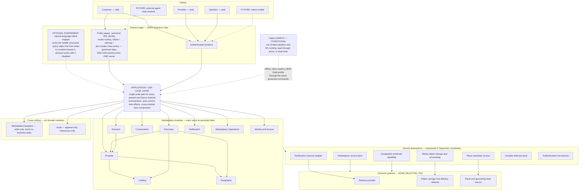

# System Architecture — P02 Logical Shape

> **Status:** `PROPOSED — TO BE VALIDATED IN P03`. Provenance: `TECHNICAL_DISCOVERY`.
>
> **Standing qualifier:** `DAVID WORKING ASSUMPTION — OWNER VALIDATION PENDING` (`SRC-013`). The P01.1 release gate was not satisfied at P02 start; `G-06` and `G-10` are unsatisfied. **Nothing here authorizes P04.**
>
> **Scenario stamp:** operational and cost statements assume **S-1** (one launch geography, one production locale).
>
> **Hard boundary:** this is a **logical** architecture. No language, framework, cloud, database, search engine, message broker, cache, payment vendor, or product is selected. Where a mechanism is needed, this document states the **requirement**; `p03-decision-inputs.md` carries the decision to P03.
>
> **No non-functional-requirements table with numbers appears in this document, deliberately.** A latency figure silently buys realtime transport; a search-latency figure without a candidate-set size and query mix silently buys a search engine; a throughput figure derived from the unaudited ~43,000 legacy count silently buys oversized infrastructure. Every such number must carry its source and volume scenario, and none of those exist yet (`SRC-006` is NOT RECEIVED).

## 1. Logical layers

> **This is a layer diagram, and it is deliberately not the dependency graph.** It shows which layer may reach which, plus a few representative module edges. **Inter-module dependency direction and the forbidden-dependency list are authoritative in [domain-map.md](domain-map.md)**, which draws every edge. Do not read the absence of an edge here as a prohibition.

Layer rules:

| Layer | Rule |
|---|---|
| Clients | A client is a delivery channel, never a rule holder. Every client, present or future, reaches domain state through the same use-case layer. No channel gets a private rule set or a private write path. |
| Delivery edge | Zero business rules, zero state transitions. Owns URL identity, locale routing, and machine-access policy — as **governed data with a named owner and a single enforcement point**, so bot mitigation cannot silently contradict the approved crawler policy. |
| Application layer | The single write path. Commits the domain transaction, then creates post-commit side effects. Composes cross-module views. Holds no invariant. |
| Domain modules | Own their persisted data. Cross-module references by identifier only. **No cross-module query joins and no cross-module referential constraints.** |
| Owned abstractions | Expressed in Superola's vocabulary. No vendor identifier, vendor error, or vendor data shape appears in domain state or public output. If a boundary requires emulating vendor semantics inside the domain, the boundary is in the wrong place. |
| External systems | None selected. All are P03 decisions with build-versus-buy, total-cost, lock-in, and exit analysis. |

## 2. Deployment shape

### Recommendation

**A single deployable modular application with module-owned data, plus out-of-band execution — a separate process from the same artifact — for media processing, notification retry, and import.** Out-of-band workers are not distribution of the domain. `ADR-001`.

### Comparison against actual P01 constraints

Not "modular monolith because it is simpler." The comparison is against the evidence.

| Justification for distribution | Present in the evidence? |
|---|---|
| Measured divergent resource saturation between workloads | **No.** Analytics is a pending source (`SRC-006`). There is no traffic evidence at all. |
| Independent deploy cadence forced by separate teams | **No.** Small team; the owner wants specialist hiring only when justified. |
| Hard compliance or data-residency isolation | **No.** No residency requirement exists in any input. |
| Divergent availability requirements | Weakly — public read surfaces versus operator work. Addressed by caching and replicas, not by splitting. |
| A third-party runtime constraint | **No.** |

| Shape | What it buys against today's constraints | What it costs |
|---|---|---|
| **Coarse distributed (3–4 services)** | Nothing measurable. | Network failure modes; and specifically it fragments the one thing that must be strong — the synchronous cross-module invariants around publication gating, request eligibility, and block enforcement. Duplicated authentication and observability. Higher fixed spend against explicit cost discipline. |
| **Microservices per module** | Nothing. | **Actively harmful.** Forces eventual consistency onto invariants that are currently simple synchronous checks; multiplies the exception-only manual operations burden the operating envelope caps; and makes the unvalidated-demand risk (`A-011`, `A-013`, `R-014`) far more expensive to abandon. |
| **Single deployable with no module ownership** | Fastest short term. | This is what the legacy platform effectively was. Rejected. |

**The asymmetry that decides it:** the *first* additional deployable unit is by far the most expensive one. Going from one to two introduces partial failure, contract versioning, and cross-unit tracing as new permanent categories. Going from five to six introduces almost nothing. Anyone arguing "it is just one small service" is proposing the single most expensive increment available. And **re-merging services is harder than splitting a monolith** — the direction of regret is asymmetric.

The load-bearing argument is not simplicity: **the modules are the durable decision; the deployment shape is the reversible one.** Under a non-contractual six-month planning hypothesis with unvalidated demand, spend the design budget on the irreversible thing.

### What a modular monolith makes worse — honestly

| Cost | Mechanism | Cheap discipline that mitigates it |
|---|---|---|
| **Boundary erosion is silent and fast** | Nothing physically prevents a cross-module join. Unenforced, "modular monolith" degrades into a monolith with folders — and then the *option* to split is lost, which destroys the entire benefit. | **This is the one place to spend.** Boundaries must be **mechanically enforced**: explicit module interfaces, and a dependency rule checked in the build so a forbidden cross-module import **fails**. This is not a nice-to-have — **it is the cost case for the decision.** |
| **The shared record store is the real trap, not the shared process** | Cross-module referential constraints and ad-hoc joins are what make later extraction expensive. | Table ownership per module; no cross-module joins in application code; compose in the application layer or in a read model owned by one module. |
| Coupled failure and coupled deploys | A bad migration or a hot loop degrades everything simultaneously, including public pages, which is a compounding acquisition loss. | Small frequent deploys; kill switches on risky and optional paths; a fast pipeline so rollback is cheap. With one unit, rollback is *simpler* than coordinated multi-service rollback. |
| Blast radius | One process — a leak, a runaway query, or a pathological upload can degrade everything. | Run background, media, and import work as a **separate process from the same artifact**. That is the cheap majority of isolation without the distributed tax. Plus per-endpoint rate limits, request timeouts, upload caps, and per-workload resource limits. |
| Dissimilar workloads scale as one unit | Read-heavy public discovery scales with the same unit as write-heavy operator work and batch import. | Horizontal replicas of the same artifact are cheap — unused code costs nothing at rest. A cache layer in front of anonymous public reads removes most load. A read replica if measured. All three are far cheaper than extracting a service. |
| Deadline pressure attacks boundaries first | A six-month planning hypothesis is precisely the condition under which someone violates a boundary "just this once". | Mechanical enforcement, again. |
| Team-scaling ceiling | Merge contention as headcount grows. | Not a V1 problem. Revisit on measurement. |

### Measurable triggers that would flip this

| Trigger | First thing to split |
|---|---|
| Two named modules show **measured** divergent resource saturation on one instance class, unrelieved by vertical scaling or a read replica | Out-of-band workers get separate resource allocation (they are already separate processes) |
| Read-model maintenance measurably degrades write-path latency, or search needs a capability the primary store provably lacks | Discovery's read model becomes a separate store — **still not a separate service** |
| Notification retry backlog affects request-path availability | Notification as an independently deployed capability |
| A legal ruling requires physical data separation, or a market forces conversation text or contact data into a separate boundary | The boundary the ruling names |
| A counted number of releases of one module blocked by another module's deploy risk | The boundary along that split |
| Two or more **teams** (not people) blocked on one release train | The boundary along the team split |
| Transaction Extension approval brings payment-compliance isolation requirements | Booking and Transaction as its own boundary from birth |

## 3. Interaction and consistency map

**State the requirement; P03 selects the mechanism.** Consistency vocabulary: `strong` (atomic and immediately visible), `read-your-writes` (the actor sees their own change immediately), `eventual-bounded` (visible within a measured bound), `best-effort` (may be lost without failing a user action).

| Interaction | Required consistency | Sync or async | User-visible guarantee actually needed | Realtime? |
|---|---|---|---|---|
| Provider publishes profile | `strong` in Provider; `read-your-writes` for the provider's own view | Sync | "Your profile is published" is immediate and authoritative | **No** |
| Appears in search results | `read-your-writes` **in V1**, because Discovery queries source truth directly and no separate store exists | Sync | Freshness is free in V1. **The product state "published but not yet discoverable" does not exist.** If a derived store is ever introduced, `eventual-bounded` becomes a requirement *and* that new product state must be shown honestly rather than hidden | **No** |
| Customer submits request, including just-in-time verification | `strong`; `read-your-writes` | Sync | "Your request exists, here is its state, it will be delivered." **Not** "the provider has seen it" | **No** |
| Request delivery notification | `best-effort` delivery over a **durable intent**, at-least-once, idempotent effect, failure visible | Async | Delivery state is visible and honest; failure is labelled delivery failure, **never provider silence** (`R-016`) | **No** |
| Provider submits response | `strong` write; the customer sees it on next read | Async arrival | Response state is durable and correctly ordered in the request lifecycle | **No** |
| Message creation | `strong` append; **per-conversation ordering required** | Sync post, async arrival | Your message is stored, in order, and visible to the participant | **No.** Presence, typing, and read receipts are excluded from the baseline; fetch on navigation is sufficient |
| Analytics event | `best-effort`, at-least-once, out of band | Async | None. **Loss must never fail a user action, and no needed state may exist only as an event** | **No** |
| Media processing | `eventual-bounded` | Async | No half-processed media is ever publicly visible; a processing state is shown | **No** |
| Import batch | Offline | N/A | None | **No** |
| Customer-reported outcome | `strong`; `read-your-writes` | Sync | "Your reported outcome is recorded, by you, at this time" | **No** |
| **Suppression, deactivation, or moderation removal of a public surface** | `strong` at the owning aggregate; **bounded short propagation to the anonymous-public-read cache** — which is the only thing standing between an unpublished record and a reader, since there is no derived store and the projection is re-versioned synchronously | Sync command, fast invalidation | Unsafe or deactivated supply stops being reachable promptly | **This is the only near-realtime requirement in V1.** Naming the cache matters: without it the requirement has no target and reads as incoherent |
| *(Future)* payment callback | Boundary requirement only. An external financial event is received into its own transaction as an immutable, idempotently-keyed record; any domain change it triggers is a separate replayable step; the marketplace never treats an external callback as source of truth for commitment state without reconciliation | Async | — | **No** |

### Product-wide realtime stance

`docs/05-roadmap/mvp-scope.md` excludes presence, typing, read receipts, and realtime transport **from the conversation baseline**. That leaves four unguarded doors — notification badge and unread count, message arrival in an open conversation, search freshness, and the provider dashboard indicator. P02 therefore states a **product-wide** stance:

> **No V1 surface requires server-initiated push to a connected client. State is fetched on navigation or explicit refresh; timeliness is delivered out of band by the notification channel. Any polling interval must be stated with its query cost.**

Polling is not free either: an aggressive unread-count poll is a per-user-per-interval query multiplier on the primary store.

The single fast-path requirement is safety suppression. That conclusion removes an entire infrastructure category from P03's scope, and it is falsifiable — see the trigger in `search-architecture-requirements.md` and `decision-branches.md`.

**Trigger to revisit:** measured provider response latency shows a distribution where sub-minute awareness would change outcomes. If the response distribution is hours or longer, realtime buys nothing.

## 4. Transactional boundaries

| Action | Atomic unit | Must NOT be in the same transaction |
|---|---|---|
| Provider publishes profile | Profile state to published, plus the validation snapshot (completeness against Catalog requirements, service-area validity, media ready and rights acknowledged), plus Business standing read, plus the `PublishedSnapshot` version and its field-set version, plus the audit record | Media derivative generation; sitemap or canonical publication; analytics; provider notification; any external verification call |
| Customer submits request | **Three phases, and the phase split is the design.** (1) Draft save — own transaction. (2) Verification challenge issue and confirm — own transactions in Identity. (3) Request creation with one-recipient binding, recipient provenance, consent reference, eligibility re-check against **Provider source truth**, block check, and the state transition to delivered — one transaction in Demand | Verification challenge send; notification; analytics. The request becomes durable in a pre-delivery state invisible to the provider, and **delivery is the verification-gated transition** — which satisfies "verified before provider delivery", avoids losing the customer's work on abandonment, and makes abandonment measurable as `R-022` requires. Submission must be idempotent |
| Provider responds | Request state transition, plus the response entity, plus timestamp, plus (for an offer) content, currency, basis, conditions, version, and stable offer identifier | Notification; analytics; conversation creation; any external validation. **This single transaction is the core argument for keeping the response inside the request aggregate** |
| Message creation | Message append, plus participant, restriction, and block checks, plus conversation last-activity | Notification; analytics; moderation scanning; **any request state change** — a message must never be able to fake a response |
| Notification delivery | The delivery intent record, created **after** the business transaction commits, in its own transaction. Each attempt and outcome is its own transaction | The business transaction. Ever |
| Read-model refresh | Not applicable in V1 — Discovery queries source truth. If a derived store is ever introduced: one idempotent unit per profile version, never in the source transaction | The source change |
| Analytics event | Its own path; never a blocking participant in a business transaction | The business transaction as a failure-propagating participant |
| Media processing | Media reference creation with pending state and rights acknowledgement (one transaction). Ready and failed transitions are separate transactions | Derivative generation; publication. A processing failure must not corrupt publication state |
| Import | **One source record**, idempotent per source record, with per-record failure isolation, writing only a legacy record — never a profile | The batch. **Publication must never be a side effect of import** |
| Claim grant | Claim decision, decider, basis, time, plus the record state at grant time, plus ownership binding, plus the audit record | Profile creation, which happens afterwards through the same governed commands a fresh provider uses; notification |
| Customer-reported outcome | Outcome record with reporter and timestamp, plus the request transition to a terminal reported state | Notification; analytics. Outcome is *reported*, never inferred |
| Moderation decision | The decision record, plus the governed state transition on the owning aggregate, plus the audit record | Notification; public-surface propagation, which is a separate fast-path step |

**The cross-cutting rule that makes all of the above survivable in one deployable:** modules own their persisted data; cross-module references are by identifier only; no cross-module query joins and no cross-module referential constraints. The mechanism and engine are P03 decisions.

## 5. Asynchrony requirement — a durable work queue is not an event bus

`docs/05-roadmap/mvp-scope.md` requires the requirement to be specified before P03 selects a mechanism.

> **V1 requires durable deferred work with at-least-once execution, retry with backoff, idempotent handlers, and a dead-letter state visible in an operator queue. It does not require publish-subscribe fan-out, topic-based routing, partitioned ordered streams, or event sourcing. P03 must compare alternatives including one that adds no new always-on operational component.**

The distinction matters because **every deferred action in V1 has exactly one known consumer and one known effect.** Publish-subscribe fan-out, topic routing, ordered partitioned streams, and event sourcing solve *unknown or multiple* consumers — a problem V1 does not have.

| V1 interaction | Genuinely async? | What it actually needs |
|---|---|---|
| Notification dispatch on request created, responded, or new message | **Yes** | Out of band from the request, retry with backoff, visible delivery and failure state |
| Media derivative generation | Yes, deferrable | Retry; failure visible to the uploader |
| Measurement and evidence events | No | Durable product records written in-transaction or batched |
| Stale-supply sweeps, freshness recompute, intake decay, reminders, notification-failure escalation | No — **scheduled**, not evented | A scheduler |
| Import | No — **batch** | Resumable, idempotent, re-runnable |
| Search read-model refresh | **Does not exist in V1** | Refusing a separate store deletes this requirement entirely |

Say these words in the artifact: notification dispatch, media derivatives, measurement forwarding, freshness and intake sweeps, reminders, and import are **jobs, not events**.

**Trigger to add a broker:** a second *independent* consumer of the same domain occurrence appears with a real owner and cannot be served by the existing handler; or measured job-store contention against the primary store degrades transactional latency past the approved budget.

## 6. Extension points

Each seam states what it *is* structurally, its V1 carry cost, and whether carrying it is justified. The admissibility test: **a future-motivated boundary enters P02 only if it is independently justified by a Phase-1 need, and that Phase-1 justification is written next to it.** Otherwise it is a named future concern with no V1 mechanism. This operationalizes `A-020`.

| Extension | The seam, structurally | Phase-1 justification | Carry cost | Verdict |
|---|---|---|---|---|
| **More countries and locales** | Country, locale, currency, timezone, and units are explicit data attributes with no implicit default; all display text is a localized label over a stable identifier; locale is a dimension of public URL identity | Required by `docs/00-context/product-context.md` and `AGENTS.md` regardless of launch market. Also the direct fix for the reported legacy location defect | LOW; a label indirection plus naming discipline | **CARRY.** Retrofitting is a data migration across every public surface, and ambiguous historical timezone or currency values are often unrecoverable |
| **More categories with category-specific attributes** | Governed archetypes in code with tests; versioned attribute definitions, permitted service-area variants, and publication requirements as governed data | The launch cohort itself needs governed taxonomy and category-appropriate profile and request semantics | **The largest carried cost in V1.** Honest downsides: validating and querying definition-bound values is harder than fixed fields, and it needs an operator path to change definitions | **CARRY** — this is where "no structural redesign" actually lives (`R-015`). Guard clause in `domain-model.md` §3.3 |
| **`DB-01` multi-provider matching** | `RequestDraft` already exists as the customer-side brief; the request already has an independent lifecycle and recipient provenance; recipient selection is already a named policy call | The draft is required for V1's stated reuse behaviour | **Near zero** | **CARRY.** Note: the one-recipient invariant is deliberately *not* pre-generalized — see `domain-model.md` §9 |
| **Transaction Extension** | (a) the offer has a stable identifier and immutable versions; (b) terminal state vocabulary is extensible without redefining existing states; (c) money always carries currency, basis, inclusions, and conditions; (d) **no financial concept anywhere in Phase 1** | (a) and (c) are required for honest Phase-1 offers regardless. (b) is a naming discipline. (d) is a prohibition, not a mechanism | Near zero | **CARRY (a)–(d). DEFER everything else** — no booking or payment states, tables, fields, or adapters. `A-004` remains OPEN |
| **Subscription entitlements** | One named `EligibilityDecision` point consulted by Provider and Discovery, with a constant entitlement input | Publication and request eligibility gating is mandatory regardless; the seam is where it already had to be | One indirection | **CARRY the decision point. DEFER** all plan, price, trial, proration, and entitlement data |
| **Sponsored placement** | Organic ordering takes organic inputs only; `placementBasis` is carried on every result and every measurement event | Truthful organic ordering and result-level measurement are Phase-1 requirements | One enumerated value plus carrying it through reads and analytics | **CARRY.** Cheapest high-value seam and the most expensive to retrofit — adding it later destroys historical comparability, which is the `R-004` and `R-018` failure mode |
| **Native mobile clients** | One application layer as the single write path, with a delivery-agnostic contract and no business rules in templates or page controllers | The discipline is required regardless; the legacy platform's failure was per-channel controllers with embedded rules | Essentially free | **CARRY the layer. DEFER** a versioned public contract, a backend-for-frontend, and any mobile-specific endpoint. `A-005` OPEN |
| **Natural-language or AI-assisted discovery** | Discovery's input is a **validated, closed structured constraint set**; the mapping step lives outside the domain; unmapped constraints are **rejected, not approximated** | A validated query object is wanted regardless | Near zero | **CARRY the contract. DEFER** the model, experiment, evaluation harness, and fallback machinery. This is what *structurally* guarantees the model is never the source of truth for eligibility or ranking |
| **External agent read access** | Per-field publication policy plus freshness and provenance metadata on public projections plus stable public identifiers | All three are required for human-public publication and correction paths | LOW | **CARRY. DEFER** feeds, protocol adapters, public contracts, and tokens. No V1 deliverable may exist whose only consumer is an emerging protocol |
| **Legacy coexistence and cutover** | Edge-level routing and URL-identity ownership; import provenance and separability; **no runtime coupling in either direction** | Only if a cohort is approved | LOW | **CARRY the URL-identity ownership question to P05.** `A-019`, `Q-019` |
| **Operator tooling growth** | Cases exist from day one as durable, queryable records with owner and age | The operating envelope requires measuring cases and staff-hours before expansion | LOW | **CARRY.** A stop rule you cannot measure is not a stop rule |

## 7. Architecture principles

Refined, and every one stated so it can be checked. Vacuous principles were reworded or rejected.

| # | Principle | The checkable test |
|---|---|---|
| P1 | One deployable until a **named measured constraint** justifies splitting; modules own their persisted data and are referenced only by identifier — no cross-module joins or referential constraints. | Mechanically enforceable in the build. |
| P2 | No business rule or state transition lives in a delivery adapter — page, template, mobile client, feed, or future agent channel. | Every transition is reachable from one use-case layer. |
| P3 | Every client, present or future, reaches domain state only through the same use-case layer. No channel gets a private rule set or private write path. | No second write path exists. |
| P4 | **Marketplace lifecycle states are explicit, named, and never inferred** — and a state's name may not assert more than the platform can evidence. | Read the state vocabulary; every name is defensible. *(The original wording said "transactional lifecycle states", which is misleading in a phase with no transactions and risks reimporting booking language.)* |
| P5 | Publication is a **per-field** decision with a named owner, and machine-readable claims never exceed visible human claims. | Per-field policy exists and is enforced at the projection, not the template. |
| P6 | Search is a projection of governed data, **rebuildable from source truth**, and never a source of truth. A search result is never authorization. | Rebuild it and compare. Durable actions re-check source truth. |
| P7 | Sponsored placement may only add a separately allocated, separately labelled result set; it may never contribute a term to organic ordering. Placement provenance is carried in every result **and every measurement event**. | Inspect ordering inputs; inspect the event shape. |
| P8 | Localization labels never define domain identity. | Every displayed label resolves from a stable identifier. |
| P9 | Countries, locales, currencies, timezones, and units are data and policy — never code branches — and **no default is implicit**. | Search for a hard-coded country, locale, currency, or unit. |
| P10 | External capabilities are reached through an owned interface expressed in **Superola's** vocabulary. No vendor identifier, error, or data shape appears in domain state or public output. If a boundary requires emulating vendor semantics inside the domain, the boundary is in the wrong place. | Search domain state and public output for vendor artifacts. *(The original "integrations behind replaceable boundaries" was unfalsifiable.)* |
| P11 | Every state transition a user, provider, operator, or regulator could later dispute records **actor, time, and cause**. | Pick any transition; those three exist. *(The original "observability and auditability" was unfalsifiable.)* |
| P12 | Every structural addition names the measurement that justified it **and** the reconsideration trigger that would remove it. | A proposal without both is rejected in review. |
| P13 | **Nothing becomes public or privileged as a side effect.** Publication, discoverability, and any future entitlement or placement are explicit governed transitions with an audit record. | Trace every path that can make a record public. |
| P14 | **Never name a fact the platform cannot prove.** Constrains `verified`, `available`, `booking`, `conversion`, `completed`. Naming is an architectural constraint here, not copywriting. | Read every state and field name against `Q-014`. |
| P15 | **Repeated actions must not create duplicate marketplace effects** — retries, double submits, import re-runs, notification retries. | Replay each and compare effects. |
| P16 | **Delivery failure and human non-response are different states and never collapse into one.** | Both states exist and are separately visible. |
| P17 | **Category variation is governed data, not a branch in code** — and if a category needs behaviour not expressible as data, that is evidence for a narrow model *for that category*, not for a bigger metadata engine. | Search for category-name conditionals. |
| P18 | **Sensitive content stays inside its owning boundary.** Conversation text and customer contact details are never copied into notification payloads, search read paths, analytics events, or public output. | Trace each of those four outputs. |
| P19 | **Imported data is provenance-tagged and separable, and passes the same gates a fresh provider passes.** | Enumerate a batch; reverse it. |
| P20 | **Cached public surfaces may be stale; safety actions may not.** Suppression, deactivation, and moderation removal invalidate the anonymous-public-read cache on a bounded short path, independent of any rebuild. | Measure propagation time from the command to the cached surface. |
| P21 | **Architecture decisions are evaluated for the manual queue volume they create.** Operator workload is plausibly the largest recurring cost at this stage and had no owner in any pre-P02 architecture document. | Every accepted boundary names its operator-cost direction. |

## 8. What this architecture deliberately does not contain

Named so their absence is a decision rather than an oversight, per reading rule 2 in `domain-map.md`.

| Absent | Why |
|---|---|
| A message broker, event bus, or event stream | Every deferred action has one known consumer. §5 |
| Realtime transport or server-initiated push | No V1 surface requires it. §3 |
| A separate search index or search service | `search-architecture-requirements.md` |
| An availability, calendar, hold, or slot model | `A-006` `SUPERSEDED`; `V1 has no availability model` |
| Plan, subscription, price, trial, or entitlement structures | §6; `docs/01-product/monetization.md` |
| Campaign, budget, rotation, or sponsored inventory | §6 |
| Booking, payment, payout, refund, dispute, completion, or review | Transaction Extension; `A-004` OPEN |
| Multi-region infrastructure | Market scope is not topology. `internationalization-architecture.md` |
| An AI or model service inside the domain | The experiment sits outside and in front, and no module imports it |
| Any protocol adapter | No V1 deliverable may exist whose only consumer is an emerging protocol |
| An observability platform, warehouse, tracing, or session replay | The funnel is durable domain state queried directly; buy technical monitoring at the smallest tier |
| A generic administration suite | Exception-only manual queues behind audited entry points. The line is that each operator capability must be possible **without a database console**, because a console action has no actor, no reason, and no audit record. The interface may be crude |
| A numeric non-functional-requirements table | Every number would need a source and a volume scenario, and none exists yet |

## Sources

`AGENTS.md` · `docs/02-architecture/architecture-overview.md` (principle 4: avoid premature Kubernetes, microservice, and event-stream complexity) · `docs/00-context/product-context.md` · `docs/00-context/assumptions.md` · `docs/01-product/feature-inventory.md` · `docs/01-product/user-journeys.md` · `docs/01-product/product-vision.md` · `docs/01-product/monetization.md` · `docs/05-roadmap/mvp-scope.md` · `docs/05-roadmap/risks.md` · `docs/06-migration/legacy-data-strategy.md` · `docs/07-research/ai-discoverability.md` · `docs/03-technology/technology-radar.md` (candidates only; no selection) · `SRC-013`.
