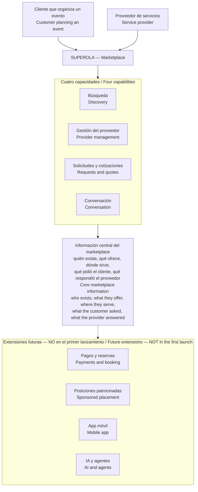

# Vista previa de arquitectura Superola v0.1 / Superola Architecture Preview v0.1

> **Estado / Status:** `PROPUESTA — VALIDACIÓN DEL OWNER PENDIENTE` / `PROPOSED — OWNER VALIDATION PENDING`
>
> **Propósito / Purpose:** Explicar cómo se organizaría Superola por dentro, en lenguaje de negocio. No es un producto aprobado, ni un plan de entrega, ni una decisión de tecnología, ni un compromiso de costo o plazo. / Explain how Superola would be organized internally, in business language. Not an approved product, delivery plan, technology decision, or cost or timeline commitment.
>
> **Importante / Important:** Este diseño se hizo sobre supuestos de trabajo, no sobre respuestas suyas. La sección 4 muestra exactamente qué cambia si usted decide distinto. / This design was built on working assumptions, not on your answers. Section 4 shows exactly what changes if you decide differently.
>
> **Uso / How to use:** Para una presentación de 1–2 slides, use **solo** el diagrama de la sección 1 y la tabla de la sección 4; el resto es material de respaldo para la conversación. / For a 1–2 slide presentation use **only** the section 1 diagram and the section 4 table; the rest is backing material for the conversation.

---

## 1. La forma de Superola / The shape of Superola

### Español

- **Cuatro capacidades, un solo sistema.** Búsqueda, gestión del proveedor, solicitudes y cotizaciones, y conversación son partes separadas por dentro, pero forman un solo producto. No son cuatro sistemas distintos que haya que operar por separado: eso costaría más y no resolvería ningún problema que Superola tenga hoy.
- **Una sola verdad.** Toda la información del marketplace vive en un solo lugar. Lo que el cliente ve al buscar sale de esa misma información, no de una copia que pueda quedar desactualizada.
- **Las extensiones futuras ya tienen dónde entrar.** Pagos, patrocinio, móvil e IA no están construidos y no están incluidos — pero el diseño deja el lugar donde se conectan, para no tener que rehacer todo cuando llegue el momento.

### English

- **Four capabilities, one system.** Discovery, provider management, requests and quotes, and conversation are separate parts internally but form one product. They are not four separate systems to operate: that would cost more and would not solve any problem Superola has today.
- **One single truth.** All marketplace information lives in one place. What the customer sees when searching comes from that same information, not from a copy that could fall out of date.
- **Future extensions already have a place to attach.** Payments, sponsorship, mobile, and AI are not built and are not included — but the design leaves the connection point, so nothing has to be rebuilt when the time comes.

---

## 2. Cinco decisiones que protegen la confianza / Five decisions that protect trust

| | Español | English |
|---|---|---|
| **1** | **El negocio y su perfil público son cosas distintas.** Suspender a alguien que se porta mal afecta al negocio, no solo a una página que puede volver a crear. | **A business and its public profile are different things.** Suspending a bad actor affects the business, not just a page they can recreate. |
| **2** | **Una solicitud va a un solo proveedor elegido por el cliente.** Contactar a otro es otra decisión del cliente. Nunca se reparte automáticamente. | **One request goes to one provider the customer chose.** Contacting another is another customer decision. Nothing is distributed automatically. |
| **3** | **Nunca afirmamos algo que no podamos probar.** Una cotización no es una reserva. "Acepta solicitudes" no significa que la fecha esté libre. "Verificado" solo se usa cuando existe una prueba concreta. | **We never claim what we cannot prove.** A quote is not a booking. "Accepting requests" does not mean the date is free. "Verified" is used only when concrete proof exists. |
| **4** | **El resultado orgánico y el pagado nunca se mezclan.** Aunque hoy no vendamos posiciones, cada resultado ya registra si es orgánico. Así, cuando se venda patrocinio, se podrá demostrar que el dinero no compró relevancia. | **Organic and paid results never mix.** Even though we sell no positions today, every result already records whether it is organic. So when sponsorship is sold, it can be proven that money did not buy relevance. |
| **5** | **Los datos de contacto del cliente no viven dentro de la solicitud.** Se resuelven en el momento de entregar, según la política que usted decida. Cambiar esa política es cambiar una regla, no rehacer el sistema. | **Customer contact details do not live inside the request.** They are resolved at delivery time according to the policy you decide. Changing that policy means changing a rule, not rebuilding the system. |

---

## 3. Los datos del sitio actual / The current site's data

### Español

Los registros del sitio actual **entran a un espacio aparte**, no al marketplace nuevo. Un registro importado:

- no aparece en las búsquedas;
- no puede recibir solicitudes de clientes;
- no se publica.

Cuando un proveedor real reclama su registro y demuestra que es suyo, eso **le da la propiedad — no lo publica**. Su perfil arranca como borrador y tiene que cumplir los mismos requisitos que un proveedor nuevo.

Y algo importante: si se borra un registro, queda anotado para que **una importación posterior no lo vuelva a crear**.

Esto no decide cuántos registros se migran. Eso se decide después de auditar los datos y de confirmar qué es legalmente utilizable.

### English

Records from the current site **enter a separate space**, not the new marketplace. An imported record:

- does not appear in search results;
- cannot receive customer requests;
- is not published.

When a real provider claims their record and proves it is theirs, that **grants ownership — it does not publish**. Their profile starts as a draft and must meet the same requirements as a new provider.

And one important point: if a record is deleted, that is recorded so **a later import cannot re-create it**.

This does not decide how many records get migrated. That is decided after auditing the data and confirming what is lawfully usable.

---

## 4. Qué cambia si… / What changes if…

Esta sección es el punto de esta presentación. / This section is the point of this presentation.

| Si usted decide… / If you decide… | Lo que NO cambia / What does NOT change | Lo que sí cambia / What does change |
|---|---|---|
| **Los pagos y las reservas entran en el primer lanzamiento** / **Payments and booking are in the first launch** | Búsqueda, perfiles, solicitudes, cotizaciones y conversación quedan igual. / Discovery, profiles, requests, quotes, and conversation stay as they are. | **Es el cambio más grande de la lista.** Se agrega toda una nueva área: reservas, cobros, pagos al proveedor, devoluciones, disputas y reseñas. Aparecen obligaciones fiscales y legales en cada país. Y cambia qué significa "reseña" y "verificado". / **The largest change on this list.** A whole new area is added: booking, charging, provider payouts, refunds, disputes, and reviews. Tax and legal obligations appear per country. And what "review" and "verified" mean changes. |
| **Una solicitud debe ir a varios proveedores a la vez** / **One request must go to several providers at once** | El borrador privado del cliente ya existe y ya sirve para esto. Perfiles, búsqueda y conversación quedan igual. / The customer's private draft already exists and already serves this. Profiles, discovery, and conversation stay as they are. | Aparecen reglas nuevas: a quién se le manda, cuántos como máximo, cuánto tiempo tienen para responder, qué pasa con los demás cuando uno responde, y cómo se evita el spam. Es trabajo real, pero **no hay que rehacer lo construido.** / New rules appear: who receives it, how many at most, how long they have to respond, what happens to the others when one responds, and how spam is prevented. Real work, but **nothing already built has to be redone.** |
| **Hay que migrar todos los registros del sitio actual** / **All records from the current site must be migrated** | El modelo de negocios, perfiles, categorías y geografía queda igual. / The model of businesses, profiles, categories, and geography stays as it is. | La revisión manual pasa a ser el costo dominante, y crece con la cantidad de registros. El riesgo real no es el costo: **si se publican proveedores que ya no responden, el producto va a parecer roto cuando en realidad funciona.** / Manual review becomes the dominant cost and grows with record count. The real risk is not cost: **if unresponsive providers get published, the product will look broken when it actually works.** |
| **Se lanza en dos países y dos idiomas a la vez** / **Two countries and two languages launch together** | **Nada por dentro.** El sistema ya está hecho para varios países, idiomas, monedas y husos horarios. / **Nothing internally.** The system is already built for multiple countries, languages, currencies, and time zones. | Cambia el costo de operar: todo el contenido se escribe y se mantiene dos veces, para siempre; y la atención al cliente y la moderación necesitan cobertura en los dos idiomas desde el primer día. / Operating cost changes: all content is written and maintained twice, forever; and support and moderation need coverage in both languages from day one. |
| **"Disponible" debe significar que la fecha está reservada** / **"Available" must mean the date is reserved** | Búsqueda, perfiles, solicitudes y conversación siguen funcionando igual. / Discovery, profiles, requests, and conversation keep working the same. | Hoy Superola **no** modela disponibilidad, a propósito: prometer una fecha que no podemos comprobar es peor que no prometer nada. Si "disponible" pasa a ser un compromiso, hay que modelar calendarios y recursos — y cada categoría los tiene distintos: un salón tiene salones, un mariachi tiene grupos, un transporte tiene vehículos. / Today Superola deliberately models **no** availability: promising a date we cannot verify is worse than promising nothing. If "available" becomes a commitment, calendars and resources must be modelled — and each category has different ones: a venue has rooms, a mariachi has groups, a transport company has vehicles. |
| **Se cobra suscripción desde el principio** / **Subscription is charged from the start** | El lugar donde se decide si un proveedor puede publicar y aparecer ya existe. Conectar la suscripción ahí es un cambio en un solo punto. / The place where it is decided whether a provider can publish and appear already exists. Connecting a subscription there is a change in one single point. | Aparecen facturación, impuestos por país, pagos fallidos, cancelaciones y devoluciones — y el soporte de facturación suele ser el más costoso de todos. / Billing, per-country tax, failed payments, cancellations, and refunds appear — and billing support is usually the most expensive kind. |

---

## 5. Lo que hace falta de usted / What we need from you

### Español

Este diseño avanzó sobre supuestos porque avanzar era mejor que esperar. Pero **cuatro preguntas siguen abiertas y el equipo técnico no puede contestarlas:**

1. **¿Dónde termina el primer lanzamiento?** ¿En que el cliente decide, o tiene que incluir reserva y pago? Es la pregunta de mayor impacto de todas.
2. **¿Qué significa "disponible" para usted?** ¿Una indicación útil, una invitación a preguntar, o un compromiso de fecha? Esto hay que resolverlo antes de diseñar las pantallas.
3. **¿Qué resultado concreto define el éxito** para el cliente y para el proveedor en el primer lanzamiento?
4. **De su documento de funcionalidades y de su material de UI/UX: qué es compromiso firme y qué es idea abierta?** Es la pregunta más barata de la lista y desbloquea el diseño de experiencia.

Y una quinta que necesita a usted **y** a un abogado: **¿tenemos permiso para contactar o migrar los registros del sitio actual?** Sin esa respuesta, la parte de "reclamar tu perfil" no puede existir.

### English

This design moved forward on assumptions because moving forward beat waiting. But **four questions remain open and the technical team cannot answer them:**

1. **Where does the first launch end?** At the customer deciding, or must it include booking and payment? This is the highest-impact question of all.
2. **What does "available" mean to you?** A useful indication, an invitation to ask, or a date commitment? This must be settled before screens are designed.
3. **What concrete result defines success** for the customer and for the provider in the first launch?
4. **In your feature document and your UI/UX material, which items are firm commitments and which are open ideas?** This is the cheapest question on the list and it unblocks experience design.

And a fifth that needs you **and** a lawyer: **do we have permission to contact or migrate the current site's records?** Without that answer, the "claim your profile" capability cannot exist.

---

*Fuentes internas / Internal sources: `docs/02-architecture/domain-map.md`, `domain-model.md`, `system-architecture.md`, `decision-branches.md`, `security-privacy-architecture.md`, `internationalization-architecture.md`, `adr/ADR-001`–`ADR-012`. Ninguna tecnología, proveedor, precio ni plazo se decide en este documento. / No technology, vendor, price, or timeline is decided in this document.*
